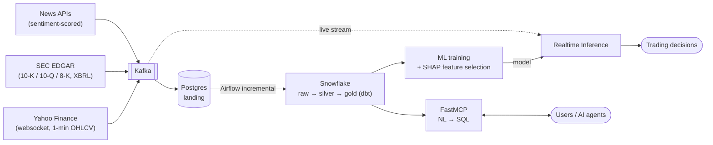

# AURUM

**Analytics & Unified Research for Market** — a streaming financial-data platform that unifies market prices, SEC EDGAR fundamentals, and news sentiment into an ML-ready Snowflake warehouse, powering realtime trading signals and a natural-language query interface.

> Ask *"Which tech stocks have P/E < 20 and grew revenue > 15% last quarter?"* — get an answer in seconds. Or let the trained model watch the live stream and emit buy/sell/hold signals with SHAP explanations.

## Architecture

## How it works

1. **Ingest** — three Kafka producers: a long-running websocket client streaming minute bars for the S&P 500, an incremental EDGAR poller (daily-index + watermark, never re-pulls history), and a news poller that scores sentiment with a fast ML classifier trained on LLM-labeled samples.
2. **Land** — Kafka consumers write idempotently to Postgres.
3. **Warehouse** — Airflow incrementally loads Postgres → Snowflake; dbt builds the medallion: cleaned staging → engineered financials & technicals → gold feature marts.
4. **Learn** — gradient-boosted model trained on gold features; SHAP prunes the feature set and explains every prediction; walk-forward validation guards against leakage.
5. **Act** — the Realtime Inference Module joins the live stream with the trained model and emits explained trading decisions.
6. **Ask** — a custom FastMCP server converts natural language to SQL over the gold marts.

## Tech stack

Kafka · Postgres · Apache Airflow · Snowflake · dbt · Python 3.12 (uv) · scikit-learn / XGBoost + SHAP · FastMCP · yfinance · SEC EDGAR APIs

## Documentation

| Doc | Content |
|-----|---------|
| [Technical Specification](docs/TECHNICAL_SPEC.md) | Full architecture, component specs, constraints, build phases |
| [Data Dictionary](docs/data-dictionary.md) | Every field, layer by layer, with formulas and gotchas |
| [EDGAR Incremental Ingestion](docs/edgar-incremental-ingestion.md) | Daily-index + watermark strategy for fetching only new filings |

## Status

Design phase complete (spec v2.0, 2026-07-12). Implementation: Phase 0 — infra bootstrap.

## Data sources & cost

All data sources are free: Yahoo Finance (unofficial API), SEC EDGAR (public, rate-limited 10 req/s, honest `User-Agent` required), Wikipedia S&P 500 list. No vendor lock-in.
