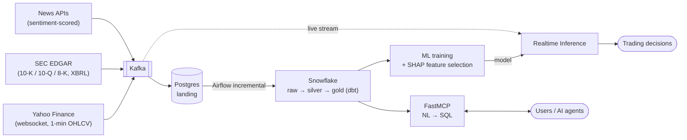

# AURUM

**Analytics & Unified Research for Market** — a streaming financial-data platform that unifies market prices, SEC EDGAR fundamentals, and news sentiment into an ML-ready Snowflake warehouse, powering realtime trading signals and a natural-language query interface.

> Ask *"Which tech stocks have P/E < 20 and grew revenue > 15% last quarter?"* — get an answer in seconds. Or let the trained model watch the live stream and emit buy/sell/hold signals with SHAP explanations.

## Architecture


```mermaid
flowchart LR
    YF["Yahoo Finance<br/>(websocket, 1-min OHLCV)"] --> K
    ED["SEC EDGAR<br/>(10-K / 10-Q / 8-K, XBRL)"] --> K
    NW["News APIs<br/>(sentiment-scored)"] --> K
    K[["Kafka"]] --> PG[("Postgres<br/>landing")]
    PG -->|Airflow incremental| SF["Snowflake<br/>raw → silver → gold (dbt)"]
    SF --> ML["ML training<br/>+ SHAP feature selection"]
    ML -->|model| RT["Realtime Inference"]
    K -.->|live stream| RT --> DEC(["Trading decisions"])
    SF --> MCP["FastMCP<br/>NL → SQL"] <--> U(["Users / AI agents"])
```

The diagram above is the **target** architecture (spec v2.0). See [Current state](#current-state) for what runs today.

## How it works

1. **Ingest** — three Kafka producers: a long-running websocket client streaming minute bars for the S&P 500, an incremental EDGAR poller (daily-index + watermark, never re-pulls history), and a news poller that scores sentiment with a fast ML classifier trained on LLM-labeled samples.
2. **Land** — Kafka consumers write idempotently to Postgres.
3. **Warehouse** — Airflow incrementally loads Postgres → Snowflake; dbt builds the medallion: cleaned staging → engineered financials & technicals → gold feature marts.
4. **Learn** — gradient-boosted model trained on gold features; SHAP prunes the feature set and explains every prediction; walk-forward validation guards against leakage.
5. **Act** — the Realtime Inference Module joins the live stream with the trained model and emits explained trading decisions.
6. **Ask** — a custom FastMCP server converts natural language to SQL over the gold marts.

## Ingestion framework

Ingestion is built on a small, config-driven framework so every data source (Yahoo, EDGAR, news) follows one pattern. Two layers meet through two contracts, and a YAML file supplies all the wiring:

- **Datasource** (`BaseDatasource`) — reads from one API or writes to one store: `read_data(run_date, watermarks)` / `write_data(run_date, df)`. Sinks add `get_watermarks()`.
- **Feed** (`BaseFeed`) — the workflow. It reads watermarks to decide *what* to fetch, calls the input datasource, transforms the frame in `process()`, stamps run metadata plus a deterministic MD5 key, and writes through the output datasource.

```
configs/*.yaml ─▶ runner ─▶ factory ─▶ Feed.run()
                                        ├─ output_ds.get_watermarks()   (incremental)
                                        ├─ input_ds.read_data()         (Yahoo / EDGAR)
                                        ├─ process()  +  RUN_DATE, EXECUTION_ID, MD5_HASH
                                        └─ output_ds.write_data()       ─▶ Postgres
```

Feeds and datasources register themselves by name (`@register_feed`, `@register_datasource`) and the factory resolves them from the config's `type`, so swapping the sink, replacing yfinance, or adding a source never touches existing code — one class, one YAML, one import line in `runner.py`.

**Run it:**

```bash
# Yahoo daily OHLCV — full load (the default; needs .env)
uv run python -m src.ingestion.cli -c src/ingestion/configs/yahoo/ohlcv_1d.yaml

# same feed, incremental from the landing-table watermark
uv run python -m src.ingestion.cli -c src/ingestion/configs/yahoo/ohlcv_1d.yaml -f False

# EDGAR quarterly income statements for a given run date
uv run python -m src.ingestion.cli -c src/ingestion/configs/edgar/income_statements_quarterly.yaml -d 2026-01-01

uv run ruff check src/ main.py   # lint (the CI gate)
```

See the [Ingestion Framework Guide](docs/datasource-framework.md) for diagrams, a step-by-step run walkthrough, the recipe for adding a new source, and the known rough edges.

## Tech stack

Kafka · Postgres · Apache Airflow · Snowflake · dbt · Python 3.12 (uv) · scikit-learn / XGBoost + SHAP · FastMCP · yfinance · SEC EDGAR APIs

## Documentation

| Doc | Content |
|-----|---------|
| [Technical Specification](docs/TECHNICAL_SPEC.md) | Full architecture, component specs, constraints, build phases |
| [Ingestion Framework Guide](docs/datasource-framework.md) | How datasources, feeds, and configs connect; how to add a source |
| [Data Dictionary](docs/data-dictionary.md) | Every field, layer by layer, with formulas and gotchas |
| [EDGAR Incremental Ingestion](docs/edgar-incremental-ingestion.md) | Daily-index + watermark strategy for fetching only new filings |
| [Infrastructure as Code](docs/infra-as-code.md) | Terraform for Snowflake objects, Kafka topics, Postgres roles |
| [CI/CD Pipeline](docs/cicd.md) | GitHub Actions: lint, tests, SonarQube quality gate, Terraform validation |

## Current state

Design phase complete (spec v2.0, 2026-07-12). Implementation is mid-Phase 0 — most of the architecture above is not built yet.

**Working today**

- `src/ingestion/` — the config-driven framework described above. Yahoo OHLCV (1d, 1min) and EDGAR income / cash-flow / balance-sheet statements (yearly + quarterly) land **directly in Postgres**; Kafka is not in the code path yet.
- Watermark-based incremental loading against the landing tables.
- CI: ruff lint + SonarCloud quality gate on `main`, `develop`, `epic/*`, and PRs.

**Not built yet**

- Kafka producers/consumers, the realtime websocket feed, and news ingestion.
- Airflow DAGs (`airflow/` is a placeholder) and the Terraform under `infra/`.
- The dbt project (`src/transformation/aurum_dwh/`) exists but still holds `dbt init` example models and currently targets local **Postgres**, not Snowflake.
- ML training / SHAP (`src/modeling/`), realtime inference (`src/inference/`), and the FastMCP server (`src/mcp/`) — placeholders.
- Tests. `tests/` is empty and the pytest step in CI is commented out.

## Data sources & cost

All data sources are free: Yahoo Finance (unofficial API), SEC EDGAR (public, rate-limited 10 req/s, honest `User-Agent` required), Wikipedia S&P 500 list. No vendor lock-in.
