# AURUM — Technical Specification

**AURUM** — Analytics & Unified Research for Market
**Version:** 2.0 (streaming redesign)
**Date:** 2026-07-12
**Status:** Design approved, implementation in progress
**Author:** Rohit Kumar

---

## 1. Overview

AURUM is a personal financial-data platform that unifies three data domains — **market prices**, **SEC fundamental filings**, and **news sentiment** — into a single streaming + warehouse architecture, with two consumption paths:

1. **ML / algo-trading path** — engineered features in Snowflake train an ML model (with SHAP-driven feature selection and explainability); the trained model is deployed to a Realtime Inference Module that consumes the live Kafka stream and emits trading decisions.
2. **Analyst path** — a custom FastMCP server translates natural-language questions into SQL against Snowflake gold marts, so users and AI agents can query without writing SQL.

The end goal is an ML-driven investment/algo-trading strategy generating a revenue stream, plus a portfolio-grade demonstration of modern data engineering (Kafka, Postgres, Airflow, Snowflake, dbt, MCP, ML explainability).

### 1.1 Problem Statement

Stock price movements, fundamental financial data (earnings, debt, filings), and market sentiment live in incompatible silos:

- **Market data** — live, structured, numeric (websocket/API)
- **EDGAR filings** (10-K, 10-Q, 8-K) — delayed, semi-structured, text-heavy
- **News** — unstructured text, needs NLP to become a signal

No single free platform unifies them into a queryable, ML-ready feature store. AURUM builds that platform from free data sources with zero data-vendor cost.

### 1.2 Goals

| # | Goal |
|---|------|
| G1 | Ingest minute-level market data via a long-running websocket process |
| G2 | Ingest SEC EDGAR filings + XBRL financial facts incrementally (no full re-pulls) |
| G3 | Ingest news and derive sentiment labels + intensity usable as a realtime feature |
| G4 | Land all raw data in Postgres via Kafka; incrementally load into Snowflake via Airflow |
| G5 | Build a dbt medallion (raw → silver → gold) producing ML-ready features |
| G6 | Train an ML model with SHAP feature selection and explainability |
| G7 | Serve realtime inference off the live stream → trading decisions |
| G8 | Expose gold marts through a FastMCP NL→SQL server for analyst/agent queries |

### 1.3 Non-Goals (v2)

- Order execution / broker integration (decisions are emitted, not auto-traded)
- Options, futures, crypto — equities only (S&P 500 universe)
- Sub-minute (tick-level) data
- Multi-user auth / SaaS hosting — single-operator platform
- Paid data vendors

### 1.4 Target Users

| Persona | Need | Question they ask |
|---------|------|-------------------|
| **Owner / Algo Trader** (primary) | ML strategy over price + fundamentals + sentiment | "Given today's stream, what does the model say about NVDA?" |
| Quant Analyst | Backtest signals combining price + fundamentals | "Which stocks had P/E < 15 AND revenue growth > 10% in 2024?" |
| Portfolio Manager | Sector rotation based on earnings | "Which S&P 500 sectors beat earnings by > 5% last quarter?" |
| Risk Manager | Flag deteriorating fundamentals | "Which large-caps have debt-to-market-cap > 1.0 and negative cash flow?" |
| Retail Investor | Plain-English screening | "Show me profitable tech companies under $10B market cap" |

---

## 2. Architecture

### 2.1 Diagram (Mermaid)

```mermaid
flowchart LR
    subgraph sources [Data Sources]
        YF["Yahoo Finance API<br/>(websocket, minute OHLCV)"]
        ED["SEC EDGAR API<br/>(10-K, 10-Q, 8-K, XBRL facts)"]
        NW["News API<br/>(headlines / articles)"]
    end

    subgraph producers [Kafka Producers]
        P1["market producer<br/>(long-running websocket client)"]
        P2["edgar producer<br/>(daily-index poller)"]
        P3["news producer<br/>(feed poller + sentiment scorer)"]
    end

    subgraph kafka [Kafka]
        T1[["market.ohlcv.1m"]]
        T2[["edgar.filings"]]
        T3[["news.sentiment"]]
    end

    subgraph consumers [Kafka Consumers]
        C1["market consumer"]
        C2["edgar consumer"]
        C3["news consumer"]
    end

    PG[("Postgres<br/>landing / OLTP")]

    subgraph snowflake [Snowflake — dbt medallion]
        RAW["RAW<br/>mirrored landing tables"]
        SIL["SILVER<br/>engineered financials,<br/>stock daily enriched"]
        GLD["GOLD<br/>selected features,<br/>summary marts"]
        RAW -->|dbt| SIL -->|dbt| GLD
    end

    subgraph ml [ML Pipeline]
        TRN["Model training<br/>+ SHAP feature selection<br/>+ explainability"]
        MDL["Trained model artifact"]
        TRN --> MDL
    end

    RTI["Realtime Inference Module<br/>(live features + trained model)"]
    DEC(["Trading decisions"])
    MCP["FastMCP server<br/>(NL → SQL → Snowflake)"]
    USR(["Users / AI Agents"])

    YF --> P1 --> T1
    ED --> P2 --> T2
    NW --> P3 --> T3
    T1 --> C1 --> PG
    T2 --> C2 --> PG
    T3 --> C3 --> PG
    PG -->|"Airflow incremental load"| RAW
    GLD --> TRN
    GLD -->|"feature selection loop (SHAP)"| SIL
    MDL --> RTI
    T1 -.->|live stream| RTI
    T3 -.->|live sentiment| RTI
    RTI --> DEC
    GLD --> MCP <--> USR
```



### 2.2 Diagram (ASCII fallback)

```
Yahoo Finance ──P──► market.ohlcv.1m ──┐
(websocket,                            │
 minute OHLCV)                         │
                                       ├──C──► POSTGRES ──Airflow──► SNOWFLAKE
SEC EDGAR ────P──► edgar.filings ──────┤      (landing)  (incremental) │
(10-K/10-Q/8-K,                        │                               │ dbt
 XBRL facts)                           │                    RAW → SILVER → GOLD
                                       │                               │
News API ─────P──► news.sentiment ─────┘                    ┌──────────┼─────────┐
                        │                                   ▼          ▼         │
                        │ live stream                ML TRAINING   FastMCP       │
                        │                            (SHAP feature (NL→SQL)      │
                        ▼                             selection +      ▲          │
              REALTIME INFERENCE ◄── trained model ── explainability)  │          │
              MODULE                                             Users/Agents     │
                        │                            feature-selection loop ──────┘
                        ▼
              TRADING DECISIONS

  P = Kafka producer   C = Kafka consumer
```

### 2.3 Data Flow Summary

| # | Flow | Transport | Cadence |
|---|------|-----------|---------|
| 1 | Yahoo Finance → Kafka `market.ohlcv.1m` | Long-running websocket producer | Streaming, minute bars |
| 2 | EDGAR → Kafka `edgar.filings` | Daily-index poller producer | Daily (Mon–Fri, after SEC publishes ~10 PM ET) |
| 3 | News → Kafka `news.sentiment` | Feed poller + sentiment classifier | Near-realtime polling |
| 4 | Kafka → Postgres | One consumer group per topic | Continuous |
| 5 | Postgres → Snowflake RAW | Airflow DAG, watermark-based incremental | Scheduled (hourly market / daily EDGAR+news) |
| 6 | RAW → SILVER → GOLD | dbt (dbt-snowflake) | Triggered by Airflow after each load |
| 7 | GOLD → model training | Batch training job (with SHAP) | Ad hoc / scheduled retrain |
| 8 | Model + live stream → decisions | Realtime Inference Module | Streaming |
| 9 | GOLD → analysts/agents | FastMCP NL→SQL server | On demand |

---

## 3. Component Specifications

### 3.1 Kafka Producers

#### 3.1.1 Market Producer (`market_producer`)

- **Purpose:** Long-running process holding a websocket connection to Yahoo Finance; normalizes minute-level price ticks into OHLCV bar messages.
- **Interface:** Publishes JSON to `market.ohlcv.1m`, keyed by `ticker`.
  ```json
  {
    "ticker": "AAPL", "ts": "2026-07-12T14:31:00Z",
    "open": 231.10, "high": 231.42, "low": 230.98,
    "close": 231.30, "volume": 183220
  }
  ```
- **Dependencies:** Yahoo Finance websocket (via `yfinance`/`websockets`), Kafka broker.
- **Notes:** Runs as a supervised daemon (systemd/docker restart policy). Reconnect with backoff on socket drop. Market-hours aware — idles when the market is closed. yfinance REST fallback (~2000 calls/hr unauthenticated, batch 50 tickers/call) for gap backfill.

#### 3.1.2 EDGAR Producer (`edgar_producer`)

- **Purpose:** Daily poller implementing the incremental strategy (see `docs/edgar-incremental-ingestion.md`). Reads EDGAR's daily `master.idx`, filters to S&P 500 CIKs and forms `10-K`/`10-Q`/`8-K`, pulls `companyfacts` XBRL for the filers only, publishes one message per new fact.
- **Interface:** Publishes JSON to `edgar.filings`, keyed by `cik`.
  ```json
  {
    "ticker": "AAPL", "cik": "0000320193",
    "metric": "EarningsPerShareBasic", "value": 1.53,
    "period_end": "2026-03-28", "filed_date": "2026-05-01",
    "form_type": "10-Q", "accession_no": "0000320193-26-000013"
  }
  ```
- **Dependencies:** `sec.gov` daily index, `data.sec.gov` XBRL APIs, watermark store (Airflow Variable or Postgres row), Kafka broker.
- **Constraints:** SEC rate limit 10 req/s (sleep 0.1 s between calls); mandatory `User-Agent: AURUM-Project <real email>`; SEC blocks datacenter IPs (403) — must run from a residential/local machine.

#### 3.1.3 News Producer (`news_producer`)

- **Purpose:** Polls news source(s), scores each item for sentiment, publishes labeled events. Sentiment approach (from the CleaNews project pattern):
  1. **Offline:** LLM generates a labeled training sample (sentiment label + intensity) from raw headlines.
  2. **Train** a traditional ML/NLP classifier (e.g., TF-IDF + linear model) on that sample — fast enough for realtime inference.
  3. **Online:** producer runs the trained classifier per news item; the LLM is never in the hot path.
- **Interface:** Publishes JSON to `news.sentiment`, keyed by `ticker` (or `_MARKET_` for macro news).
  ```json
  {
    "ticker": "NVDA", "ts": "2026-07-12T13:05:11Z",
    "headline": "...", "source": "...",
    "sentiment": "positive", "intensity": 0.82, "url": "..."
  }
  ```
- **Dependencies:** News API (source TBD — see Open Questions), trained sentiment classifier artifact, Kafka broker.

### 3.2 Kafka Topics

| Topic | Key | Retention | Notes |
|-------|-----|-----------|-------|
| `market.ohlcv.1m` | ticker | 7 days | High volume (≈ 500 tickers × 390 bars/day) |
| `edgar.filings` | cik | 30 days | Low volume; bursty in earnings season (typical day 0–5 S&P filers, peak 20–50) |
| `news.sentiment` | ticker | 7 days | Medium volume |

Single-broker Kafka (docker-compose) is sufficient for v2; partitioning by key keeps per-ticker ordering.

### 3.3 Kafka Consumers → Postgres

- **Purpose:** One consumer group per topic; batch-inserts messages into the Postgres landing schema.
- **Interface:** Consumes the topics above; writes with `INSERT ... ON CONFLICT DO NOTHING` against the natural key so replays/redeliveries are idempotent.
- **Dependencies:** Kafka broker, Postgres.
- **Landing tables** (schema `landing`):

| Table | Natural key | From topic |
|-------|-------------|------------|
| `landing.market_ohlcv_1m` | `(ticker, ts)` | `market.ohlcv.1m` |
| `landing.edgar_facts` | `(cik, metric, period_end, form_type, accession_no)` | `edgar.filings` |
| `landing.news_sentiment` | `(source, url, ts)` | `news.sentiment` |
| `landing.company_meta` | `(ticker)` | seeded from S&P 500 list (Wikipedia) + `company_tickers.json` CIK map |

Every landing table carries `_ingested_at TIMESTAMPTZ DEFAULT now()` — the incremental-load watermark column.

### 3.4 Postgres (Landing / OLTP)

- **Purpose:** Durable, transactional landing zone decoupling stream ingestion from warehouse loading; also the operational store for watermarks and pipeline state.
- **Retention:** Landing rows can be pruned after confirmed load to Snowflake (retain ≥ 30 days for replay).
- **Dependencies:** none upstream except consumers; Airflow reads from it.

### 3.5 Airflow — Orchestration

| DAG | Schedule | Work |
|-----|----------|------|
| `aurum_load_market` | Hourly during market days | Incremental copy `landing.market_ohlcv_1m` → Snowflake `RAW.market_ohlcv_1m` (rows where `_ingested_at` > watermark), then `dbt run --select silver.market+` |
| `aurum_load_edgar` | `0 2 * * 1-5` (2 AM UTC Mon–Fri) | Incremental copy `landing.edgar_facts` → `RAW.edgar_facts`, then `dbt run --select silver.edgar+ gold` |
| `aurum_load_news` | Daily | Incremental copy `landing.news_sentiment` → `RAW.news_sentiment`, then downstream dbt |
| `aurum_quality_checks` | After each load DAG | `dbt test` + row-count reconciliation Postgres vs Snowflake |
| `aurum_retrain` | Manual / monthly | Rebuild training set from GOLD, retrain model, run SHAP report, publish model artifact |

- **Watermark pattern:** per-table `last_loaded_at` stored as Airflow Variable (dev) or a `meta.watermarks` Postgres table (prod). Load = `SELECT ... WHERE _ingested_at > :watermark`; update watermark only after Snowflake commit succeeds.
- **Dependencies:** Postgres, Snowflake, dbt project.

### 3.6 Snowflake — dbt Medallion

Database `AURUM`, warehouse `COMPUTE_WH`, dbt adapter `dbt-snowflake`.

| Layer | Schema | Models | Content |
|-------|--------|--------|---------|
| **RAW** | `RAW` | (loaded by Airflow, declared as dbt sources) | 1:1 mirror of Postgres landing tables |
| **SILVER** | `SILVER` | `stg_market_ohlcv`, `stg_edgar_facts`, `stg_news_sentiment`, `stg_companies`, `int_stock_daily_enriched`, `int_engineered_financials` | Cleaned, typed, deduplicated; minute bars rolled up to daily; engineered financial ratios (P/E, net margin, debt-to-market-cap, revenue growth QoQ); technicals (MA-30d/90d, volatility, Sharpe-30d); daily sentiment aggregates |
| **GOLD** | `GOLD` | `mart_features` (ML feature store: one row per ticker per day, price + fundamental + sentiment features), `mart_feature_summary` (post-SHAP selected feature set — training view), `mart_stock_screener` (analyst-facing joined mart — the MCP query target) | ML-ready + analyst-ready |

- **Dedup rule (EDGAR):** same `(cik, metric, period_end)` reported multiple times → keep latest `filed_date` (amendments `10-K/A`, `10-Q/A` supersede).
- **Incremental:** silver models use dbt `is_incremental()` on `_ingested_at` / `filed_date`.
- **Tests:** not-null/unique keys, positive volume, valid tickers, accepted `form_type` values.

Field-level detail: `docs/data-dictionary.md`.

### 3.7 ML Training Pipeline

- **Purpose:** Turn GOLD features into a trained, explainable model for trade-decision inference.
- **Flow:**
  1. Extract training frame from `GOLD.mart_features` (features + forward-return target).
  2. Train candidate model (start: gradient-boosted trees — fast, tabular-native, SHAP-friendly).
  3. **SHAP feature selection:** compute SHAP values, rank features, prune low-importance ones; the selected set is materialized back as `mart_feature_summary` (the feature-selection loop in the diagram).
  4. Retrain on the selected set; produce an explainability report (global SHAP summary + per-prediction attributions).
  5. Version and publish the model artifact (local registry: `models/{version}/model.pkl` + metadata JSON; MLflow optional later).
- **Interface:** input = GOLD tables; output = versioned model artifact + SHAP report.
- **Dependencies:** Snowflake reader, Python ML stack (scikit-learn/XGBoost/LightGBM + `shap`).
- **Validation:** walk-forward (time-series) splits only — no random shuffles; leakage guard: features at time *t* must use data filed/observed ≤ *t* (respect EDGAR `filed_date`, not `period_end`).

### 3.8 Realtime Inference Module

- **Purpose:** Consume live `market.ohlcv.1m` + `news.sentiment` streams, maintain rolling in-memory feature state per ticker, score with the trained model, emit decisions.
- **Interface:**
  - In: Kafka topics (own consumer group, independent of Postgres consumers) + model artifact.
  - Out: decision events — `{ts, ticker, signal: buy|sell|hold, score, model_version, top_features}` — written to Postgres `landing.decisions` (and optionally a `decisions` Kafka topic later).
- **Dependencies:** Kafka, model registry, slow-moving fundamental features fetched from GOLD at startup/daily refresh.
- **Notes:** decisions are recommendations only (no broker execution — non-goal). `top_features` carries per-prediction SHAP attribution for auditability.

### 3.9 FastMCP NL→SQL Server (retained from v1)

- **Purpose:** Natural-language query interface over Snowflake GOLD for users and AI agents; the NL→SQL layer is a portfolio differentiator (kept instead of off-the-shelf Snowflake MCP).
- **Tools:**
  - `screen_stocks(question)` — NL → SQL (LLM with schema context injected) → run on `mart_stock_screener` → markdown table
  - `get_stock_fundamentals(ticker)` — latest quarters for one ticker
  - `compare_peers(tickers)` — side-by-side fundamentals + momentum
  - `sector_performance(sector?)` — sector aggregates
- **Dependencies:** FastMCP, Snowflake connector, LLM API (Claude) for SQL generation.
- **Safety:** generated SQL restricted to `SELECT` on GOLD schema; read-only Snowflake role; statement timeout; parameterize ticker inputs in the non-NL tools (no f-string interpolation).
- **Example queries:**
  - "Which S&P 500 stocks had the highest Sharpe ratio in the last 30 days?"
  - "Tech companies with P/E under 15 and net margin above 20%"
  - "Compare AAPL, MSFT, GOOGL on fundamentals and price momentum"
  - "Which stocks had negative sentiment spikes this week?"

---

## 4. Operational Constraints & Gotchas

| Constraint | Detail | Handling |
|-----------|--------|----------|
| SEC rate limit | 10 req/s hard limit | `time.sleep(0.1)` between companyfacts calls |
| SEC User-Agent | 403 without `Name email` UA | `AURUM-Project <real email>` on every request |
| SEC blocks cloud IPs | AWS/GCP/Azure egress gets 403 | Run EDGAR producer on local/residential machine |
| Daily index timing | Published ~10 PM ET; no file on weekends/holidays (404) | DAG at 2 AM UTC targets *day before yesterday*; treat 404 as empty day |
| Amended filings | `10-K/A`, `10-Q/A` correct prior values | Dedup keeps latest `filed_date` |
| `Revenues` tag variance | Some issuers use `RevenueFromContractWithCustomerExcludingAssessedTax` | Fallback tag lookup in producer |
| Shares outstanding namespace | Lives in `dei`, not `us-gaap` | Pull `facts.dei.EntityCommonStockSharesOutstanding` |
| XBRL values are raw dollars | Apple revenue = `383285000000`, not millions | Never rescale on ingest; format at query layer |
| yfinance unofficial | Websocket/API can break without notice | Supervised producer + REST backfill; treat as replaceable adapter |
| Kafka replays | At-least-once delivery duplicates rows | Idempotent upserts on natural keys in Postgres |
| ML leakage | Fundamentals knowable only after `filed_date` | Feature timestamps use `filed_date`; walk-forward validation |

---

## 5. Repository Layout (target)

```
aurum/
├── src/
│   ├── datasources/apis/        # API clients: yahoo, edgar, news
│   ├── producers/               # market_producer, edgar_producer, news_producer
│   ├── consumers/               # kafka → postgres writers
│   ├── inference/               # realtime inference module
│   ├── ml/                      # training, SHAP selection, registry
│   └── mcp_server/              # FastMCP NL→SQL server
├── dbt/                         # dbt-snowflake project (raw sources, silver, gold)
├── airflow/dags/                # load + quality + retrain DAGs
├── infra/
│   ├── docker-compose.yml       # runtime: kafka, postgres, airflow
│   └── terraform/               # IaC: snowflake objects, kafka topics, postgres roles (see docs/infra-as-code.md)
├── nbs/                         # exploration notebooks
├── docs/
│   ├── TECHNICAL_SPEC.md        # this document
│   ├── data-dictionary.md
│   ├── edgar-incremental-ingestion.md
│   └── infra-as-code.md
└── README.md
```

## 6. Build Phases

| Phase | Deliverable | Effort |
|-------|-------------|--------|
| 0 | Infra: docker-compose Kafka + Postgres + Airflow; Terraform for Snowflake objects, Kafka topics, Postgres roles ([infra-as-code.md](infra-as-code.md)) | 1.5d |
| 1 | EDGAR producer (incremental, daily-index) + consumer → Postgres | 2d |
| 2 | Market websocket producer + consumer → Postgres | 2d |
| 3 | Airflow incremental load Postgres → Snowflake RAW | 1d |
| 4 | dbt silver + gold (features, screener) with tests | 2d |
| 5 | News sentiment: LLM labeling → classifier → producer | 2d |
| 6 | ML training + SHAP selection + registry | 2d |
| 7 | Realtime Inference Module | 2d |
| 8 | FastMCP server on GOLD | 1d |
| 9 | README polish, demo, diagrams | 1d |
| | **Total** | **~16d** |

## 7. Open Questions

1. **News source** — which API (free tier)? Candidates: Finnhub, NewsAPI, GDELT, RSS aggregation. Decision needed before Phase 5.
2. **Yahoo websocket reliability** — unofficial; confirm minute-bar coverage for 500 tickers on one connection, else shard producers.
3. **Prediction target** — forward return horizon (1d? 5d?) and classification vs regression. Decide at Phase 6 start.
4. **Postgres pruning policy** — exact retention after Snowflake load confirmation.
5. **Model registry** — flat files now; adopt MLflow when retraining becomes regular.

---

*Sources: Obsidian vault (`AURUM.md`, `AURUM-Incremental-Data-Strategy.md`, `SEC-EDGAR-Data-Dictionary.md`), daily note 2026-07-12, hand-drawn architecture diagrams (12 Jul 2026). v1 draw.io diagram (`AURUM_ArchitectureDiagram_drawio.png`) documents the superseded Spark-medallion design.*
