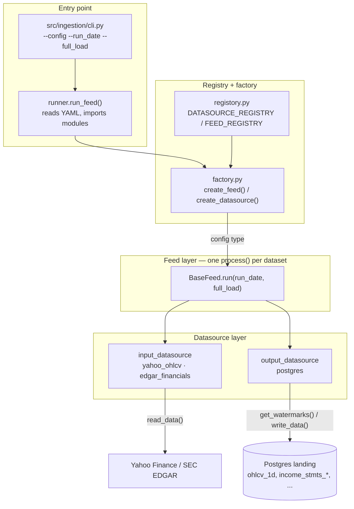
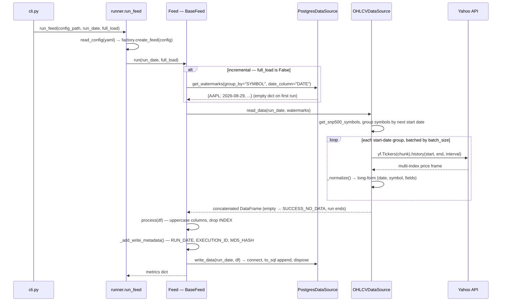

# AURUM — Ingestion Framework Guide

> A developer's map of how datasources and feeds are built, wired, and run.
> This document describes the code that exists today in `src/ingestion/`. The target
> architecture (Kafka, Snowflake, ML, MCP) lives in `docs/TECHNICAL_SPEC.md`.

---

## 1. The one-sentence mental model

A **datasource** knows how to read from one API or write to one store. A **feed** is the workflow: it asks the output datasource for watermarks, asks the input datasource for data, transforms it, stamps run metadata, and writes it back out. Both are chosen **by name from a YAML config** through a registry, so a new source is a new class plus a new file — never new wiring code.

```
        knows the API / store            knows the workflow
      ┌────────────────────────┐       ┌────────────────────────┐
      │      Datasource        │◄──────│         Feed           │
      │ read_data / write_data │ used  │ watermarks → process   │
      └────────────────────────┘  by   └────────────────────────┘
```

---

## 2. How the pieces connect


```mermaid
flowchart TB
    subgraph entry ["Entry point"]
        CLI["src/ingestion/cli.py<br/>--config --run_date --full_load"]
        RUN["runner.run_feed()<br/>reads YAML, imports modules"]
    end

    subgraph reg ["Registry + factory"]
        REGY["registory.py<br/>DATASOURCE_REGISTRY / FEED_REGISTRY"]
        FAC["factory.py<br/>create_feed() / create_datasource()"]
    end

    subgraph feeds ["Feed layer — one process() per dataset"]
        FEED["BaseFeed.run(run_date, full_load)"]
    end

    subgraph ds ["Datasource layer"]
        IN["input_datasource<br/>yahoo_ohlcv · edgar_financials"]
        OUT["output_datasource<br/>postgres"]
    end

    API["Yahoo Finance / SEC EDGAR"]
    PG[("Postgres landing<br/>ohlcv_1d, income_stmts_*, ...")]

    CLI --> RUN --> FAC
    REGY --> FAC
    FAC -->|"config type"| FEED
    FEED --> IN
    FEED --> OUT
    IN -->|"read_data()"| API
    OUT -->|"get_watermarks() / write_data()"| PG
```

**Read it top to bottom:** the CLI hands a YAML path to the runner → the runner imports every feed/datasource module so their decorators register → the factory looks up `config["type"]` → the feed builds its own input and output datasources from the nested config blocks → `run()` executes one pass.

---

## 3. The two contracts

Both are ABCs, not protocols — subclass them.

| Contract | Abstract methods | Who implements it today |
|----------|------------------|-------------------------|
| `BaseDatasource` (`datasources/base_datasource.py`) | `read_data(run_date, watermarks) -> DataFrame`, `write_data(run_date, df)` | `OHLCVDataSource`, `FinancialStmtsDatasource`, `PostgresDataSource` |
| `BaseFeed` (`feed/base_feed.py`) | `process(df) -> DataFrame` | `Ohlcv1d`, `Ohlcv1min`, the six `*Statements` feeds |

Every datasource implements **both** methods, but only one side does real work: API sources stub `write_data` with `...`, and the Postgres sink stubs `read_data`. Sinks additionally implement `get_watermarks`, `connect`, and `disconnect` (declared abstract on the intermediate `Database` class in `datasources/storage/db.py`).

`BaseFeed` owns the entire run loop — metrics, execution id, PK stamping, error handling. A feed subclass writes **only** `process()`.

---

## 4. What each file does

```
src/ingestion/
├── cli.py                        # argparse entry point: --config / --run_date / --full_load
├── runner.py                     # read_config → create_feed → feed.run(); imports every
│                                 #   feed + datasource module so decorators fire (F401 ignored)
│
├── factory/
│   ├── registory.py              # DATASOURCE_REGISTRY / FEED_REGISTRY + the two decorators
│   └── factory.py                # create_datasource(config) / create_feed(config) by "type"
│
├── datasources/
│   ├── base_datasource.py        # BaseDatasource ABC
│   ├── api/                      # read side
│   │   ├── yahoo/ohlcv.py        # @register_datasource("yahoo_ohlcv") — yfinance batch history
│   │   └── edgar/
│   │       ├── financial_stmts.py  # @register_datasource("edgar_financials") — income /
│   │       │                       #   cashflow / balance_sheet, annual or quarterly
│   │       └── income_stmts.py     # superseded by financial_stmts.py; not imported by runner,
│   │                               #   so "edgar_income_stmts" never registers
│   └── storage/db.py             # Database ABC + @register_datasource("postgres")
│                                 #   PostgresDataSource (SQLAlchemy, to_sql append)
│
├── feed/
│   ├── base_feed.py              # BaseFeed ABC — the run loop
│   ├── stock_market.py           # ohlcv_1d, ohlcv_1min
│   └── financial_stmts_feed.py   # income / cashflow / balance_sheet × yearly / quarterly
│
└── configs/
    ├── yahoo/ohlcv_1d.yaml, ohlcv_1min.yaml
    └── edgar/{income,cashflow,balance_sheet}_statements_{yearly,quarterly}.yaml

src/utils/
├── config_reader.py              # read_config(Path) -> dict (yaml.safe_load)
├── env.py                        # load_env() (repo-root .env) + get_sec_user_agent()
└── symbols.py                    # get_snp500_symbols() (Wikipedia), get_sec_symbols() (SEC)
```

> **Registration gotcha.** A decorator only runs when its module is imported. `runner.py` imports
> every feed and datasource module for exactly this reason — its unused imports are deliberate and
> `F401` is silenced for that file in `pyproject.toml`. **Add your import there or the factory will
> raise `Feed type ... not supported`.**

---

## 5. A run, step by step

```bash
# full load (the default)
uv run python -m src.ingestion.cli -c src/ingestion/configs/yahoo/ohlcv_1d.yaml

# incremental — resume from each symbol's watermark
uv run python -m src.ingestion.cli -c src/ingestion/configs/yahoo/ohlcv_1d.yaml -f False
```


```mermaid
sequenceDiagram
    participant C as cli.py
    participant R as runner.run_feed
    participant F as Feed — BaseFeed
    participant O as PostgresDataSource
    participant I as OHLCVDataSource
    participant Y as Yahoo API

    C->>R: run_feed(config_path, run_date, full_load)
    R->>R: read_config(yaml) → factory.create_feed(config)
    R->>F: run(run_date, full_load)
    alt incremental — full_load is False
        F->>O: get_watermarks(group_by="SYMBOL", date_column="DATE")
        O-->>F: {AAPL: 2026-08-29, ...}   (empty dict on first run)
    end
    F->>I: read_data(run_date, watermarks)
    I->>I: get_snp500_symbols, group symbols by next start date
    loop each start-date group, batched by batch_size
        I->>Y: yf.Tickers(chunk).history(start, end, interval)
        Y-->>I: multi-index price frame
        I->>I: _normalize() → long-form (date, symbol, fields)
    end
    I-->>F: concatenated DataFrame (empty → SUCCESS_NO_DATA, run ends)
    F->>F: process(df) — uppercase columns, drop INDEX
    F->>F: _add_write_metadata() — RUN_DATE, EXECUTION_ID, MD5_HASH
    F->>O: write_data(run_date, df)  → connect, to_sql append, dispose
    F-->>R: metrics dict
```

The **incremental behaviour** lives in the grouping step: a symbol whose watermark is already at or past `run_date` is skipped entirely — zero API calls. A missing landing table makes `get_watermarks` return `{}` (logged, not raised), so the first run naturally behaves as a full load.

---

## 6. Config is the whole wiring

One YAML fully describes a run. There is no per-feed Python wiring.

```yaml
feed_name: "ohlcv_1d"          # label for logs/metrics
type: "ohlcv_1d"               # → FEED_REGISTRY key
full_load: false               # informational only — the CLI -f value is what runs
watermark_group_by: "SYMBOL"   # passed to get_watermarks()
watermark_date_column: "DATE"

input_datasource:
  type: "yahoo_ohlcv"          # → DATASOURCE_REGISTRY key
  name: "ohlcv_1d_source"
  interval: "1d"               # datasource-specific tunables, read via config.get()
  batch_size: 100
  sleep_seconds: 10
  history_floor: "2000-01-01"  # start date when a symbol has no watermark

output_datasource:
  type: "postgres"
  name: "ohlcv_1d_sink"
  host: "HOST"                 # ← env var NAMES, not values (os.getenv at connect time)
  port: "PORT"
  username: "AURUM_USERNAME"
  password: "AURUM_PASSWORD"
  db_name: "aurum"
  db_schema: "public"
  table: "ohlcv_1d"
  primary_key: "MD5_HASH"      # column that receives the hash
  cols_for_pk:                 # required — hashed to build the deterministic key
    - "SYMBOL"
    - "DATE"
```

EDGAR configs swap the input block for `type: edgar_financials` with `stmt_type`
(`income` | `cashflow` | `balance_sheet`), `period` (`annual` | `quarterly`), `periods`,
`max_workers`, `timeout`, and key on `["SYMBOL", "QTR"]`.

Secrets live in `.env` at the repo root and are referenced **by name**:

```
SEC_USER_AGENT=AURUM-Project you@example.com
HOST=localhost
PORT=5432
AURUM_USERNAME=...
AURUM_PASSWORD=...
```

> **Gotcha:** `config["username"]` holds the *name of an environment variable*, and
> `PostgresDataSource.connect()` resolves it with `os.getenv`. Putting a literal username in the
> YAML yields a `None` in the connection string.

---

## 7. Conventions the framework assumes

- **Uppercase columns.** Every `process()` uppercases the frame's columns, and configs
  (`cols_for_pk`, `watermark_group_by`, `watermark_date_column`) use uppercase names. Postgres
  identifiers are quoted in the watermark query, so case is significant.
- **Deterministic primary key.** `_add_write_metadata` builds
  `md5("COL=value||COL=value")` over `cols_for_pk` (nulls become `<NULL>`) into the
  `primary_key` column, alongside `RUN_DATE` and `EXECUTION_ID`. Missing key columns raise.
- **`run()` never raises.** Failures are caught, logged, and returned as
  `execution_status: FAILED` in the metrics dict — check the return value; a zero exit code does
  not mean the load succeeded.
- **Watermark identifiers are validated,** not parameterised (SQL identifiers can't be bound), so
  table/schema/column names must be alphanumeric + underscore.
- **EDGAR / Wikipedia need an honest `User-Agent`** — SEC is capped at 10 req/s. Every API
  datasource pulls it from `SEC_USER_AGENT` via `src/utils/env.get_sec_user_agent()`, which raises
  if the variable is unset. `symbols.py` still takes it as an argument.
- **Full load is the default.** `--full_load` / `-f` takes an explicit `True` or `False`
  (`true/yes/1` and `false/no/0` also parse; anything else is an argparse error) and defaults to
  `True`, so a bare run re-pulls history. Pass `-f False` to run incrementally from the watermarks.
  The `full_load` key in the YAML is **not** read — the CLI value is the only one that reaches
  `BaseFeed.run`.

---

## 8. How to add a new datasource

Example: adding a news source.

**1. Datasource** — `src/ingestion/datasources/api/news/headlines.py`:

```python
@register_datasource("news_headlines")
class HeadlinesDatasource(BaseDatasource):
    def read_data(self, run_date: str, watermarks: Dict[str, date]) -> pd.DataFrame:
        ...          # honour watermarks; return a tidy frame

    def write_data(self, run_date: str, data: pd.DataFrame) -> None:
        ...          # not required for an API source
```

**2. Feed** — `src/ingestion/feed/news_feed.py`:

```python
@register_feed("news_sentiment")
class NewsSentiment(BaseFeed):
    def process(self, data: pd.DataFrame) -> pd.DataFrame:
        data.columns = [c.upper() for c in data.columns]
        return data
```

**3. Config** — `src/ingestion/configs/news/sentiment.yaml`, with `type: news_sentiment`, the
input block pointing at `news_headlines`, and an output block naming the landing table plus
`cols_for_pk`.

**4. Wire the imports** — add both modules to the import block in `src/ingestion/runner.py`.

**5. Run it** — `uv run python -m src.ingestion.cli -c src/ingestion/configs/news/sentiment.yaml`.

You touch one datasource file, one feed file, one YAML, and one import line — nothing in
`base_feed.py`, `factory/`, or any other source.

---

## 9. Why it's built this way

| You want to… | You change… | You do NOT touch… |
|--------------|-------------|-------------------|
| Land in Kafka/Snowflake instead of Postgres | add a datasource with `@register_datasource("kafka")`, swap `output_datasource.type` | any feed, any API source |
| Replace yfinance (it broke again) | one datasource class | feeds, sinks, configs |
| Add a new dataset from an existing API | a feed + a YAML | the datasource |
| Run incrementally instead of a full backfill | pass `-f False` | code |
| Change the universe (S&P rebalance) | `src/utils/symbols.py` | everything else |
| Change the dedup key | `cols_for_pk` in the YAML | code |

---

## 10. Known rough edges

Worth knowing before you build on this:

- `datasources/api/edgar/income_stmts.py` is superseded by `financial_stmts.py` and is not imported
  by `runner.py`, so its `edgar_income_stmts` type never lands in the registry.
- `Database.write_data` appends with `to_sql`, so the MD5 key is computed but **not** enforced as a
  constraint — re-running the same window duplicates rows. Idempotent upsert is still to be built.
- `src/ingestion/schema/` is empty; there is no schema validation layer yet.
- There are no tests for any of this (`tests/` is empty, and CI's pytest step is commented out).
