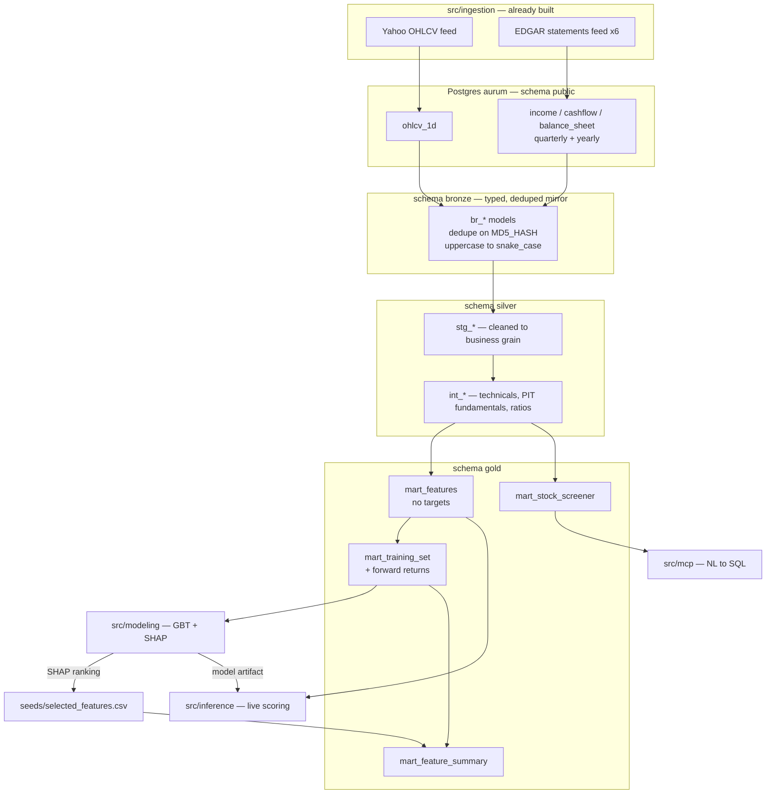
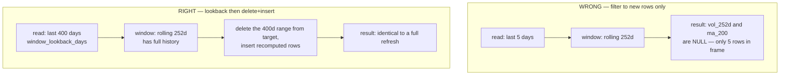
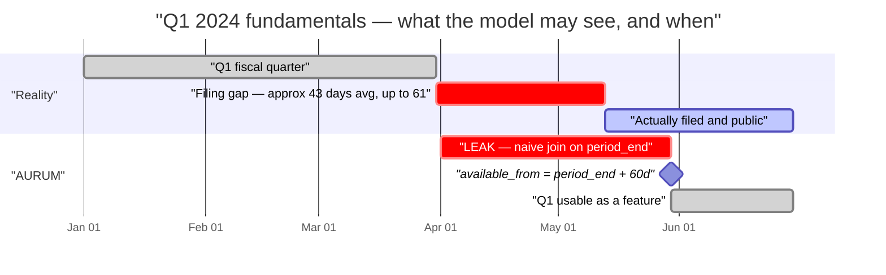
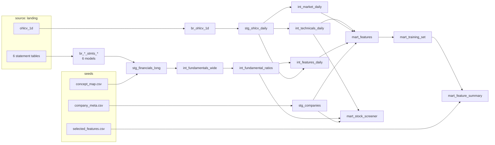

# aurum_dwh — Bronze/Silver/Gold medallion for ML + SHAP

> **Status: plan, not built.** Approved 2026-09-02. Nothing in this document exists in
> `src/transformation/aurum_dwh/` yet — that directory is still the `dbt init` scaffold.
> Delete or rewrite this file into `docs/dwh-medallion.md` once the phases land.

## Context

`src/transformation/aurum_dwh/` is still the raw `dbt init` scaffold: two example models, no sources, no tests, `target/` and `logs/` committed to git. Meanwhile `src/ingestion/` already lands real data in Postgres `aurum`. Nothing connects the two, so there is no ML-ready dataset and no way to train or explain a model.

This plan builds the warehouse that closes that gap: landing tables → BRONZE (typed, deduped mirror) → SILVER (technicals, point-in-time fundamentals, ratios) → GOLD (`mart_features` feature store, `mart_training_set` with forward-return targets, `mart_stock_screener` for the future MCP server).

Decisions taken with the user:

| Decision | Choice |
|---|---|
| Warehouse | **Postgres only** — existing `aurum_dwh` profile, `dbt-snowflake` stays out of deps |
| Look-ahead guard | **Conservative lag in dbt** — quarterly fundamentals knowable at `period_end + 60d`, annual `+ 90d`, both dbt vars |
| ML target | **Forward N-day return, ticker × day grain** — `fwd_ret_5d`, `fwd_ret_21d`, plus cross-sectional decile rank |
| Scope | **Daily only** — `ohlcv_1d` + all 6 EDGAR statement tables. `ohlcv_1min` and news are out |

## Ground truth about the inputs

Landing tables, all in Postgres db `aurum`, schema `public` (from `src/ingestion/configs/**`):

| Table | Grain | PK cols | Notes |
|---|---|---|---|
| `ohlcv_1d` | SYMBOL × DATE | SYMBOL, DATE | `src/ingestion/configs/yahoo/ohlcv_1d.yaml` |
| `income_stmts_quarterly` / `_yearly` | SYMBOL × QTR\|FY × CONCEPT | SYMBOL, QTR\|FY | long format |
| `cashflow_stmts_quarterly` / `_yearly` | same | same | |
| `balance_sheet_stmts_quarterly` / `_yearly` | same | same | |

Every table also carries `RUN_DATE`, `EXECUTION_ID`, `MD5_HASH` from `BaseFeed._add_write_metadata`. All identifiers are **uppercase and quoted** in Postgres.

Three input realities the models must absorb:

1. **Landing appends, never upserts.** `PostgresDataSource.write_data` (`src/ingestion/datasources/storage/db.py:27`) uses `to_sql(if_exists='append')`. Re-runs duplicate rows. Every BRONZE model must dedupe on `MD5_HASH` keeping the latest `EXECUTION_ID`.
2. **EDGAR feeds run `full_load: true`.** Each run re-lands the entire statement history. Deduping is not optional.
3. **No `filed_date`, no `cik`, no `form_type`.** `FinancialStmtsDatasource._melt_statement` (`src/ingestion/datasources/api/edgar/financial_stmts.py:29`) emits `CONCEPT`/`LABEL`/`QTR`|`FY`/`VALUE`/`SYMBOL` only. `docs/data-dictionary.md` describes an `edgar_facts` shape with `filed_date` that **does not exist in code** — that doc is aspirational and is corrected by this plan's docs step.

> Exact EDGAR column list is inferred from `_melt_statement`, not observed. **Step 1.1 introspects the live tables before any model is written.**

## Architecture



Schemas `bronze`, `silver`, `gold` in the same Postgres db. Requires a `generate_schema_name` macro override so dbt writes to the literal schema instead of `bronze_silver`.

## Phase 0 — Scaffolding and cleanup

Files: `src/transformation/aurum_dwh/`

- Delete `models/example/` (4 files) and the committed `target/` + `logs/` trees; add them to `src/transformation/aurum_dwh/.gitignore`. Also delete stray `src/transformation/logs/`.
- `macros/generate_schema_name.sql` — standard override returning `custom_schema_name` verbatim when set.
- `packages.yml` — `dbt-labs/dbt_utils` (surrogate keys, `date_spine`, `star`, `pivot`), `calogica/dbt_expectations` (range + distribution tests).
- `dbt_project.yml` — replace the `example:` block with per-layer materializations and the project vars:

```yaml
models:
  aurum_dwh:
    bronze:  {+schema: bronze,  +materialized: incremental}
    silver:  {+schema: silver,  +materialized: incremental}
    gold:    {+schema: gold,    +materialized: table}
vars:
  fundamental_lag_days_quarterly: 60
  fundamental_lag_days_annual: 90
  risk_free_annual: 0.045
  window_lookback_days: 400   # history re-read by incremental window models
  min_price: 1.0
  min_adv_usd: 1000000
```

- Seeds (`seeds/`), all human-maintained CSVs:
  - `company_meta.csv` — `symbol,company_name,sector,industry`. Sector is required for sector-relative features and is not in any landing table. Generate once from `get_snp500_symbols` (`src/utils/symbols.py:29`) via a throwaway script; commit the CSV.
  - `concept_map.csv` — `concept,canonical_name,statement,sign`. Maps raw XBRL concept strings to the canonical names below, with fallbacks (`Revenues` **and** `RevenueFromContractWithCustomerExcludingAssessedTax` → `revenue`). This seed is the single place issuer tag variation is handled.
  - `selected_features.csv` — `feature_name,rank,mean_abs_shap`. Written by the SHAP loop; ships with one placeholder row so `mart_feature_summary` compiles before any model is trained.

## Phase 1 — BRONZE

Files: `models/bronze/_sources.yml`, `models/bronze/br_*.sql`, `models/bronze/_bronze_models.yml`

1.1 **Introspect first.** `\d+ public."ohlcv_1d"` and one EDGAR table; confirm actual column names (esp. whether the melted frame carries `LABEL`, `LEVEL`, `ABSTRACT`, `DIMENSION`, and whether Yahoo emits `"ADJ CLOSE"` / `"STOCK SPLITS"` with spaces). Adjust the models to what is there.

1.2 `_sources.yml` — declare the 7 in-scope landing tables under source `landing` (schema `public`), with `freshness` on `RUN_DATE` and `not_null` on the PK columns.

1.3 One bronze model per source, all following the same pattern:

```sql
{{ config(materialized='incremental', unique_key='md5_hash',
          incremental_strategy='delete+insert') }}
with ranked as (
  select *, row_number() over (
      partition by "MD5_HASH" order by "EXECUTION_ID" desc, "RUN_DATE" desc
    ) as rn
  from {{ source('landing','ohlcv_1d') }}
  
    where "RUN_DATE" >= (select max(run_date) from {{ this }})
                        - interval '{{ var("window_lookback_days") }} days'
  
)
select ... from ranked where rn = 1
```

Lowercase and snake_case every column here — this is the one place the uppercase convention ends; SILVER and GOLD are plain lowercase. Cast types explicitly (`numeric` for prices, `bigint` for volume, `date` for dates).

Models: `br_ohlcv_1d`, `br_income_stmts_quarterly`, `br_income_stmts_yearly`, `br_cashflow_stmts_quarterly`, `br_cashflow_stmts_yearly`, `br_balance_sheet_stmts_quarterly`, `br_balance_sheet_stmts_yearly`.

Tests: `unique` on `md5_hash`, `not_null` on keys, `dbt_expectations.expect_column_values_to_be_between` on prices (`> 0`).

## Phase 2 — SILVER staging

Files: `models/silver/staging/stg_*.sql`, `models/silver/staging/_staging_models.yml`

**`stg_ohlcv_daily`** — grain `symbol × date`.
- Dedupe to one row per `(symbol, date)`.
- Drop rows with `volume = 0` or null/non-positive `close` (halts, bad ticks).
- Derive `adj_factor = adj_close / close`; adjust `open/high/low` by it so all OHLC is split- and dividend-consistent. **All downstream price features use adjusted prices** — unadjusted prices produce fake ±50% returns on split days.
- Add `dollar_volume = close * volume`.

**`stg_financials_long`** — grain `symbol × statement × period × concept`.
- `union all` of the 6 bronze statement models, each tagged `statement` (`income`/`cashflow`/`balance_sheet`) and `period_type` (`quarterly`/`annual`).
- Parse the period label into a real date: `'Q1 2024'` / `'FY2024'` → `fiscal_period_end`. Keep the raw label. This parser is the most fragile piece — cover it with a dedicated singular test asserting zero unparsed labels.
- Join `seeds/concept_map.csv` to attach `canonical_name`; keep unmapped concepts with `canonical_name is null` (so coverage is measurable, not silently lost).
- Dedupe on `(symbol, statement, period_type, fiscal_period_end, concept)` keeping the latest `execution_id` — this is where the amendment-supersedes rule from the spec lands, approximated by "latest ingest wins".

**`stg_companies`** — `seeds/company_meta.csv` cleaned, one row per symbol; the sector dimension.

## Phase 3 — SILVER intermediate

Files: `models/silver/intermediate/int_*.sql`

**`int_fundamentals_wide`** — grain `symbol × period_type × fiscal_period_end`.
- Pivot `canonical_name` → columns via `dbt_utils.pivot` over the concept map's distinct canonical names: `revenue`, `gross_profit`, `operating_income`, `net_income`, `eps_basic`, `eps_diluted`, `shares_outstanding`, `total_assets`, `total_liabilities`, `total_equity`, `long_term_debt`, `cash_and_equivalents`, `inventory`, `receivables`, `interest_expense`, `operating_cash_flow`, `capex`, `depreciation_amortization`.
- **TTM columns for flow items** — `revenue_ttm`, `net_income_ttm`, `operating_cash_flow_ttm`, `eps_ttm`, `capex_ttm`: 4-quarter rolling sum on the quarterly rows. Single-quarter fundamentals are seasonally noisy; TTM is what ratios should use.
- **`available_from`** = `fiscal_period_end + lag`, using the quarterly/annual var. Every downstream join keys on this column, never on `fiscal_period_end`.

**`int_fundamental_ratios`** — same grain, adds the derived fundamentals (list in "Feature set" below). Guard every division with `nullif(denominator, 0)`.

**`int_technicals_daily`** — grain `symbol × date`, window functions over `stg_ohlcv_daily` partitioned by `symbol` ordered by `date`.
- Incremental with the lookback window: rolling 252-day features need history, so `is_incremental()` filters `date >= (select max(date) from {{ this }}) - interval '{{ var("window_lookback_days") }} days'` and the model uses `delete+insert` on the date range. **Getting this wrong silently produces null/NaN long-window features on every incremental run** — this is the highest-risk detail in the plan.



Rule: any model with a rolling window of N days needs `window_lookback_days > N`, and must rewrite that whole range rather than append. 400 > 252 with headroom for non-trading days. Verification step 3 exists solely to catch a violation of this.

**`int_market_daily`** — grain `date`. Equal-weight universe return and volatility (the market regime features and the beta denominator).

**`int_features_daily`** — the as-of join. For each `(symbol, date)`, attach the most recent `int_fundamental_ratios` row where `available_from <= date`, via `distinct on (symbol, date)` ordered by `available_from desc` (Postgres-native, cheaper than a correlated subquery). Adds `days_since_available` — itself a useful staleness feature.

### The point-in-time rule, visually

Q1 ends 2024-03-31. Naively joining on `fiscal_period_end` lets the model see Q1 numbers on 2024-04-01 — but nobody could. The lag var pushes visibility to 2024-05-30.



The 60-day var sits deliberately *past* the average 43-day filing gap. Over-lagging costs a little signal freshness; under-lagging invents alpha that does not exist. Swap the lag for a true `filed_date` join once ingestion carries it.

### Model DAG



## Phase 4 — Feature set

Researched against current cross-sectional / fundamental ML practice (sources at the bottom). Everything below is computable from the data actually landed.

```mermaid
flowchart LR
    F["~90 raw features"]

    F --> P["Price / momentum<br/>ret_1d..252d, mom_12_1,<br/>MAs, 52w distance"]
    F --> V["Volatility / risk<br/>vol_21/63/252, parkinson,<br/>ATR, drawdown, sharpe, beta"]
    F --> L["Liquidity<br/>adv_21d, amihud_illiq,<br/>turnover, volume z"]
    F --> O["Oscillators<br/>RSI, MACD, bollinger, stoch"]
    F --> FU["Fundamentals — PIT lagged"]
    F --> R["Regime / calendar<br/>market ret, vol, breadth"]

    FU --> FU1["Profitability<br/>margins, ROE, ROA, ROIC"]
    FU --> FU2["Growth<br/>QoQ + YoY on rev, EPS, NI, OCF"]
    FU --> FU3["Valuation<br/>PE, PS, PB, FCF yield, EV/EBITDA"]
    FU --> FU4["Leverage<br/>D/E, debt/mktcap, coverage"]
    FU --> FU5["Quality<br/>accruals, OCF/NI,<br/>asset turnover, buybacks"]

    P --> X
    V --> X
    L --> X
    O --> X
    FU --> X
    R --> X

    X["Cross-sectional transform<br/>per date, across S&amp;P 500"]
    X --> X1["_z — winsorized 1/99 then z-scored"]
    X --> X2["_decile — rank within date"]
    X --> X3["_vs_sector — minus sector median"]
```



The cross-sectional layer is what turns this from "indicators on one stock" into a panel a ranking model can learn from: a P/E of 30 means nothing absolute, but "top decile P/E within tech, today" does.

**Momentum & trend** (adjusted close)
`ret_1d`, `ret_5d`, `ret_21d`, `ret_63d`, `ret_126d`, `ret_252d`; `mom_12_1` (252d return excluding the last 21d — the canonical momentum factor; skipping the recent month avoids short-term-reversal contamination); `reversal_5d`; `ma_10/20/50/200`; `price_to_ma_50`, `price_to_ma_200`, `ma_50_over_200`; `dist_from_52w_high`, `dist_from_52w_low`; `gap_overnight`.

**Volatility & risk**
`vol_21d`, `vol_63d`, `vol_252d` (annualized stdev of daily log returns); `parkinson_vol_21d` (high–low estimator, far more efficient than close-to-close); `atr_14`, `atr_pct`; `downside_dev_21d`; `max_drawdown_252d`; `sharpe_21d`, `sharpe_63d` (uses `risk_free_annual` var, matching the `docs/data-dictionary.md` formula); `beta_252d` vs `int_market_daily`; `idio_vol_252d` (residual vol).

**Liquidity & volume**
`adv_21d` (avg dollar volume); `volume_zscore_21d`; `amihud_illiq_21d` = `mean(abs(ret) / dollar_volume)` — the standard illiquidity factor; `turnover_21d` = `volume / shares_outstanding`; `obv_slope_21d`.

**Oscillators**
`rsi_14`; `macd`, `macd_signal`, `macd_hist` (12/26/9); `bollinger_pctb_20`, `bollinger_width_20`; `stoch_k_14`.

**Fundamental — profitability**
`gross_margin`, `operating_margin`, `net_margin`, `roe`, `roa`, `roic`.

**Fundamental — growth**
`revenue_growth_qoq`, `revenue_growth_yoy`, `eps_growth_yoy`, `net_income_growth_yoy`, `ocf_growth_yoy`.

**Fundamental — valuation** (fundamentals joined to *that day's* price, so these move daily)
`market_cap`, `price_to_earnings` (on `eps_ttm`), `earnings_yield`, `price_to_sales`, `price_to_book`, `fcf_yield` (`(ocf_ttm − capex_ttm) / market_cap`), `ev_to_ebitda`.

**Fundamental — leverage & health**
`debt_to_equity`, `debt_to_market_cap`, `current_ratio`, `interest_coverage`, `net_debt_to_ebitda`.

**Fundamental — quality** (the highest-value block, and the one most often skipped)
`accruals` = `(net_income_ttm − operating_cash_flow_ttm) / total_assets` — Sloan's accrual anomaly, one of the best-documented cross-sectional predictors; `ocf_to_net_income` (earnings quality); `asset_turnover`; `capex_to_revenue`; `shares_change_yoy` (negative = buyback).

**Cross-sectional transforms** — for each of the above, per `date` across the universe: `_z` (winsorized at 1/99 pct then z-scored) and `_decile`. Raw levels are not comparable across sectors or regimes; the model should see relative position. Plus sector-relative `_vs_sector` (value minus that date's sector median, via `stg_companies`).

**Regime & calendar**
`market_ret_21d`, `market_vol_21d`, `market_breadth` (share of universe above its 50d MA); `day_of_week`, `month`, `is_month_end`, `is_quarter_end`; `days_since_available` (fundamental staleness).

**Targets** (in `mart_training_set` only, never in `mart_features`)
`fwd_ret_5d`, `fwd_ret_21d` (forward log returns); `fwd_ret_5d_excess` (minus universe mean that day); `fwd_ret_5d_xs_decile` (cross-sectional rank — the label for ranking models); `label_up_5d`. All null for the last N days by construction; a test asserts they are **null, not zero**.

## Phase 5 — GOLD

Files: `models/gold/mart_*.sql`, `models/gold/_gold_models.yml`

- **`mart_features`** — `symbol × date`, every feature above, **no targets**. This is what live inference reads, so it must be target-free by construction.
- **`mart_training_set`** — `mart_features` + targets + `fold_id` for walk-forward splits (assigned by calendar month; **never random**), filtered by the `min_price` / `min_adv_usd` vars to drop untradeable names.
- **`mart_feature_summary`** — `mart_training_set` narrowed to the columns listed in `seeds/selected_features.csv`. Regenerating this after a SHAP run is `dbt seed && dbt run --select mart_feature_summary`; that is the whole feature-selection loop from spec §3.7.
- **`mart_stock_screener`** — one row per symbol, latest date: latest price, headline fundamentals, ratios, technicals, sector. The MCP server's query target; columns match the `docs/data-dictionary.md` screener table.

**Tests** (`_gold_models.yml` plus `tests/`):
- `unique_combination_of_columns` on `(symbol, date)`; `relationships` from `symbol` to `stg_companies`.
- `dbt_expectations` range tests: `net_margin` between -10 and 1, `price_to_earnings` between -1000 and 1000, `rsi_14` between 0 and 100.
- **`tests/assert_no_lookahead.sql`** — zero rows where `fundamental_available_from > feature_date`. The single most important test in the project.
- **`tests/assert_targets_null_at_edge.sql`** — `fwd_ret_5d` is null for the last 5 trading dates.
- **`tests/assert_concept_map_coverage.sql`** — fails if unmapped-concept share of total absolute value exceeds 5%.
- **`tests/assert_period_labels_parsed.sql`** — zero null `fiscal_period_end`.

## Phase 6 — Docs

- Rewrite the SILVER/GOLD sections of `docs/data-dictionary.md` to the shipped models. Replace the `edgar_facts` / `market_ohlcv_1m` landing tables with the real `ohlcv_1d` + 6 statement tables, and state plainly that the PIT guard is a lag approximation because `filed_date` is not ingested.
- New `docs/dwh-medallion.md`: layer map, feature catalogue, the lag decision and its cost, the incremental-lookback rule, how to add a feature, how the SHAP loop feeds `selected_features.csv`.
- Update `CLAUDE.md` ("Project state" + a dbt commands block) and `README.md`.
- File a follow-up issue: *add `filed_date`, `form_type`, `accession_no` to the EDGAR datasource*, so the lag can be swapped for a true point-in-time join.

## Verification

```bash
cd src/transformation/aurum_dwh
# dbt is in the `dbt` dependency group, not the default sync — --group dbt is required
uv run --group dbt dbt debug                     # Postgres aurum reachable, profile aurum_dwh
uv run --group dbt dbt deps && uv run --group dbt dbt seed
uv run --group dbt dbt build --select bronze     # models + tests, layer at a time
uv run --group dbt dbt build --select silver
uv run --group dbt dbt build --select gold
uv run --group dbt dbt test --select tag:leakage # assert_no_lookahead / target-edge tests
```

Then the checks dbt cannot make for you:

1. **Split sanity** — pick a symbol with a known split (e.g. `NVDA` 2024-06-10); confirm `ret_1d` there is small, not ~-90%. Proves the adjusted-price path.
2. **Feature coverage** — `select count(*) filter (where price_to_earnings is null)::float / count(*) from gold.mart_features;` Above ~40% means the concept map is missing tags; inspect `stg_financials_long where canonical_name is null` ordered by frequency.
3. **Incremental correctness** — full `dbt build`, snapshot `mart_features` row counts and a checksum of the last 30 days; then re-run incrementally and confirm identical numbers. Catches a too-short `window_lookback_days`.
4. **Leakage spot-check** — for one symbol, verify `fundamental_available_from` on a given day is ~60 days past the fiscal quarter end, and that the value equals the *previous* quarter's, not the one just ended.
5. **End-to-end** — pull `mart_training_set` into pandas, fit a quick LightGBM on `fwd_ret_5d` with walk-forward folds, run `shap.TreeExplainer`. Success is a ranked feature list, not accuracy — this exists to prove the contract is trainable and SHAP-able.

## Out of scope

`ohlcv_1min` rollups, news sentiment, Kafka, Snowflake, Airflow orchestration, the training code in `src/modeling/`, and the MCP server. `mart_stock_screener` and `mart_feature_summary` are built to *their* contracts so those pieces can land without reshaping the warehouse.

## Sources

- [Point-In-Time vs. Lagged Fundamentals — S&P Global](https://www.spglobal.com/content/dam/spglobal/mi/en/documents/general/sp-capitaliq-quantamental-point-in-time-vs-lagged-fundamentals.pdf)
- [Lookahead Bias in Fundamental Backtests: 66 Days, Measured](https://tradevodata.com/blog/lookahead-bias-fundamental-backtests)
- [Fundamental and Alternative Data — ML for Trading](https://ml4trading.io/third-edition/chapters/04_fundamental_alternative_data/)
- [ML-Enhanced Multi-Factor Quantitative Trading: A Cross-Sectional Portfolio Optimization Approach](https://arxiv.org/html/2507.07107)
- [AI Models for Predicting Stock Returns Using Fundamental, Technical, and Entropy-Based Strategies](https://www.mdpi.com/1099-4300/27/6/550)
- [Cross-Sectional Equity Factor Overview](https://www.emergentmind.com/topics/cross-sectional-equity-factor)
