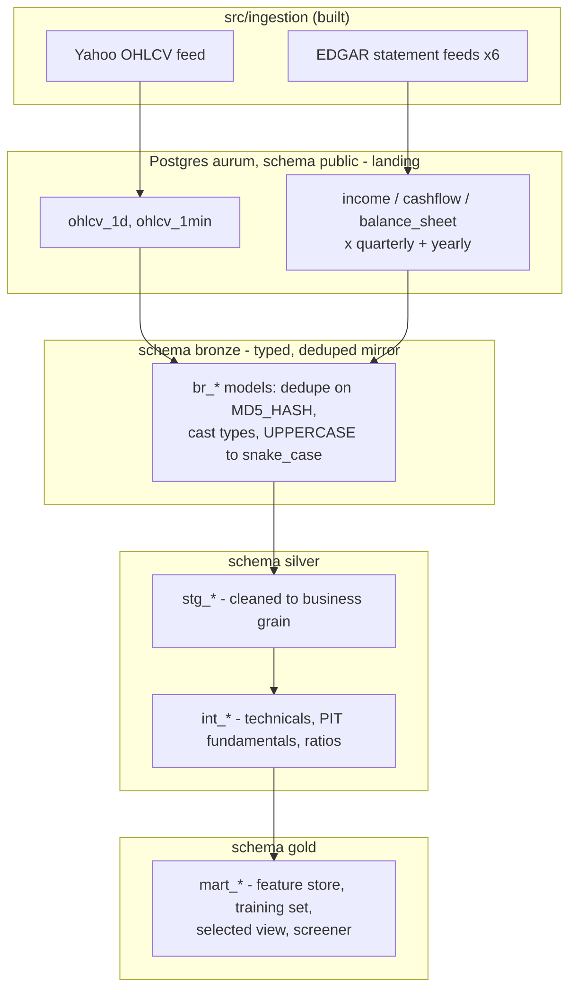
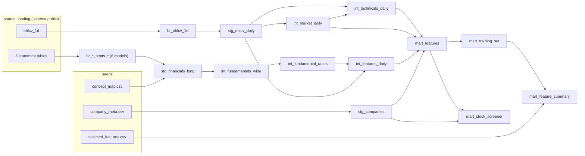
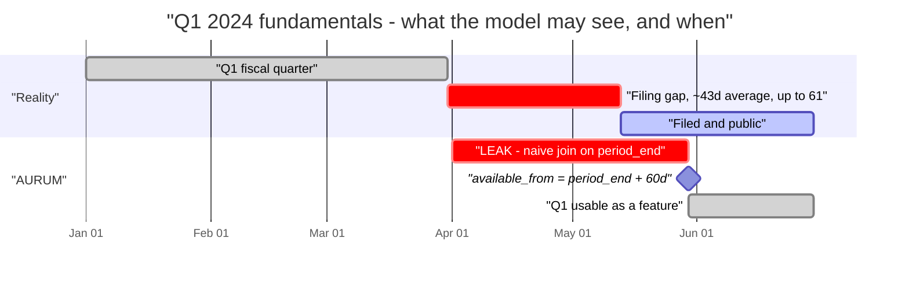
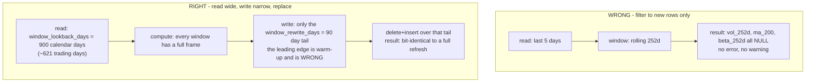
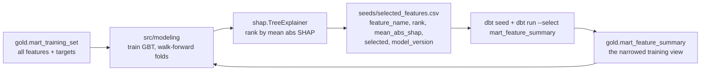

# AURUM data warehouse — the medallion as built

> **Status: built and running.** This document describes `src/transformation/aurum_dwh/` as it
> exists in code, not a target design. It replaces `dwh-medallion-plan.md`, which was the approved
> plan (GH-33 … GH-36) and has been folded into this file.
>
> Numbers quoted below were measured against the local Postgres warehouse on **2026-09-05**.
> They will drift as data lands; the shapes and rules will not.

Contents:

1. [What exists](#what-exists)
2. [Layer map](#layer-map)
3. [Model DAG](#model-dag)
4. [What each layer is allowed to do](#what-each-layer-is-allowed-to-do)
5. [The point-in-time lag decision, and what it costs](#the-point-in-time-lag-decision-and-what-it-costs)
6. [The incremental-lookback rule](#the-incremental-lookback-rule)
7. [Feature catalogue](#feature-catalogue)
8. [The cross-sectional transform](#the-cross-sectional-transform)
9. [Targets, folds and the leakage contract](#targets-folds-and-the-leakage-contract)
10. [How to add a feature](#how-to-add-a-feature)
11. [The SHAP loop and `selected_features.csv`](#the-shap-loop-and-selected_featurescsv)
12. [Commands and verification](#commands-and-verification)
13. [Known approximations and debt](#known-approximations-and-debt)

---

## What exists

A dbt project against **local Postgres** (database `aurum`), not Snowflake. The `aurum_dwh`
profile in `~/.dbt/profiles.yml` targets it; the separate `aurum` profile pointing at Snowflake is
unused by this project. `macros/generate_schema_name.sql` is overridden so the layer schemas are
written verbatim as `bronze`, `silver`, `gold` instead of being prefixed with the profile schema.

| Layer | Schema | Models | Materialization |
|---|---|---|---|
| Bronze | `bronze` | 8 `br_*` mirrors + 3 seeds | `incremental`, `delete+insert` |
| Silver staging | `silver` | 3 `stg_*` | `incremental` (2) / `table` (1) |
| Silver intermediate | `silver` | 5 `int_*` | `incremental` (3) / `table` (2) |
| Gold | `gold` | 4 `mart_*` | `table` |

237 tests are defined (schema tests plus 6 singular tests in `tests/`). Two of them — the
`net_margin` and `price_to_earnings` range tests on `mart_features` — are configured with warn/error
thresholds rather than zero tolerance, because a small number of rows genuinely sit outside the
bounds; see [Known approximations](#known-approximations-and-debt).

**Scope.** Daily bars plus all six EDGAR statement tables. `ohlcv_1min` is mirrored into bronze but
nothing downstream reads it. News/sentiment is not ingested anywhere, so no model has a sentiment
column. Kafka, Snowflake and Airflow are not in this path.

Measured size, 2026-09-05:

| Relation | Rows | Notes |
|---|---:|---|
| `bronze.br_ohlcv_1d` | 2,941,914 | 503 symbols, 2000-01-03 → 2026-09-02 |
| `silver.stg_ohlcv_daily` | 2,935,412 | 6,502 bad-tick rows dropped |
| `silver.stg_financials_long` | 1,878,625 | union of 6 statement mirrors, deduped |
| `silver.int_fundamentals_wide` | 20,032 | one row per symbol × period_type × period end |
| `silver.int_market_daily` | 6,707 | one row per traded date |
| `gold.mart_features` | 2,935,412 | the feature store |
| `gold.mart_training_set` | 2,895,171 | after the tradability filter; 321 monthly folds |
| `gold.mart_stock_screener` | 503 | one row per symbol |

---

## Layer map



Rules that hold across the whole warehouse:

- **Nothing outside bronze reads `source('landing', ...)`.** Dedup and typing happen once.
- **Uppercase stops at bronze.** Landing identifiers are quoted uppercase (`"SYMBOL"`, `"ADJ CLOSE"`);
  everything from `br_*` down is plain snake_case.
- **ML and MCP read only gold.** `mart_features` for inference, `mart_training_set` /
  `mart_feature_summary` for training, `mart_stock_screener` for the future NL→SQL server.

---

## Model DAG



Two edges are easy to miss and load-bearing:

- **`int_market_daily` → `int_technicals_daily`.** The market series is joined *before* the 252-day
  window, because `beta_252d` and `idio_vol_252d` regress the symbol return on the market return over
  the same frame. Attaching the market downstream would leave nothing to regress against.
- **`mart_features` → `mart_stock_screener`.** The screener reads the finished feature store, not the
  intermediate models, so its cross-sectional columns (`earnings_yield_decile`,
  `net_margin_vs_sector`) are the same numbers the model sees.

Model inventory:

| Model | Grain | Materialization | Rows |
|---|---|---|---:|
| `br_ohlcv_1d` / `br_ohlcv_1min` | symbol × bar | incremental | 2,941,914 / 918,316 |
| `br_{income,cashflow,balance_sheet}_stmts_{quarterly,yearly}` | symbol × period × concept | incremental | 245k–423k each |
| `stg_ohlcv_daily` | symbol × date | incremental | 2,935,412 |
| `stg_financials_long` | symbol × statement × period_type × period_end × concept | incremental | 1,878,625 |
| `stg_companies` | symbol | table | 503 |
| `int_market_daily` | date | incremental | 6,707 |
| `int_technicals_daily` | symbol × date | incremental | 2,935,412 |
| `int_fundamentals_wide` | symbol × period_type × fiscal_period_end | table | 20,032 |
| `int_fundamental_ratios` | same | table | 20,032 |
| `int_features_daily` | symbol × date | incremental | 2,935,412 |
| `mart_features` | symbol × date | table | 2,935,412 |
| `mart_training_set` | symbol × date | table | 2,895,171 |
| `mart_feature_summary` | symbol × date | table | 2,895,171 |
| `mart_stock_screener` | symbol | table | 503 |

---

## What each layer is allowed to do

### Bronze — mirror, three jobs only

1. **Deduplicate.** `src/ingestion` writes with `to_sql(if_exists='append')`, so a re-run appends
   duplicate rows and the EDGAR feeds re-land their whole history every run. Bronze keeps one row per
   `MD5_HASH`, ordered by `EXECUTION_ID desc, RUN_DATE desc` — the execution id is a
   `YYYYMMDD_HHMMSSssssss` stamp, so a descending string sort is chronological.
2. **Type.** Landing columns are whatever pandas inferred: prices as `double precision`, `RUN_DATE`
   as text. Bronze casts prices to `numeric` (float drift compounds once returns and ratios are built
   on them), volume to `bigint`, dates to `date`.
3. **Rename.** `"ADJ CLOSE"` → `adj_close`, and so on.

Bronze does **not** clean. Bad ticks, unparsed period labels and inconsistent bars all survive into
bronze on purpose — filtering there would make the mirror untestable against landing.

`br_ohlcv_1d.sql` is the reference model; the other seven follow it exactly.

### Silver staging — clean to the business grain

- **`stg_ohlcv_daily`** filters bad ticks (null/zero volume, non-positive prices, bars whose high/low
  do not bound their own open/close — 6,502 rows of 2.94M), derives `adj_factor = adj_close / close`
  and applies it to open/high/low and volume, and computes `dollar_volume` from the **raw** close and
  volume (notional traded is already split-invariant, so adjusting either leg double-counts).
- **`stg_financials_long`** unions the six statement mirrors into one long fact, tags `statement` and
  `period_type`, parses `'Q1 2024'` / `'FY 2016'` into a real `fiscal_period_end`, left-joins
  `concept_map` for `canonical_name` / `canonical_sign` / `concept_priority`, and dedupes to one row
  per grain with latest-ingest-wins.
- **`stg_companies`** cleans the S&P 500 seed into the sector dimension: trimmed symbol, GICS sector
  and industry, `cik` plus its zero-padded 10-character EDGAR form, and a `founded_year` parsed out of
  free text like `"2013 (1888)"`.

Staging computes nothing that looks across rows. No returns, no rolling windows — those belong in the
intermediate models where the lookback is explicit rather than an accident of the incremental filter.

### Silver intermediate — the features

- **`int_market_daily`** — the equal-weight universe aggregate, one row per date. Equal weight rather
  than cap weight for two reasons: share counts are fundamentals and only knowable point-in-time
  (cap weighting would drag the leakage problem into the benchmark), and an equal-weight index is the
  right benchmark for a model that *ranks across* the universe rather than tracking it.
- **`int_technicals_daily`** — every price-derived feature. Fundamental-free by design, so it needs no
  point-in-time guard: a price is knowable the day it prints.
- **`int_fundamentals_wide`** — resolve competing XBRL concepts by seed priority, pivot
  `canonical_name` to columns, add trailing-twelve-month sums for flow items, and stamp
  `available_from`.
- **`int_fundamental_ratios`** — profitability, growth, leverage and quality ratios. All price-free;
  every denominator wrapped in `nullif(..., 0)`.
- **`int_features_daily`** — the as-of join plus the valuation ratios (which need a price and so
  cannot live upstream).

### Gold — the marts

- **`mart_features`** — the feature store. Every feature, **no target columns at all**. That is a
  structural guarantee, not a convention: live inference reads this table, so a target column here
  would be a target column in production.
- **`mart_training_set`** — `mart_features` plus four forward-looking targets and `fold_id`, filtered
  to names that were actually tradable that day (`close_raw >= min_price`,
  `adv_21d >= min_adv_usd`). The only model in the warehouse that looks into the future.
- **`mart_feature_summary`** — the training set narrowed to the columns named in
  `seeds/selected_features.csv`.
- **`mart_stock_screener`** — one row per symbol, latest bar per symbol, flat headline numbers. The
  query target for the future FastMCP server.

---

## The point-in-time lag decision, and what it costs

**The rule.** A fundamental may enter a feature only on or after the date the market could actually
have known it. Every join downstream keys on `available_from`, never on `fiscal_period_end`.

**The approximation.** AURUM does not know the real filing date. `src/ingestion` melts the statement
frames without a `filed_date`, `form_type` or `accession_no` column
(`src/ingestion/datasources/api/edgar/financial_stmts.py`), so `int_fundamentals_wide` stands in a
fixed lag:

```
available_from = fiscal_period_end + fundamental_lag_days_quarterly (60 days)   -- quarterly
available_from = fiscal_period_end + fundamental_lag_days_annual    (90 days)   -- annual
```

Both are `dbt_project.yml` vars.



**What the choice costs, both directions:**

| Direction | Consequence |
|---|---|
| Lag too short | The model sees numbers before they were public. A backtest looks brilliant and the live strategy does not reproduce it. This is look-ahead bias, and 43 days of average filing lag is exactly the window it exploits. |
| Lag too long (chosen) | Freshness. A filing that really landed on day 43 is invisible for another 17 days, so recent-earnings signal is muted and `days_since_available` runs higher than reality. Measured mean staleness across `mart_features` is **126 days**. |

Over-lagging loses a little signal; under-lagging invents alpha that never existed. The 60/90 numbers
sit deliberately past the observed gap.

**Second cost: the amendment rule is approximate too.** The spec's rule is "keep the latest
`filed_date` per `(cik, metric, period_end)`, so a 10-K/A supersedes the 10-K it amends".
`stg_financials_long` implements *latest ingest wins* — highest `execution_id` in the grain. That is
correct for a forward-running feed and wrong for an out-of-order backfill. The partition is already
the right one; only the ordering key needs swapping.

**Fixing it** is tracked in [GH-47](https://github.com/Analyst-Ninja/aurum/issues/47): add `filed_date`, `form_type` and `accession_no` to
`FinancialStmtsDatasource._melt_statement`, then replace the lag arithmetic with a real filed-date
join and re-key the dedup. Until then `assert_no_lookahead.sql` guards the *shape* of the guard —
that no row carries a fundamental dated after its bar — but it cannot detect that the lag itself is a
guess.

**Tests that enforce this:**

| Test | Asserts |
|---|---|
| `tests/assert_no_fundamental_lookahead.sql` | inside silver: the as-of join never attaches a future filing |
| `tests/assert_no_lookahead.sql` | at the gold boundary: same, plus `days_since_available >= 0` and `fiscal_period_end <= date`. The duplication is deliberate — silver proves the join is right, gold proves nothing downstream reintroduced the leak |

---

## The incremental-lookback rule

This is the highest-risk detail in the warehouse, because getting it wrong produces **no error** —
just silently NULL or degraded columns in a model that trains on them.

A rolling 252-day feature computed over an incremental slice of the last five days returns NULL. The
defence is three parts, all load-bearing:



1. **Read a frame longer than the longest feature** — `window_lookback_days`, 900 calendar days.
2. **Write only the `window_rewrite_days` tail** — 90 calendar days. The leading edge of the read
   frame is warm-up: its first bar has no `lag()` predecessor, its first 49 have no complete `ma_50`,
   its first 251 have no complete 252-day window. Those rows already exist in the target, computed
   correctly by an earlier run against real history. Re-emitting them replaces correct values with
   degraded ones.
3. **`delete+insert`, not append** — so a row computed near a previous slice edge is replaced rather
   than kept alongside.

### The rule, stated the way that survives contact with reality

> A feature built from a window of **N** rows over a value that itself spans **M** rows needs warm-up
> for **N + M**, and `window_lookback_days` must cover that **plus** `window_rewrite_days`.

Three corrections are baked into the 900:

- **Count in trading days, then convert.** 252 trading days is ~366 calendar days.
  `window_lookback_days` is in calendar days. The original 400 left only ~23 trading days of usable
  tail.
- **Windows compound when nested.** `max_drawdown_252d` is a 252-row minimum over `drawdown_252d`,
  which is itself measured against a 252-row running peak — effective history 504 trading days, not
  252. Sizing for 252 left that column wrong by up to 0.39 on 2,472 of 11,113 recent rows, silently.
- **Unbounded frames are banned outright.** A cumulative sum starts in a different place in a slice
  than in a full refresh, so it is not reproducible. The conventional cumulative-OBV slope was
  replaced by the bounded `obv_flow_21d` for exactly this reason: cumulative OBV reaches ~1e11 while
  its 21-day variation is ~1e8, so the slope came out of catastrophic cancellation and differed on
  9,062 of 11,113 rows between a full and an incremental build.

900 calendar days ≈ 621 trading days: 559 of warm-up behind a 62-trading-day tail, against the 504
actually required.

`window_rewrite_days` is also **the maximum time the pipeline may lapse.** A gap longer than 90 days
leaves dates that no run ever writes.

### Vars

| Var | Value | Meaning |
|---|---:|---|
| `window_lookback_days` | 900 | calendar days of history **re-read** by incremental window models |
| `window_rewrite_days` | 90 | calendar days actually **re-emitted**; must be shorter |
| `fundamental_lag_days_quarterly` | 60 | PIT lag, quarterly filings |
| `fundamental_lag_days_annual` | 90 | PIT lag, annual filings |
| `risk_free_annual` | 0.045 | Sharpe risk-free rate; divided by 252 for daily use |
| `min_price` | 1.0 | tradability floor on `close_raw` |
| `min_adv_usd` | 1000000 | tradability floor on `adv_21d` |

Bronze and `stg_*` models window on **`run_date`**, not on the business date: a backfill re-lands old
bar dates under a recent run date, and filtering on the business date would leave those corrections
permanently outside the window.

### Tests that enforce this

| Test | Catches |
|---|---|
| `tests/assert_long_window_features_populated.sql` | a lookback that has gone too short |
| `tests/assert_intermediate_covers_all_bars.sql` | a rewrite tail that has — i.e. dates no run ever wrote |

Neither is optional, and neither can be replaced by eyeballing row counts: both failure modes leave
the row count correct and the values wrong.

---

## Feature catalogue

All formulas below are as implemented. Rolling frames are **ROWS-based** (trading days), never
RANGE-based — "252 days" in finance means 252 bars.

### Price, momentum and trend — `int_technicals_daily`

| Feature | Formula | Reading |
|---|---|---|
| `ret_1d` … `ret_252d` | `adj_close / lag(adj_close, N) - 1` | simple horizon return over N bars |
| `mom_12_1` | `lag(close,21) / lag(close,252) - 1` | the canonical momentum factor: 12-month return **skipping the last month**, because that month carries short-term reversal, which is the opposite effect |
| `reversal_5d` | `-ret_5d` | short-horizon reversal, by definition the negated 5-day return |
| `gap_overnight` | `adj_open / lag(adj_close) - 1` | where today opened relative to yesterday's close |
| `ma_10/20/50/200` | rolling mean of `adj_close` | trend levels |
| `price_to_ma_50`, `price_to_ma_200` | `adj_close / ma_N - 1` | scale-free distance from the trend |
| `ma_50_over_200` | `ma_50 / ma_200 - 1` | golden-cross / death-cross state as a number |
| `high_252d`, `low_252d` | rolling max/min of `adj_high` / `adj_low` | 52-week extremes |
| `dist_from_52w_high` | `adj_close / high_252d - 1` | negative; `0` = closed at the 52-week high |
| `dist_from_52w_low` | `adj_close / low_252d - 1` | |

Two return conventions are used on purpose: `log_ret = ln(close / lag(close))` feeds volatility,
Sharpe and beta (those formulas assume returns add across time); simple returns feed the `ret_Nd`
family and Amihud, because that is how a horizon return is quoted.

### Volatility and risk

| Feature | Formula | Reading |
|---|---|---|
| `vol_21d/63d/252d` | `stddev_samp(log_ret) over N * sqrt(252)` | annualized realized volatility |
| `parkinson_vol_21d` | `sqrt(mean(ln(H/L)^2) / (4 ln 2)) * sqrt(252)` | high-low estimator, ~5× more efficient than close-to-close at the same sample size; blind to overnight gaps, which is why both are kept |
| `downside_dev_21d` | `sqrt(mean(least(log_ret,0)^2)) * sqrt(252)` | Sortino convention: up days are zeroed, not dropped |
| `atr_14` / `atr_pct` | simple 14-bar mean of Wilder true range; `atr_14 / adj_close` | average daily range |
| `max_drawdown_252d` | `min(adj_close / max(adj_close) over 252 - 1) over 252` | deepest peak-to-trough in the trailing year; negative by construction |
| `sharpe_21d`, `sharpe_63d` | `(mean(log_ret) - rf_daily) / stddev(log_ret) * sqrt(252)`, `rf_daily = risk_free_annual / 252` | risk-adjusted return |
| `beta_252d` | `regr_slope(log_ret, market_log_ret)` over 252 rows, requiring `regr_count >= 200` | market sensitivity |
| `market_corr_252d` | `corr(log_ret, market_log_ret)` over the same frame, same 200-row floor | |
| `idio_vol_252d` | `vol_252d * sqrt(1 - market_corr_252d^2)` | residual volatility; exact for a univariate OLS fit, so no second pass is needed |

### Liquidity and volume

| Feature | Formula | Reading |
|---|---|---|
| `adv_21d` | `avg(dollar_volume)` over 21 | average daily dollar volume; the tradability screen |
| `volume_zscore_21d` | `(adj_volume - mean) / stddev` over 21 | unusual-volume detector |
| `amihud_illiq_21d` | `avg(abs(ret_1d) / dollar_volume)` over 21 | price impact per dollar traded. Values are ~1e-11 in absolute terms — expected; only ever used after ranking or z-scoring |
| `obv_flow_21d` | `sum(sign(Δclose) · volume) / sum(volume)` over 21 | bounded [-1, 1] net accumulation. Replaces the conventional cumulative-OBV slope, which is not reproducible incrementally |
| `turnover_21d` | `avg_volume_21d / shares_outstanding` (in `int_features_daily`) | fraction of the float traded per day. Lives with the fundamentals because it needs a point-in-time share count |

### Oscillators

| Feature | Formula | Note |
|---|---|---|
| `rsi_14` | Cutler's RSI: `100 - 100/(1 + avg_gain_14 / avg_loss_14)` on **simple** 14-bar means | Wilder's recursive smoother has no Postgres window equivalent. `avg_loss = 0` returns 100 explicitly |
| `macd`, `macd_signal`, `macd_hist` | `ma_12 - ma_26`; 9-bar mean of that; their difference — on **simple** moving averages | documented deviation from the 12/26/9 EMA convention: Postgres has no window EMA and a recursive CTE over ~2.9M rows is not viable. The column is a relative trend measure either way and is z-scored before any model sees it |
| `bollinger_pctb_20` | `(close - (ma_20 - 2σ)) / 4σ` | 0 at the lower band, 1 at the upper |
| `bollinger_width_20` | `4σ / ma_20` | volatility regime |
| `stoch_k_14` | `(close - low_14) / (high_14 - low_14) * 100`, clamped to [0,100] | the clamp is not cosmetic: `adj_close` is landed while `adj_low` is derived, so a bar that closed exactly at its low lands a whisker below zero on ~3.6k of 2.9M rows |

### Market regime — `int_market_daily`

| Feature | Formula | Reading |
|---|---|---|
| `market_log_ret`, `market_ret_1d` | equal-weight mean of member log returns; `exp(mean) - 1` | the universe's day |
| `market_ret_21d`, `market_ret_63d` | `exp(sum(market_log_ret) over N) - 1` | log returns sum, so an N-day market return is a rolling sum exponentiated back |
| `market_vol_21d`, `market_vol_63d` | `stddev_samp(market_log_ret) over N * sqrt(252)` | regime volatility |
| `market_breadth` | share of the universe above its own 50-day MA (only symbols with a full 50-bar window count) | participation |
| `market_xs_dispersion` | `stddev_samp(log_ret)` across the universe that date | high dispersion = stock selection pays; low = a beta day |

### Fundamentals — `int_fundamentals_wide`

Resolution, pivot and TTM happen here.

- **Resolve.** Several XBRL concepts can compete for one `canonical_name` in a period (`Revenues` vs
  `RevenueFromContractWithCustomerExcludingAssessedTax`). The seed's `priority` picks the winner
  (1 = most trusted); `abs(value) desc, concept asc` only breaks ties so the choice is stable across
  runs. `value * canonical_sign` normalizes items EDGAR reports as positive magnitudes (capex,
  buybacks, dividends paid) into cash-flow signing.
- **Pivot.** `canonical_name` becomes a column — 37 pivoted line items plus derived ones.
- **Derive.** `gross_profit = coalesce(reported, revenue - cost_of_revenue)` (a filed subtotal beats a
  reconstruction); `eps = coalesce(diluted, basic)`; `shares_outstanding = coalesce(diluted, basic)`;
  `total_debt = long_term_debt + long_term_debt_current` (interest-bearing only — payables and leases
  are excluded, because D/E is a leverage measure, not a total-liability one);
  `ebitda = operating_income + depreciation_amortization`; `free_cash_flow = operating_cash_flow + capex`
  (capex is already negative, so this is an addition).
- **TTM.** *Trailing twelve months* — the last four quarters summed, which removes seasonality. Flow
  items only; a balance sheet is already a point-in-time level and summing four of them is
  meaningless. Three guards: annual rows short-circuit (an annual row already **is** twelve months);
  `count(...) = 4` rejects a window missing any quarter (`sum()` skips NULLs silently, which would
  otherwise return a three-quarter total labelled as twelve months); and the four period ends must
  span 240–320 days, which rejects a window that straddles a reporting gap.

### Fundamental ratios — `int_fundamental_ratios`

| Family | Feature | Formula |
|---|---|---|
| Profitability | `gross_margin` / `operating_margin` / `net_margin` | `*_ttm / revenue_ttm` |
| | `roe`, `roa` | `net_income_ttm / total_equity`, `/ total_assets` |
| | `roic` | `operating_income_ttm × (1 − effective tax rate) / (equity + total_debt − cash)`. Tax rate derived per period and clamped to [0, 0.60], falling back to the 21% statutory rate; excess cash is not capital the business earns a return on |
| Growth | `{revenue,eps,net_income,ocf,shares_change}_growth_qoq` | `(curr − prev_1) / abs(prev_1)`, quarterly rows only, and only when the previous row really is 60–120 days back |
| | `…_growth_yoy` | four rows back (quarterly) or one row back (annual), and only when that period sits 300–430 days earlier. `abs()` in the denominator: a swing from −10 to +5 is an improvement, and dividing by a negative base would report it as a collapse |
| Leverage | `debt_to_equity` | `total_debt / total_equity` |
| | `current_ratio` | `current_assets / current_liabilities` |
| | `interest_coverage` | `operating_income_ttm / abs(interest_expense_ttm)` — filers tag interest both ways round |
| | `net_debt_to_ebitda` | `(total_debt − cash − short_term_investments) / ebitda_ttm`; negative (net cash) is meaningful and kept |
| Quality | `accruals` | `(net_income_ttm − operating_cash_flow_ttm) / total_assets` — Sloan's accrual anomaly; large positive accruals predict underperformance |
| | `ocf_to_net_income` | `operating_cash_flow_ttm / abs(net_income_ttm)` — earnings quality |
| | `asset_turnover` | `revenue_ttm / total_assets` |
| | `capex_to_revenue` | `-capex_ttm / revenue_ttm` (negated so intensity is positive) |
| | `free_cash_flow_ttm` | `operating_cash_flow_ttm + capex_ttm`, built from the two TTM legs so each keeps its own four-quarter completeness guard |

Growth is computed on the **raw periodic value, not the TTM**: year-over-year against the same quarter
a year ago is already seasonality-free, and TTM growth is a smoothed duplicate of it.

### Valuation — `int_features_daily`

These need a price, so they live with the as-of join, and they move **every trading day** even though
the fundamental leg changes four times a year. That is intended.

All of them price off **`close_raw = adj_close / adj_factor`**, not `adj_close`. This matters:
`adj_close` is back-adjusted for every later split and dividend, while `shares_outstanding` and `eps`
come from the filing as reported at the time. Multiplying an adjusted price by an unadjusted share
count understates every historical market cap by the cumulative adjustment factor. Valuation is the
one place the raw price is the correct input; every technical stays on the adjusted series.

| Feature | Formula |
|---|---|
| `market_cap` | `close_raw × shares_outstanding` |
| `price_to_earnings` | `close_raw / eps_ttm` — negative for a loss-maker, which is the honest answer |
| `earnings_yield` | `eps_ttm / close_raw` — the well-behaved inverse; this, not P/E, is what the cross-sectional block ranks |
| `price_to_sales` | `market_cap / revenue_ttm` |
| `price_to_book` | `market_cap / total_equity` |
| `fcf_yield` | `free_cash_flow_ttm / market_cap` |
| `enterprise_value` | `market_cap + total_debt − cash − short_term_investments` |
| `ev_to_ebitda` | `enterprise_value / ebitda_ttm` |
| `debt_to_market_cap` | `total_debt / market_cap` — market value rather than book, because book equity goes stale between filings and can go negative after large buybacks |
| `days_since_available` | `date − available_from` — staleness, both a feature and the diagnostic that makes a broken lag visible: it can never be negative, and a run past ~130 means a filing was missed |

### The as-of join

Every trading day gets the newest fundamental row whose `available_from` is on or before the bar
date. It is implemented as an **interval lookup**, not `distinct on (symbol, date)`: `lead()` turns
each fundamental row's `available_from` into a half-open validity window
`[available_from, next available_from)`, and the join becomes a range match that hits exactly one row
by construction. Same result as the plan's `distinct on`, one pass instead of a ~180M-row sort.

Details that are load-bearing:

- **`>=` on the lower bound, `<` on the upper.** A filing is usable *on* its availability date and
  hands the day over the moment the next one becomes visible.
- **LEFT join to the fundamentals.** A symbol's early history predates its first filing; those bars
  survive with NULL fundamentals rather than vanishing.
- **Rows with a NULL `available_from` are dropped** rather than defaulted. A missing feature beats a
  leaked one.
- When a quarterly and an annual filing share a visibility date, **the quarterly row wins** — it is the
  more recent economic period.

### Calendar — `mart_features`

`day_of_week`, `month_of_year`, `is_month_end`, `is_quarter_end`. Derived from the **trading**
calendar (`int_market_daily` is already one row per traded date), not the civil one: `is_month_end`
marks the last date the market was actually open that month, which is when rebalancing flows land.

---

## The cross-sectional transform

A P/E of 30 means nothing absolute. "Top-decile earnings yield within tech, today" means something.
`mart_features` turns 36 curated features into a panel a ranking model can learn from by adding three
derived columns per feature, computed **per date across the universe**:

| Suffix | Definition |
|---|---|
| `_z` | winsorized at the 1st/99th percentile **of that date**, then z-scored |
| `_decile` | rank within that date; 1 = lowest, 10 = highest |
| `_vs_sector` | raw value minus the median of its GICS sector on that date |

Four implementation choices that are easy to get wrong:

- **Winsorize before the z-score.** One bad tick otherwise drags the mean and standard deviation of the
  whole cross-section, and every other symbol's z-score moves with it.
- **`greatest()`/`least()` ignore NULLs in Postgres.** A null feature clamped without an explicit
  `case` guard comes back as the 1st-percentile value and enters the cross-section as a real
  observation at the bottom of the distribution. Every clamp here carries the guard.
- **`ntile()` is not used for deciles.** It buckets every row in the partition *including nulls*, so a
  feature that is 30% null would see its real values squeezed into deciles 1–7. Ranking against
  `count(feature)` — non-nulls only — keeps the ten buckets spanning observed values.
- **`_vs_sector` uses a median, not a mean.** Some GICS sectors hold a handful of names, and one
  outlier would move a mean enough to flip the sign for every peer. It is also computed on the raw
  value, since a median is already outlier-proof.

The list is **curated, not every numeric column**: each entry costs three window passes over ~2.9M
rows and the panel is rebuilt in full. Near-duplicates are dropped in favour of one representative —
`earnings_yield` in and `price_to_earnings` out, `reversal_5d` in and `ret_5d` out (it is its
negation), `price_to_ma_50` in and the raw `ma_50` level out.

The join to `stg_companies` is **INNER**: gold is the S&P 500 panel by definition, a symbol with no
sector cannot get a `_vs_sector` value, and a symbol that drops out of the seed should drop out of
gold rather than sit there with a null sector.

---

## Targets, folds and the leakage contract

Targets exist **only** in `mart_training_set`. `mart_features` is target-free by construction because
live inference reads it.

| Target | Formula |
|---|---|
| `fwd_ret_5d`, `fwd_ret_21d` | `ln(lead(adj_close, N) / adj_close)` — forward log returns |
| `fwd_ret_5d_excess` | `fwd_ret_5d − mean(fwd_ret_5d)` across the tradable universe that date. Removes the market move, which no cross-sectional model can predict and every symbol shares |
| `fwd_ret_5d_xs_decile` | cross-sectional rank of `fwd_ret_5d` within the date — the label for ranking models |
| `label_up_5d` | `1` if `fwd_ret_5d > 0`, `0` if not, **NULL** if the return is null |

Three rules the model enforces:

1. **Forward returns are taken on the full panel, before the tradability filter.** Filtering first
   would let `lead(adj_close, 5)` skip the days a symbol spent below the price or liquidity floor and
   silently stretch a 5-day horizon into 8 or 12 sessions.
2. **The targets are NULL at the right edge and must stay NULL.** `lead()` past the last bar returns
   null; a `coalesce` to zero would hand the model a flat five-day return as a real observation on
   every recent row — exactly the rows a fresh backtest scores.
   `tests/assert_targets_null_at_edge.sql` enforces it.
3. **Untradable names are dropped, not flagged.** A sub-dollar stock or one turning over less than
   `min_adv_usd` cannot be entered at the price a backtest assumes. The filter uses `close_raw`, not
   `adj_close`: a stock that traded at $4 in 2015 can carry an `adj_close` of 40¢ today and would be
   dropped for the wrong reason.

**Folds are walk-forward, one per calendar month, never random.** `fold_id` is
`dense_rank() over (order by date_trunc('month', date))` — monotone in time, so training on
`fold_id <= k` and validating on `fold_id = k + 1` is a correct expanding-window split. 321 folds
exist today.

A random split puts tomorrow in the training set and today in validation. Neighbouring days share
overlapping feature windows *and* overlapping forward returns, so the model memorises the answer and
the validation score is fiction.

---

## How to add a feature

Work outward from where the inputs live.

**1. Pick the model.** The layer boundary is about what the feature *needs*, not what it is:

| Needs | Model |
|---|---|
| prices only | `int_technicals_daily` |
| the whole universe on a date | `int_market_daily` |
| a filing, no price | `int_fundamental_ratios` |
| a filing **and** a price (any valuation ratio, anything per-share) | `int_features_daily` |
| features from more than one of the above | `mart_features` |

**2. If it rolls, size the lookback.** Count the window in **trading** days, add any nested window it
reads (see [the rule](#the-incremental-lookback-rule)), convert to calendar days (×~1.45), and confirm
`window_lookback_days` still exceeds that plus `window_rewrite_days`. Raise the var if it does not.
Never use an unbounded frame.

**3. Guard every denominator** with `nullif(..., 0)`, and remember that `greatest()`/`least()` swallow
NULLs in Postgres.

**4. Carry it to gold.** Add the column to the relevant block in `mart_features`'s `base` CTE. If it
should be ranked across the universe, add its name to the `xs_features` list at the top of
`mart_features.sql` — that is the entire change; the `_z` / `_decile` / `_vs_sector` columns are
generated. Weigh it: each entry costs three window passes over the full panel.

**5. Document and test it.** Add a `description` in the model's `_*.yml`, plus a range test if the
feature has a defined domain (`rsi_14` is 0–100). Range tests on unbounded financial ratios should
carry warn/error thresholds rather than zero tolerance — see the note at the top of
`_gold_models.yml`.

**6. Verify incrementally, not just fully.** A full `dbt build` will not catch a lookback error. Run
the full-vs-incremental checksum in [Commands and verification](#commands-and-verification).

**Adding a new XBRL concept** instead of a feature: add the row to `seeds/concept_map.csv` (with
`statement`, `sign` and `priority`), add the canonical name to `pivot_columns` in
`int_fundamentals_wide.sql`, and to `ttm_columns` if it is a flow rather than a balance. See
`docs/concept-map-rationale.md` for why each concept is mapped, dropped or ranked where it is.

---

## The SHAP loop and `selected_features.csv`

`mart_feature_summary` is `mart_training_set` narrowed to the columns named in
`seeds/selected_features.csv`. That seed is written by the SHAP feature-selection loop in
`src/modeling/` (not yet built). The whole loop is:



```bash
uv run --group dbt dbt seed
uv run --group dbt dbt run --select mart_feature_summary
```

**The model must compile before anything has ever been trained.** The seed ships with a single
placeholder row, and three guards keep the unseeded/stale cases working:

1. the seed relation is looked up with `load_relation`, so an unseeded project compiles instead of
   failing on a missing table;
2. requested names are intersected with the real columns of `mart_training_set`, so a stale seed
   naming a renamed or dropped feature skips it rather than raising `column does not exist`;
3. if that intersection is empty, the model **falls back to the full training set** — an unselected
   panel, never an empty one.

Keys, targets and `fold_id` are always carried whether the seed names them or not: a feature list
without its label is not trainable.

Full detail: `docs/selected-features-seed.md`.

---

## Commands and verification

dbt lives in the **`dbt` dependency group**, not the default sync, so `--group dbt` is required on
every invocation. The project directory must be the dbt project root.

```bash
cd src/transformation/aurum_dwh

uv run --group dbt dbt debug                      # profile aurum_dwh reaches Postgres aurum
uv run --group dbt dbt deps                       # dbt_utils + dbt_expectations
uv run --group dbt dbt seed                       # company_meta, concept_map, selected_features

uv run --group dbt dbt build --select bronze      # models + tests, one layer at a time
uv run --group dbt dbt build --select silver
uv run --group dbt dbt build --select gold

uv run --group dbt dbt build                      # everything
uv run --group dbt dbt test                       # 237 tests
uv run --group dbt dbt run --select mart_features+ # a model and everything downstream
```

Then the five checks dbt cannot make for you:

1. **Split sanity.** Pick a symbol with a known split (`NVDA`, 2024-06-10) and confirm `ret_1d` there
   is small rather than ~−90%. Proves the adjusted-price path.
2. **Feature coverage.**
   `select count(*) filter (where price_to_earnings is null)::float / count(*) from gold.mart_features;`
   Much above ~40% means the concept map is missing tags; inspect
   `stg_financials_long where canonical_name is null` ordered by frequency.
3. **Incremental correctness — the one that matters.** Full `dbt build`; snapshot row counts and a
   checksum over the last 30 days of `mart_features`; then re-run incrementally and confirm the
   numbers are identical. This is the only check that catches a too-short `window_lookback_days` or a
   missing warm-up guard, and it is what caught both of the failures documented above.
4. **Leakage spot-check.** For one symbol, confirm `fundamental_available_from` on a given day sits
   ~60 days past the fiscal quarter end, and that the attached value is the *previous* quarter's, not
   the one just ended.
5. **End-to-end.** Pull `mart_training_set` into pandas, fit a quick GBT on `fwd_ret_5d` with
   walk-forward folds, run `shap.TreeExplainer`. Success is a ranked feature list, not accuracy — this
   exists to prove the contract is trainable and SHAP-able.

---

## Known approximations and debt

Every item here is a deliberate trade, recorded so nobody "fixes" it silently or trusts it further
than it deserves.

| # | Approximation | Why | Cost | Fix |
|---|---|---|---|---|
| 1 | **PIT guard is a fixed lag**, not a filing date | EDGAR ingestion carries no `filed_date` | Fundamentals are 17+ days staler than reality (mean staleness 126 days); the guard cannot be validated against truth | [GH-47](https://github.com/Analyst-Ninja/aurum/issues/47): add `filed_date`/`form_type`/`accession_no` to `_melt_statement` |
| 2 | **Amendment rule is "latest ingest wins"** | same missing `filed_date` | Correct for a forward-running feed, wrong for an out-of-order backfill | Swap the ordering key in `stg_financials_long`; the partition is already right |
| 3 | **Fiscal periods map to calendar quarter ends** | ingestion carries a text label (`'Q1 2024'`), not a real `period_end` | Accurate for the ~75% of the index on a December year end; shifts the rest by up to a quarter. Also produces future-dated period ends (max in the warehouse is 2027-06-30) | Ingest the real `period_end` |
| 4 | **RSI and ATR use simple 14-bar means**, not Wilder's recursive smoothing | Postgres has no window equivalent for Wilder's smoother | Tracks the original closely; matches what most screeners report | none planned |
| 5 | **MACD is built on SMAs, not EMAs** | no window EMA in Postgres; a recursive CTE over 2.9M rows is not viable | A documented deviation from 12/26/9. The column is a relative trend measure either way and is z-scored before any model sees it | none planned |
| 6 | **`obv_flow_21d` replaces the conventional OBV slope** | cumulative sums are not reproducible across an incremental slice | none — the bounded form carries the same signal *and* has a meaningful scale | n/a, this is the fix |
| 7 | **53% of `stg_financials_long` rows have no `canonical_name`** | the seed maps 84 concepts; issuers tag thousands | Unmapped rows are kept with a NULL canonical name so coverage stays measurable. Coverage by *value* on the mapped line items is what matters — see `docs/concept-map-rationale.md` | extend `seeds/concept_map.csv` |
| 8 | **Two range tests run at threshold severity** | `net_margin < -10` on 14,339 rows (0.49%) — a quarter where revenue collapsed but losses did not; `abs(price_to_earnings) > 1000` on 8,623 rows (0.29%) — `eps_ttm` within a rounding error of zero | Thresholds are ~2× the measured counts, so a unit error, sign flip or infinity still fails loudly while a normal build stays green | none; this is why `earnings_yield` and not `price_to_earnings` is what gets ranked |
| 9 | **`ohlcv_1min` is mirrored but unused**; no news/sentiment anywhere | out of scope for the daily panel; news is not ingested | `mart_stock_screener` has no `sentiment_7d` / `news_count_7d`, deliberately — a column of nulls would suggest otherwise | later phases |

---

## See also

| Doc | Content |
|---|---|
| `docs/data-dictionary.md` | field-by-field reference for landing, bronze, silver and gold |
| `docs/bronze-models-rationale.md` | bronze as built, in detail |
| `docs/silver-staging-models-rationale.md` | `stg_*` as built |
| `docs/silver-intermediate-models-rationale.md` | `int_*` as built; the long form of the lookback/warm-up rules and the full-vs-incremental recipe |
| `docs/gold-models-rationale.md` | `mart_*` as built; the long form of the cross-sectional and target contracts |
| `docs/concept-map-rationale.md` | why each XBRL concept is mapped, dropped or ranked, with measured coverage |
| `docs/selected-features-seed.md` | the SHAP loop and the seed contract |
| `docs/TECHNICAL_SPEC.md` | the target v2.0 system — Kafka, Snowflake, MCP. Not what this warehouse is |
