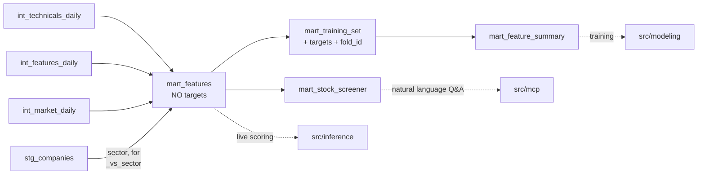

# GOLD marts — what they do and why

Written for someone who knows data engineering but not finance. Every finance
term is explained the first time it appears.

Companion docs: [`bronze-models-rationale.md`](bronze-models-rationale.md),
[`silver-staging-models-rationale.md`](silver-staging-models-rationale.md),
[`silver-intermediate-models-rationale.md`](silver-intermediate-models-rationale.md).

Implements [GH-36](https://github.com/Analyst-Ninja/aurum/issues/36) (Phases 4
and 5 of [`dwh-medallion-plan.md`](dwh-medallion-plan.md)).

---

## 1. What this layer is for

SILVER produced **features** — one row per stock per day, ~100 numeric columns.
That is still not something you can hand to a model, for three reasons, and GOLD
exists to fix all three.

**1. Raw feature values are not comparable.** A price-to-earnings ratio of 30
means nothing on its own. For a utility it is expensive; for a software company
in 2021 it was cheap. A volatility of 0.28 is calm in March 2020 and alarming in
July 2017. A model trained on raw levels spends its capacity learning "what year
is this" instead of "which stock is better". The fix is the **cross-sectional
transform** (§3): compare every stock only against the other stocks *on the same
day*.

**2. Nothing to learn from.** SILVER has no answer column. Somebody has to
compute "what did this stock do over the next five days", and that is the one
computation in the whole warehouse that deliberately looks into the future.

**3. No contract.** `src/modeling/`, `src/inference/` and `src/mcp/` each need a
different shape of the same data. If each one reshapes the warehouse itself, the
warehouse has three owners. GOLD is the agreed shape, so those three can be
built without touching anything upstream.

Four marts:

| Model | Grain | Rows | Cols | Build | In one line |
|---|---|---|---|---|---|
| `mart_features` | symbol × date | 2,935,412 | 222 | ~14 min | every feature, **no answers** — what live inference reads |
| `mart_training_set` | symbol × date | 2,895,171 | 228 | ~8 min | features **+ answers** + walk-forward folds — what training reads |
| `mart_feature_summary` | symbol × date | 2,895,171 | 10 | 14 s | the training set narrowed to the features SHAP kept |
| `mart_stock_screener` | symbol | 503 | 54 | 1 s | one row per company, latest known state — what the MCP server queries |

`mart_training_set` drops 40,241 rows (1.4%) against `mart_features` — that is
the tradability filter in §5.3, not row loss. `mart_feature_summary` is 10
columns today because the seed still holds its single placeholder row; it widens
as soon as a real SHAP run writes to it. A full `dbt build --select gold` takes
**~25 minutes** end to end.



All four are materialized as **tables, rebuilt in full** — not incrementally,
unlike everything in SILVER. The reason is §3: a z-score depends on every other
stock on that date, so there is no such thing as updating one row. An
"incremental" run would have to re-read the whole date anyway.

---

## 2. The one rule this layer exists to enforce

> **`mart_features` contains no answer columns. Not by convention — by
> construction.**

The forward returns live in `mart_training_set`, one model *downstream*. This
looks like a stylistic choice and is not. Live inference reads
`mart_features`. If a target column existed there, the day someone writes
`SELECT *` in the inference path, the model is being fed the answer it is
supposed to predict — and it will look extraordinary in testing and lose money
in production, because in production that column is empty.

Splitting the models makes the mistake impossible rather than merely
discouraged. The acceptance criterion is mechanical: *no column in
`mart_features` matches `fwd_ret%` or `label_%`.*

---

## 3. The cross-sectional transform — the core idea of this layer

"Cross-sectional" means **across stocks, at one point in time** — one day, all
503 companies — as opposed to "time-series", which means one stock across many
days.

Every feature in the curated list (36 of them, see §4) gets three siblings,
computed per date:

| Suffix | What it is | Question it answers |
|---|---|---|
| `_z` | winsorized, then z-scored | how unusual is this stock today, in standard deviations? |
| `_decile` | rank bucket 1–10 | which tenth of the market is it in today? |
| `_vs_sector` | value − sector median | is it cheap *for a bank*, or just cheap? |

### 3.1 Worked example

Say on 2026-09-02 earnings yield (annual earnings ÷ share price — the
right-way-up version of P/E, so bigger = cheaper) across the universe looks
like:

| Symbol | earnings_yield | Sector | ...after transform |
|---|---|---|---|
| AAPL | 0.031 | Information Technology | `_z` = −0.4, `_decile` = 4, `_vs_sector` = +0.004 |
| JPM | 0.092 | Financials | `_z` = +1.6, `_decile` = 9, `_vs_sector` = −0.011 |
| XYZ | 4.10 | Energy | `_z` = +2.9 *(clamped)*, `_decile` = 10 |

Read the JPM row carefully. In absolute terms JPM looks far cheaper than AAPL —
9.2% vs 3.1%. Ranked against the whole market it is in the 9th decile, cheap.
But ranked against **other banks**, `_vs_sector` is *negative*: banks trade
cheaply as a group, and JPM is slightly expensive for one. Those are three
genuinely different facts, and a model that can only see the raw 0.092 has no
way to separate them.

### 3.2 Why winsorize first

`XYZ` above has an earnings yield of 4.10 — a company whose earnings figure is
a rounding artifact, not a real 410% return. One row like that, left alone,
drags the mean and standard deviation of the entire cross-section, and *every
other stock's* z-score moves because of it.

**Winsorizing** means clamping values to a percentile band instead of dropping
them: anything below the 1st percentile becomes the 1st percentile, anything
above the 99th becomes the 99th. The stock stays in the panel and stays at the
top of the ranking — it just stops setting the scale for everyone else.

Order matters, and the model comments say so explicitly: **winsorize, then
z-score.** Z-scoring first and clamping after would compute the mean and
standard deviation from the polluted distribution, which is the thing being
avoided.

In SQL, the bounds come from one ordered-set aggregate per date:

```sql
percentile_cont(array[0.01, 0.99]) within group (order by feature::double precision)
```

The array form is deliberate — it returns both bounds from a **single sort** of
the date group rather than two.

### 3.3 Two null traps, both load-bearing

**`greatest()` and `least()` ignore NULLs in Postgres.** They do not propagate
them like arithmetic does. So the obvious clamp is wrong:

```sql
-- WRONG: a NULL feature comes back as the 1st-percentile value,
-- entering the cross-section as a real observation at the bottom.
least(greatest(feature, p01), p99)

-- RIGHT: the guard makes null stay null.
case when feature is null then null
     else least(greatest(feature, p01), p99) end
```

**`ntile()` buckets nulls too.** The natural way to write a decile is
`ntile(10) over (partition by date order by feature)`, and it is wrong here.
`ntile` divides *every row in the partition* into ten equal buckets, including
the rows where the feature is missing. A fundamental feature that is 30% null
would see its real values squeezed into deciles 1–7, with 8–10 holding nothing
but nulls. The model uses a rank against the **non-null count** instead:

```sql
case
    when feature is null then null
    else least(10, floor((rank() over (partition by date order by feature) - 1)
                         * 10.0 / nullif(count(feature) over (partition by date), 0))::int + 1)
end
```

`count(feature)` counts non-nulls only, which is exactly the denominator wanted.

### 3.4 Why median for `_vs_sector`, and why the list is curated

`_vs_sector` subtracts the **median** of the sector, not the mean. Some GICS
sectors hold a handful of names in this universe; one outlier moves a mean
enough to flip the sign for every peer, and the median does not care.

The transform list is 36 features rather than all ~100, because each one costs
three window passes over ~2.9M rows plus two ordered-set aggregates, and the
panel is rebuilt in full. Near-duplicates are dropped in favour of one
representative:

- `price_to_earnings` is **out**, `earnings_yield` is **in** — the inverse
  behaves through zero earnings, the ratio explodes (§8).
- `ret_5d` is out because `reversal_5d` is literally its negation.
- `ma_50` is out because `price_to_ma_50` is the same information without the
  share-price scale attached.

Adding one is a one-line change: put the name in the `xs_features` list at the
top of `mart_features.sql`. It must already exist as a column in the model's
`base` CTE.

---

## 4. `mart_features` — the feature store

Grain `(symbol, date)`, one row per stock per trading day. Four inputs:

| Source | Contributes |
|---|---|
| `int_technicals_daily` | 44 price-derived features — returns, moving averages, volatility, liquidity, oscillators |
| `int_features_daily` | point-in-time fundamentals + the valuation ratios that need a price |
| `int_market_daily` | 7 regime columns — what the whole market did that day |
| `stg_companies` | sector and industry |

Plus four calendar flags, and then the ~108 cross-sectional columns from §3.

### 4.1 The join to `stg_companies` is INNER

Deliberate, and the one place this model drops rows. GOLD *is* the S&P 500
panel. A symbol with no sector cannot get a `_vs_sector` value, and the
`relationships` test in `_gold_models.yml` asserts every symbol resolves. A
company that leaves the seed leaves GOLD, rather than sitting in it with a null
sector and silently poisoning its sector's median.

### 4.2 The calendar flags use the trading calendar

`is_month_end` marks the last date **the market was open** that month, not the
31st:

```sql
(date = max(date) over (partition by date_trunc('month', date)))::int
```

That matters because month-end rebalancing flows — funds mechanically adjusting
their holdings — land on the last *trading* day. Flagging a Sunday would flag a
day on which nothing happened.

### 4.3 Point-in-time provenance is carried, not dropped

`available_from` from SILVER is carried through renamed to
**`fundamental_available_from`**, alongside `days_since_available`. Two reasons:
staleness is a genuinely useful feature (a number 85 days old carries less
information than one from last week), and it is what
`tests/assert_no_lookahead.sql` (§7) checks. A feature store that cannot prove
when its inputs became knowable cannot be audited.

---

## 5. `mart_training_set` — features plus answers

`mart_features`, plus five target columns and a fold assignment, restricted to
names that could actually be traded.

### 5.1 The targets

| Column | Definition |
|---|---|
| `fwd_ret_5d` | `ln(close 5 bars ahead / close today)` — the 5-day forward log return |
| `fwd_ret_21d` | same, 21 bars (~one month) |
| `fwd_ret_5d_excess` | `fwd_ret_5d` minus the mean forward return of the universe that day |
| `fwd_ret_5d_xs_decile` | decile of `fwd_ret_5d` within its date — the label for ranking models |
| `label_up_5d` | 1 if `fwd_ret_5d > 0`, 0 if not, NULL if unknown |

**Why the logarithm.** `lead(adj_close, 5) / adj_close` is a growth factor —
1.03 means +3%. `ln()` of it is the *log return*, and it is used throughout the
warehouse for three reasons: log returns **add** across time (five daily log
returns sum to the 5-day figure; simple returns must be multiplied), they are
**symmetric** (+10% then −10% cancels exactly in logs; in simple returns you end
down 1%), and `stg_ohlcv_daily` guarantees `adj_close > 0` so the function is
always defined.

**Why `_excess` exists.** On a day the whole market falls 3%, nearly every stock
has a negative forward return. No cross-sectional model can predict the market
move, and it is shared by every symbol, so leaving it in means the model spends
its capacity on a component it cannot forecast. Subtracting the universe mean
leaves only the part that is specific to the stock.

### 5.2 The targets are NULL at the right edge — never zero

On the last five traded dates in the warehouse, the five bars ahead do not exist
yet. `lead()` returns NULL, and it must stay NULL all the way into the table.

This gets its own test because **a zero forward return is a real, plausible
observation.** If a `coalesce`, a pandas `fillna`, or a join against a padded
date spine ever turns the edge into zeros, nothing looks broken: the column is
fully populated, the row count is right, the build is green — and the model
quietly learns that the most recent week is always flat. Those are exactly the
rows a fresh backtest scores.

`tests/assert_targets_null_at_edge.sql` asserts the last 5 dates have no
non-null `fwd_ret_5d` (and the last 21 none for `fwd_ret_21d`). Note what it
does *not* assert: that every null is at the edge. A delisted symbol runs out of
forward bars early and is legitimately null long before the panel does.

### 5.3 Forward returns are computed BEFORE the tradability filter

Order of the CTEs is load-bearing:

```
panel     -> lead() over the FULL history
tradable  -> filter close_raw >= min_price and adv_21d >= min_adv_usd
final     -> cross-sectional target stats over the TRADABLE set
```

If the filter ran first, `lead(adj_close, 5)` would skip over the days a symbol
spent below the price or liquidity floor, silently stretching a 5-day horizon
into 8 or 12 calendar sessions for exactly the stocks most likely to be
mispriced.

The filter itself (`min_price` = $1, `min_adv_usd` = $1M, both dbt vars) drops
names that cannot be entered at the price a backtest assumes — the classic way a
paper strategy beats the market and a live one does not. It screens on
**`close_raw`**, the unadjusted price, not `adj_close`: a stock that genuinely
traded at $4 in 2015 can carry an `adj_close` of $0.40 today after adjustments,
and would be dropped for a reason that never happened.

The cross-sectional target statistics (`_excess`, `_xs_decile`) are computed
**after** the filter, on the tradable universe — because that is the set the
model ranks and the set a real book could hold.

### 5.4 `fold_id` — walk-forward, never random

One fold per calendar month, monotone in time:

```sql
dense_rank() over (order by date_trunc('month', date)) as fold_id
```

Train on `fold_id <= k`, validate on `fold_id = k + 1`. That is an expanding
window with no gap to reason about. The panel carries **321 folds** — one per
month from 2000-01 to 2026-09 — every row assigned, and zero folds whose date
range overlaps the next one.

**Why a random split is not merely suboptimal but wrong.** Neighbouring days
share overlapping feature windows (a 21-day volatility on Tuesday and on
Wednesday are 20/21 the same data) *and* overlapping forward returns (Monday's
5-day return and Tuesday's cover four of the same days). A random split puts
Wednesday in training and Tuesday in validation, so the model has effectively
seen the answer. The validation score is fiction, and it is a *flattering*
fiction — which is why this is a mistake people ship.

---

## 6. `mart_feature_summary` — closing the SHAP loop

`mart_training_set` narrowed to the columns named in
`seeds/selected_features.csv`, plus keys, targets and `fold_id` unconditionally
(a feature list without its label is not trainable).

SHAP is a method for attributing a model's prediction to its individual inputs;
averaging `|SHAP|` over many rows gives a ranked list of which features actually
carried weight. The loop is:

```bash
# src/modeling writes seeds/selected_features.csv from a SHAP run
uv run --group dbt dbt seed
uv run --group dbt dbt run --select mart_feature_summary
```

That is the entire feature-selection loop from spec §3.7 — no code change, no
model edit.

**This model must build before any model has ever been trained.** The seed ships
with a single placeholder row, so three guards keep it honest:

1. the seed and training relations are looked up with `load_relation`, so an
   unseeded project compiles instead of failing on a missing table;
2. requested names are intersected with the **real** columns of
   `mart_training_set`, so a stale seed naming a renamed feature is skipped
   rather than raising `column does not exist`;
3. if that intersection is empty, the model falls back to the full training set
   — an unselected panel, never an empty one.

Because both `ref()` calls sit inside conditionals, dbt cannot infer them from
the SQL and the model carries explicit `-- depends_on:` hints. Without them dbt
raises *"unable to infer all dependencies"*.

---

## 7. `mart_stock_screener` — the human-facing mart

One row per symbol, at **that symbol's own latest bar** — not the warehouse's
latest date. A company whose history stops early (delisted, acquired, renamed
upstream) still gets its last known row, and `price_date` says plainly how stale
it is.

```sql
select distinct on (symbol) * from mart_features order by symbol, date desc
```

`distinct on` is the Postgres idiom for argmax: one row per symbol by
construction, no group-by plus self-join, no chance of a tie fanning out.

Deliberately flat and narrow: this is the FastMCP server's query target, and
every column is a headline number a human would ask for by name. No z-scores, no
window functions to explain — with two exceptions carried on purpose
(`earnings_yield_decile`, `net_margin_vs_sector`) so the server can answer *"is
this cheap relative to its sector"* without recomputing a percentile at query
time.

**Two documented deviations from the column contract in
[`data-dictionary.md`](data-dictionary.md)**, both because that table describes
the target v2 system rather than what is built:

1. `ma_30d` / `ma_90d` / `vol_30d` / `sharpe_30d` do not exist. SILVER builds
   moving averages at 10/20/50/200 and risk windows at 21/63/252 — the
   conventional trading-day equivalents. `ma_50`, `ma_200`, `vol_21d` and
   `sharpe_21d` are carried under their real names instead.
2. `sentiment_7d` and `news_count_7d` are absent. The news domain is not
   ingested; a column of nulls would suggest otherwise.

---

## 8. Tests

`_gold_models.yml` plus two singular tests, both tagged `leakage`:

```bash
uv run --group dbt dbt test --select tag:leakage
```

| Test | Asserts |
|---|---|
| `assert_no_lookahead.sql` | zero rows where `fundamental_available_from > date`, or `days_since_available < 0`, or `fiscal_period_end > date` |
| `assert_targets_null_at_edge.sql` | no non-null target on the last 5 (resp. 21) traded dates |
| `unique_combination_of_columns` | `(symbol, date)` on all three panel marts, `(symbol)` on the screener |
| `relationships` | every `symbol` resolves to `stg_companies` |
| range tests | `net_margin` ∈ [−10, 1], `price_to_earnings` ∈ [−1000, 1000], `rsi_14` ∈ [0, 100] |

### 8.1 Why `assert_no_lookahead` is duplicated from SILVER

SILVER already has `assert_no_fundamental_lookahead.sql` on
`int_features_daily`. This one repeats the check at the GOLD boundary on
purpose. SILVER proves the as-of join is correct; GOLD proves that nothing
downstream of it — a widened `select`, a re-ordered join, a new model wedged in
between — reintroduced the leak on the way to the table training and inference
actually read.

The failure it guards against is the worst one available: a model trained on
information nobody had on the day produces a backtest that looks brilliant and a
live strategy that loses money. Hence the comment in the file calling it the
single most important test in the project.

### 8.2 Why two range tests carry a threshold instead of zero tolerance

`net_margin` and `price_to_earnings` genuinely have rows outside the bounds GH-36
names, and no honest bound excludes them:

| Test | Violations | Share | What they actually are |
|---|---|---|---|
| `net_margin` < −10 or > 1 | 14,339 | 0.49% | quarters where revenue collapsed to near zero while losses did not |
| `price_to_earnings` outside ±1000 | 8,623 | 0.29% | `eps_ttm` within a rounding error of zero, so the ratio explodes |

Both are configured `warn_if: ">0"`, `error_if: ">30000"` / `">20000"` — roughly
twice the measured counts. The test still does its real job: a unit error, a
sign flip or a division that produced an infinity would move those counts by
orders of magnitude and fail the build. A normal build stays green, and nobody
learns to ignore a permanently red test.

The `price_to_earnings` row is also the clearest argument for why
`earnings_yield`, not `price_to_earnings`, is what §3 ranks on.

`rsi_14` gets no such allowance — it is clamped at source in SILVER, so any
violation is a bug.

---

## 9. Known gaps

**`price_to_earnings` null rate is ~49% across the full panel, above the ~40%
GH-36 target — but not for the reason the criterion is checking.** The
criterion's purpose is to catch a `concept_map` that is missing XBRL tags. That
is not what is happening here. Broken down by year:

| Period | P/E null rate | Cause |
|---|---|---|
| 2000–2008 | ~100% | EDGAR ingestion pulls a limited window of recent periods. There are no filings this old in the warehouse at all. |
| 2010–2019 | 12–22% | normal — companies with no visible filing yet, plus TTM guard rejections |
| 2020–2022 | 59–84% | missing quarters break the four-quarter TTM completeness guard (see `silver-intermediate-models-rationale.md`) |
| 2023–2026 | 12–21% | normal |

The pre-2009 stretch is a **price history / filing history mismatch**: OHLCV goes
back to 2000, fundamentals do not. It drags the panel-wide average without
saying anything about concept coverage. The 2020–2022 spike is the real finding
and is upstream of GOLD — it is the known Q4 balance-sheet sparsity plus skipped
filings documented in the SILVER intermediate doc.

Neither is fixable in this layer. Both are recorded here rather than papered
over by filtering the panel, because the null rate is itself the signal.

**Regime columns dominate SHAP when the target is the raw return — and that is
a trap.** The end-to-end check in §10 (LightGBM on `fwd_ret_5d`, 455k rows, 215
features, 6 walk-forward splits) produces this top of the ranking:

| Rank | Feature | mean \|SHAP\| |
|---|---|---|
| 1 | `market_vol_63d` | 0.00282 |
| 2 | `market_xs_dispersion` | 0.00080 |
| 3 | `market_vol_21d` | 0.00065 |
| 4 | `market_ret_21d` | 0.00045 |
| 5 | `month_of_year` | 0.00041 |

Every one of the top four is a **market-level** column — identical for all 503
symbols on a given date. They rank first because `fwd_ret_5d` contains the
market move, and the market move is the largest and most predictable component
of it. They carry **zero cross-sectional information**: they cannot help decide
which stock to prefer today, only what the average stock will do.

So for a ranking model, train on `fwd_ret_5d_excess` or `fwd_ret_5d_xs_decile`
(§5.1), which have the market component removed by construction, and treat the
regime columns as conditioning variables rather than features. This is the
concrete reason `_excess` exists, and it shows up the first time anyone runs the
loop.

**No news sentiment anywhere** — the domain is not ingested, so the screener's
sentiment columns do not exist.

**`fundamental_available_from` is still a lag approximation.** EDGAR ingestion
carries no `filed_date`, so fundamentals are treated as knowable at
`period_end + 60` (quarterly) or `+ 90` (annual) days. Over-lagging costs
freshness; under-lagging would invent alpha that never existed, so the vars sit
deliberately past the observed ~43-day median filing delay. Swapping this for a
true point-in-time join is a follow-up issue.

---

## 10. Operating it

```bash
cd src/transformation/aurum_dwh

uv run --group dbt dbt build --select gold        # models + tests
uv run --group dbt dbt test  --select tag:leakage # the two that matter most
uv run --group dbt dbt run   --select mart_feature_summary   # after a SHAP run
```

The GH-36 end-to-end check — pull the training set into pandas, fit LightGBM
with walk-forward folds, run `shap.TreeExplainer`, get a ranked list — is not
committed to the repo, because `src/modeling/` is where it belongs and that is a
later phase. It was run once against this build to prove the contract is
trainable and SHAP-able (455,257 rows from 2023 onward, 215 numeric features, 44
folds, 6 expanding-window splits; rank IC positive on 5 of 6). Success there is
a working pipeline, not accuracy.

Adding a feature to the cross-sectional block:

1. make sure the column exists in `int_technicals_daily` or
   `int_features_daily`;
2. add it to the `base` CTE of `mart_features.sql`;
3. add its name to the `xs_features` list at the top of the same file.

Steps 2 and 3 generate the `_z`, `_decile` and `_vs_sector` siblings
automatically. Nothing downstream needs to change — `mart_training_set` selects
`*`, and `mart_feature_summary` discovers columns at compile time.
