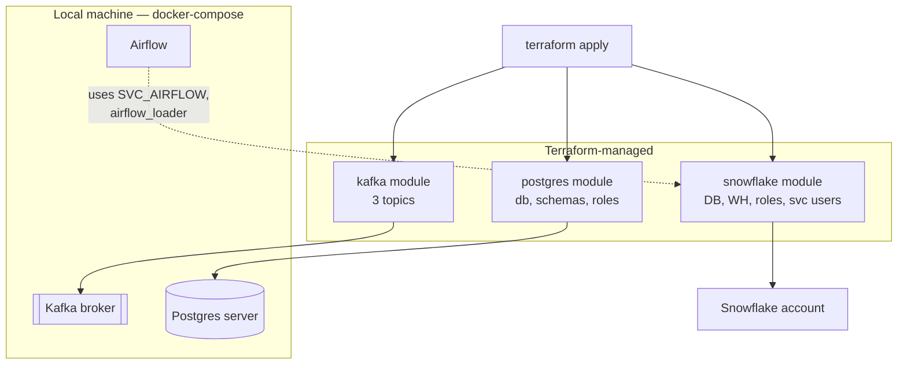

# AURUM — Infrastructure as Code (Terraform)

**Version:** 1.0
**Date:** 2026-07-12
**Status:** Design approved
**Parent spec:** [TECHNICAL_SPEC.md](TECHNICAL_SPEC.md)

---

## 1. Purpose & Scope

Terraform manages AURUM's **declarative, stateful infrastructure**; docker-compose keeps running the **processes**. Hybrid split:

| Layer | Managed by | Why |
|-------|-----------|-----|
| Snowflake account objects (database, schemas, warehouse, roles, grants, service users) | **Terraform** | Stateful, security-sensitive, painful to rebuild by hand |
| Kafka topics (partitions, retention) | **Terraform** | Declarative config that drifts silently when created ad hoc |
| Postgres database, schemas, roles, grants | **Terraform** | Same — schema/permission state, not process |
| Kafka broker, Postgres server, Airflow (containers) | docker-compose (`infra/docker-compose.yml`) | Runtime processes; dev loop needs fast restarts |
| Table DDL inside Snowflake (RAW tables, marts) | Airflow (RAW) + dbt (SILVER/GOLD) | Data-layer schema belongs to the pipeline, not TF |
| Landing table DDL in Postgres | App migrations (SQL files applied by consumers/Airflow) | Same reasoning |
| EDGAR producer host | Local machine, no IaC | SEC blocks cloud IPs — this stays a local process by design |

**Non-goals:** no cloud provider (no AWS/GCP footprint in v2), no Kubernetes, no TF-managed containers, no CI pipeline yet (single operator).

## 2. Layout

```
infra/
├── docker-compose.yml            # runtime: kafka, postgres, airflow (unchanged)
└── terraform/
    ├── versions.tf               # terraform + provider version pins
    ├── providers.tf              # provider configs (aliased where needed)
    ├── variables.tf              # inputs (no defaults for secrets)
    ├── main.tf                   # module wiring
    ├── outputs.tf                # connection strings, role names
    ├── terraform.tfvars.example  # committed template — real tfvars gitignored
    ├── modules/
    │   ├── snowflake/            # database, schemas, warehouse, roles, users, grants
    │   ├── kafka/                # topics
    │   └── postgres/             # db, schemas, roles, grants
    └── .gitignore                # *.tfstate*, *.tfvars, .terraform/
```

## 3. Providers

| Provider | Source | Manages |
|----------|--------|---------|
| Snowflake | `snowflakedb/snowflake` | All Snowflake account objects |
| Kafka | `Mongey/kafka` | Topics on the compose broker (`localhost:9092`) |
| PostgreSQL | `cyrilgdn/postgresql` | DB/schemas/roles on the compose Postgres (`localhost:5432`) |

Version-pin all three in `versions.tf` (`required_providers` with `~>` constraints); pin `required_version` for Terraform itself.

## 4. Resources per Module

### 4.1 `modules/snowflake`

| Resource | Name | Notes |
|----------|------|-------|
| Database | `AURUM` | |
| Schemas | `RAW`, `SILVER`, `GOLD`, `META` | META holds load bookkeeping if warehouse-side state needed |
| Warehouse | `COMPUTE_WH` | `XSMALL`, `auto_suspend = 60`, `auto_resume = true`, `initially_suspended = true` — cost guard |
| Roles | `AURUM_LOADER` | Airflow: INSERT/CREATE on RAW |
| | `AURUM_TRANSFORMER` | dbt: full on SILVER/GOLD, read RAW |
| | `AURUM_ML` | training + inference: read GOLD |
| | `AURUM_MCP_READONLY` | FastMCP: **SELECT-only on GOLD** — enforces the spec's read-only guarantee at the warehouse, not just app code |
| Service users | `SVC_AIRFLOW`, `SVC_DBT`, `SVC_ML`, `SVC_MCP` | One per component, **key-pair auth** (RSA), no passwords |
| Grants | role → schema/warehouse/future-tables | Future grants so dbt-created tables inherit permissions |

### 4.2 `modules/kafka`

Topics per the parent spec (§3.2):

| Topic | Partitions | Retention | Config |
|-------|-----------|-----------|--------|
| `market.ohlcv.1m` | 6 | 7 days | keyed by ticker |
| `edgar.filings` | 3 | 30 days | keyed by cik |
| `news.sentiment` | 3 | 7 days | keyed by ticker |

Single compose broker → `replication_factor = 1` everywhere.

### 4.3 `modules/postgres`

| Resource | Name | Notes |
|----------|------|-------|
| Database | `aurum` | |
| Schemas | `landing`, `meta` | Per parent spec §3.3, §3.5 |
| Roles | `consumer_writer` | INSERT on `landing.*` |
| | `airflow_loader` | SELECT on `landing.*`, ALL on `meta.*` (watermarks) |
| | `inference_writer` | INSERT on `landing.decisions` |
| Grants | default privileges per schema | So future landing tables inherit |

## 5. State & Secrets

- **State:** local `terraform.tfstate`, **gitignored**. Single operator — no locking needed. Migration path to a remote backend is a one-off `terraform init -migrate-state` later.
- **Secrets:** never in `.tf` files or committed tfvars.
  - Provider credentials via environment: `SNOWFLAKE_*`, `TF_VAR_postgres_admin_password`, etc.
  - Snowflake service users authenticate by **RSA key pair** — public key in TF, private keys stay in local files referenced by each component's env.
  - ⚠️ **State contains secrets anyway** (provider attributes land in state). Local + gitignored contains the blast radius; treat `terraform/` dir as sensitive. Re-check before any move to remote state.

## 6. Workflow

```bash
# 0. runtime up first — TF needs live endpoints for kafka/postgres providers
docker compose -f infra/docker-compose.yml up -d

# 1. bootstrap
cd infra/terraform
cp terraform.tfvars.example terraform.tfvars   # fill in
terraform init
terraform plan
terraform apply

# 2. day-2: any topic/role/schema change goes through TF
terraform plan   # review drift before every apply
```

**Ordering constraint:** `kafka` and `postgres` modules require the compose stack up; `snowflake` module is independent (cloud API). Modules have no cross-dependencies — `-target` works if compose is down.

**Drift & import:** existing hand-made objects (e.g., a manually created `AURUM` database) get `terraform import` rather than recreate. Anything not in TF that TF owns by this spec = drift, fix in TF.

## 7. Dependency Diagram



## 8. Build-Phase Impact

Extends parent spec Phase 0 (infra bootstrap): compose up → `terraform apply` → verify with `terraform plan` (empty diff) + smoke queries. Adds ~0.5d to Phase 0.

## 9. Open Questions

1. **Kafka provider vs init script** — `Mongey/kafka` is community-maintained; fallback is a compose-side topic-init container. Decide at Phase 0 if provider proves flaky.
2. **Snowflake provider resource coverage** — `snowflakedb/snowflake` provider evolves fast; verify grant resources against current provider version before writing modules.

---

*Scope decisions (user-confirmed 2026-07-12): hybrid split (TF = stateful objects, compose = processes), local gitignored state.*
