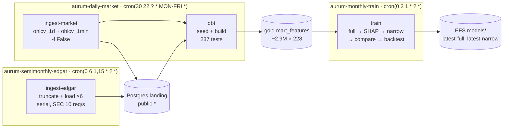
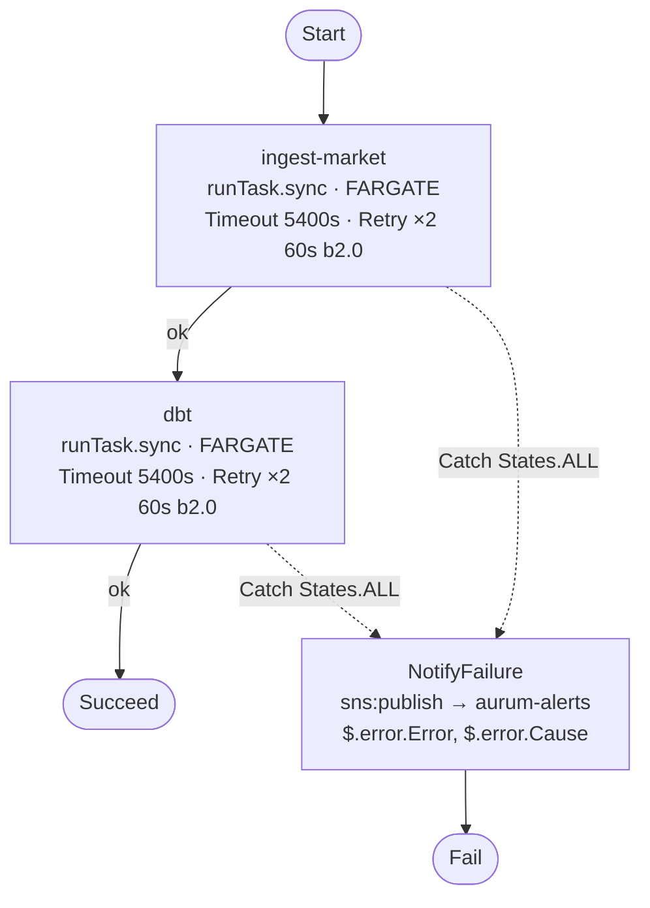

# AURUM — AWS Deployment Plan

**Status:** Built — infrastructure applied, every task verified by hand, and **all three
schedules live**
([#73](https://github.com/Analyst-Ninja/aurum/issues/73),
[#78](https://github.com/Analyst-Ninja/aurum/issues/78),
[#74](https://github.com/Analyst-Ninja/aurum/issues/74),
[#75](https://github.com/Analyst-Ninja/aurum/issues/75) done)
**Date:** 2026-09-06
**Related:** [../operations/infra-as-code.md](../operations/infra-as-code.md) ·
[../operations/training-container.md](../operations/training-container.md) ·
[../operations/cicd.md](../operations/cicd.md) ·
[../modeling/pipeline-runbook.md](../modeling/pipeline-runbook.md)

---

## 1. Why

Phase 6 is built: ingestion → the dbt medallion → `gold.mart_features` → LightGBM → backtest all run
end to end. They run on a laptop — Postgres on `localhost`, dbt from `~/.dbt/profiles.yml`, training
in a container with `./models` and `./data` bind-mounted, every run started by hand.

This plan moves that to AWS and puts it on a schedule:

- **RDS Postgres** replaces local Postgres — landing plus bronze/silver/gold in one instance.
- **One image on ECR**, run as **ECS Fargate tasks** for ingestion, dbt and modelling.
- **Step Functions + EventBridge Scheduler** replace manual invocation.
- **Terraform** owns the infrastructure; state in S3, `apply` run locally.

Two constraints shape everything below:

1. **This is a personal project, not a platform.** Every choice takes the smaller option.
2. ~~**Budget ceiling: $20/month.**~~ Held until the first backfill, then abandoned for the
   database — see §5. The topology it produced was kept.

**Not included:** Kafka/MSK, Snowflake, `src/inference/`, `src/mcp/`, Airflow, model serving,
automatic promotion, multiple environments, Multi-AZ.

## 2. Schedules

| State machine | Cron (UTC) | States |
|---|---|---|
| `aurum-daily-market` | `cron(30 22 ? * MON-FRI *)` | `ingest-market` → `dbt` |
| `aurum-semimonthly-edgar` | `cron(0 6 1,15 * ? *)` | `ingest-edgar` |
| `aurum-monthly-train` | `cron(0 2 1 * ? *)` | `train` |

**dbt rides the daily machine, not the monthly one.** Market data lands every weekday and
`gold.mart_features` is only as fresh as the last `dbt build` — putting dbt in front of a
monthly training run would leave the marts up to 30 days stale for everything else that
reads them. It runs strictly after the ingest state, so a broken feed never feeds a green
warehouse build.

The 1st of a month carries all three. They do not collide in wall-clock.

### 2.1 The DAG

The edges below are **data** dependencies, not Step Functions transitions. The two ingests
write landing tables, dbt reads them and builds the medallion, train reads
`gold.mart_features`. Nothing waits on anything across machines; the ordering holds because
each downstream job runs later in wall-clock and reads whatever is committed by then.



The 1st of a month, the only day all three fire:

```
02:00  train         reads the marts the previous weekday's dbt built
06:00  edgar         truncate + reload the six statement tables
22:30  market → dbt  picks up both the new prices and the new fundamentals
```

Train deliberately runs *before* that day's EDGAR refresh. It reads gold, gold is only
rebuilt at 22:30, so moving train later in the same day would gain it nothing and would
risk overlapping the build.

### 2.2 The state graph

Same shape for all three machines; only the ECS states differ.



`aurum-semimonthly-edgar` is the same graph with one ECS state (`ingest-edgar`, Retry ×1).
`aurum-monthly-train` is the same graph with one ECS state (`train`, Timeout 10800 s, **no
Retry** — a one-hour fit that OOMs does not succeed on a blind second attempt, and it is
the most expensive task in the account).

`NotifyFailure` publishes and then transitions to `Fail`, so a broken job produces **both**
an email and a red execution — never a green one that quietly emailed someone.

### 2.3 Why the ten-state chain collapsed to one task

The original design ran one Fargate task per CLI invocation: ten states for the modelling
loop alone. What ships instead puts the whole logical workflow in each task definition's
`command` — `sh -c "a && b && c"`, which stops at the first non-zero exit, exactly the
semantics the ten-state chain was hand-building with `Next`.

| | Ten states | One task |
|---|---|---|
| Container starts per weekly run | 10 (~40 s PROVISIONING + image pull each) | 1 |
| Passing `<config>_narrow.yaml` between steps | needs the base config on EFS, because the narrow path is *derived* | a file in the same container |
| Failure at step 7 of 8 | resume from step 7 | restart from step 1 (~35 min wasted) |
| Diagnosis | which box went red | read the CloudWatch log stream |

For four scheduled jobs and one operator, that is the right trade. **The one exception is
`dbt` versus `train`**, which stay separate task definitions and separate states: a dbt
failure must never reach `train` — training on a half-built `mart_features` produces a
model that looks fine and is not — and there is no reason to start a 4 vCPU / 16 GB task
to discover dbt is broken.

Everything the ten-state table used to specify still happens, in `tasks.tf`'s `train`
command: `train --version-suffix full`, `evaluate`, `select-features`, the seed copy plus
`dbt seed --select selected_features && dbt build --select mart_feature_summary`,
`train --version-suffix narrow`, `evaluate`, `compare`, `backtest`. The three non-obvious
constraints are unchanged and still hold:

- **`--version-suffix` is required, not cosmetic.** Both fits run on the same day from the
  same image, so `version_id()` — `{date}-{git short sha}` — produces the same id for both,
  and the narrowed run would overwrite the baseline it is meant to be compared against. The
  flag also publishes `models/latest-full` and `models/latest-narrow`, which is how the
  later steps name their inputs.
- **The base config lives on EFS, not in the image.** `select-features` writes the generated
  `<config>_narrow.yaml` beside the base config, at a derived path. Keeping the base config
  at `/app/models/configs/` puts the generated sibling on EFS with no code change.
- **The seed is copied into the dbt project directory first**, and `dbt seed` precedes
  `dbt build --select mart_feature_summary`, because the mart reads the Postgres table
  rather than the CSV.

**Promotion stays manual.** `compare` writes `comparison.json` with a `narrowed_wins`
verdict and promotes nothing, which matches
[training-and-retraining.md](../modeling/training-and-retraining.md) — the two-sided gate
is a judgement call.

`models/latest` **does** move: `save_run` repoints it on every train, so after the narrowed
fit it points there whether or not that fit won. `latest` means "most recently trained",
not "blessed"; `latest-full` and `latest-narrow` are the names that carry meaning. The
automated loop also does **not** commit `selected_features.csv` back to git the way the
manual runbook does — it lives on EFS, and you copy it into the repo by hand if you keep
the narrowed model.

### 2.4 EDGAR truncates before it loads

The EDGAR configs are `full_load: true`, carry no `watermark_group_by`/
`watermark_date_column`, and their `cols_for_pk` is `(SYMBOL, QTR, CONCEPT)` with no date
column — so `-f False` has nothing to resume from and every run re-pulls the full history.
`Database.write_data` uses `to_sql(if_exists="append")` with no unique index on `MD5_HASH`,
so a second run duplicated every row: ~1.9M each time, growing linearly. Twice a month is
~45M junk rows a year. Bronze deduplicates downstream so the warehouse stayed correct, but
the landing tables did not.

`python -m src.ingestion.truncate -c <config>` empties the config's landing table first,
making it match the contract the config already declares: one full snapshot per run. A
missing table is a no-op, so the first run is unaffected.

It runs **per config, immediately before that config's load**, not once for all six up
front. A failure halfway through then leaves at most one table empty rather than all six —
which matters because the 22:30 dbt build would otherwise turn a 06:00 EDGAR failure into a
mart with no fundamentals at all.

## 3. Architecture

```
EventBridge Scheduler (3 crons) → Step Functions (3) ──runTask.sync──▶ ECS Fargate
                                       │ Catch → SNS → email              (default VPC, public
                                                                           subnets, SG no ingress)
                                                                                │
                                          RDS Postgres ◀───────────────────────┤
                                          EFS /app/models, /app/data ◀─────────┤
                                          Yahoo / SEC ◀──── IGW, no NAT ───────┘
```

`runTask.sync` waits for the task and fails the state on a **non-zero container exit**,
which is what makes #72's exit-code fix load-bearing: `src/ingestion/cli.py` turns a
swallowed feed exception into `exit 1`, without which a broken feed would record a green
execution. `.sync` also needs `events:PutRule`/`PutTargets`/`DescribeRule` on the managed
`StepFunctionsGetEventsForECSTaskRule` — omitting it is the most common reason a state
fails with `AccessDeniedException` before the task ever starts.

No state supplies `ContainerOverrides`. Each task definition's own `command` *is* the
workflow (§2.3); overriding it from ASL would put the pipeline in two places at once.

**On-demand `FARGATE` throughout, not Spot.** The original plan put ingest and dbt on Spot;
at under a dollar a month of Fargate spend against a ~$122 bill, Spot saves cents and adds
an interruption failure mode to a state that is waiting synchronously.

All four task definitions run the **same image** from one ECR repo, differing only in `command`,
cpu/memory, and which env and secrets they receive.

## 4. What was deliberately not built

| Instead of | Do | Why |
|---|---|---|
| Custom VPC + 4 subnets + IGW + route tables | **Default VPC**, two `data` lookups | ~20 resources → 2 data blocks. The security groups do the real work either way |
| NAT Gateway (**$32/mo**) | Tasks in the default public subnets with `assignPublicIp` | Egress out the IGW is free. `sg-tasks` has zero ingress rules, so the public IP is egress-only in practice |
| 4 interface VPC endpoints (**$29/mo**) | Nothing. Only the free S3 gateway endpoint | They exist to avoid NAT data charges; with no NAT they are pure cost |
| 7 Terraform modules | One flat set of `.tf` files | Modules earn their keep on reuse. There is no reuse |
| A `bootstrap/` Terraform project for the state bucket | Two `aws` CLI commands, documented | A whole sub-project for one bucket |
| DynamoDB lock table | S3 native locking (`use_lockfile = true`, TF ≥ 1.10) | One operator, one laptop |
| Secrets Manager (**$0.40/secret/mo**) | SSM Parameter Store `SecureString` | Free. Costs managed rotation, which nothing here needs |
| Per-layer CloudWatch alarms | One SNS topic + a Step Functions `Catch` | The requirement is "email me when a job breaks" |
| Migrating the local warehouse with `pg_dump` | RDS starts empty; a one-off backfill rebuilds it from source | The sources are still there. The local database stays as the reference copy |

## 5. Cost

**The $20/month ceiling was abandoned on 2026-09-06, deliberately.** The original design fit
~$18.40/mo on a `db.t4g.micro`. During the first backfill that instance's `CPUCreditBalance`
hit **zero** and it throttled to baseline — roughly a fifth of one core — which stalled
ingestion and would have made the weekly `dbt build` unusable. The instance was moved to
`db.m7g.large`, which is non-burstable and therefore has no credits to exhaust.

| Item | ~USD/mo |
|---|---|
| RDS `db.m7g.large`, 30 GB gp3, 7-day backups | 118 |
| EFS (~5 GB, IA after 7 days) | 1.00 |
| ECR (one image, 3 tags retained) | 0.75 |
| Fargate on-demand — daily ingest + dbt, semi-monthly EDGAR, monthly train | 1.30 |
| CloudWatch Logs (7-day retention) | 0.50 |
| Public IPv4 hours (tasks, plus the RDS public address) | 0.60 |
| Step Functions, Scheduler, SNS, SSM, S3 state | ~0.05 |
| **Total** | **~123** |

The architecture choices made *for* the old budget all still stand on their own merits and were
not reverted: no NAT gateway, no interface VPC endpoints, default VPC, SSM Parameter Store
instead of Secrets Manager, one image, flat Terraform. Together they still avoid ~$61/mo, and
none of them cost anything in capability.

`db_instance_class` is a variable. Dropping to `db.t4g.small` (~$24/mo, total ~$30) is one
apply if the weekly build turns out not to need the headroom — but note it reintroduces credit
burn, which is what caused the original stall.

### Network exposure

RDS is **publicly accessible and its security group admits `0.0.0.0/0` on 5432**, so the
operator can connect from a laptop. This was a deliberate choice on 2026-09-06 over the two
alternatives that keep the database private:

| Option | Why it was not taken |
|---|---|
| Tailscale subnet router on a `t4g.nano` in the VPC | Needs a Tailscale auth key and one more instance (~$3/mo). Tailscale's own `100.64.0.0/10` addresses cannot be used in a security group — they are CGNAT and exist only inside the tailnet, so a rule naming one matches nothing |
| SSM Session Manager port-forward via a `t4g.nano` | No inbound ports at all, works anywhere with AWS credentials, but also one more instance |

What stands between the internet and the data is the master password — 32 random characters,
generated at apply time and held in SSM as a `SecureString`. Connections negotiate TLS
(`sslmode=prefer` in libpq, which RDS accepts). Narrowing `db_ingress_cidrs` to a `/32`, or
setting `db_publicly_accessible = false` and using one of the options above, is a single
variable change.

## 5.1 What the first apply actually found

Applied 2026-09-06 to account `851459781998`, `us-east-1`: **32 resources**. Four things
differed from the plan, all of them discovered rather than predicted.

**SEC does not block the Fargate IP.** This was the single largest unknown, carried as a gate
in #74 and inherited from `operations/infra-as-code.md` §1, which asserted "SEC blocks cloud
IPs — this stays a local process by design". That statement was never measured and is wrong
here. Probed from a Fargate task, egress IP `32.198.113.156`, with the honest `SEC_USER_AGENT`
from SSM:

| Endpoint | Result |
|---|---|
| `www.sec.gov/cgi-bin/browse-edgar` | **200**, 16,501 bytes |
| `data.sec.gov/submissions/CIK0000320193.json` | **200**, 164,121 bytes |
| `data.sec.gov/api/xbrl/companyconcept/…` | **200**, 2,252 bytes |

What SEC enforces is the honest `User-Agent` and the 10 req/s cap, both of which the ingestion
framework already respects. The EDGAR state machine in #75 is therefore built as
designed, with no local fallback.

**One subnet per AZ, not every subnet.** This account's default VPC has **11** subnets — two in
five of the six AZs. EFS permits exactly one mount target per availability zone, so the first
apply would have got partway through and died with `MountTargetConflict`. The `aws_subnets` data
source now filters on `default-for-az`, giving six.

**`engine_version = "17"` resolved to 17.9.** The major-only pin behaved as intended: no exact
minor to drift against `auto_minor_version_upgrade`.

**The task definitions had to be applied twice.** `var.image_tag` defaults to `latest`, and ECR
had no such tag until `make push` ran. Apply, push, then re-apply with
`-var="image_tag=$(git rev-parse --short HEAD)"` — or pass the tag on the first apply if the
image is already there.

### Verified by hand

| Check | Result |
|---|---|
| `dbt debug` on Fargate → RDS, credentials from SSM only | **All checks passed**, exit 0 |
| Image pull with `assignPublicIp=ENABLED`, no NAT | works |
| `/app/models` and `/app/data` are separate directories | confirmed — two EFS access points |
| EFS bootstrap wrote the base config and seed | `/app/models/configs/`, `/app/models/seeds/` |
| RDS `publicly_accessible` / `deletion_protection` | `False` / `True` |

## 6. Constraints found in the code

These are not preferences; each one breaks the deployment if ignored.

| # | Constraint | Consequence |
|---|---|---|
| 1 | `.dockerignore` excludes `src/transformation/` | The existing image **cannot run dbt**. The exclusion must go |
| 2 | The `dbt` dependency group cannot install under `--no-build` — `dbt-core-experimental-parser` is sdist-only (`pyproject.toml` comment) | The image needs a second `uv sync` layer without `--no-build`. CI's install path stays as it is |
| 3 | `dbt_packages/` is gitignored (`src/transformation/aurum_dwh/.gitignore:5`) | It is not in the build context; `dbt deps` must run at image build time |
| 4 | No `profiles.yml` exists in the repo | The image needs one templated on env vars, kept **outside** the dbt project dir so host runs still use `~/.dbt/profiles.yml` |
| 5 | `models/latest` is a symlink repointed with `os.replace`; `data/training` is a Parquet cache | Both need POSIX semantics → **EFS**, not S3. No registry rewrite |
| 6 | The image carries no `.git` | `AURUM_GIT_SHA` must be injected, or every run stamps `{date}-unknown` and overwrites the previous version |
| 7 | `BaseFeed.run()` swallows exceptions and reports `execution_status: FAILED` in a dict; `run_feed()` discards that dict and `cli.main()` ignores the return | **A failed feed exits 0.** Step Functions would record a green run. Must be fixed before anything is scheduled |
| 8 | Env var names are fixed: `HOST`, `PORT`, `AURUM_USERNAME`, `AURUM_PASSWORD`, `SEC_USER_AGENT`, `AURUM_GIT_SHA` | `src/utils/env.py` uses `load_dotenv`, which does not override real process env — so ECS-injected values win with **no code change** |
| 9 | Training needs ≥12 GB; 8 GB is OOM-killed with exit 137 ([training-container.md](../operations/training-container.md) §5) | The train task gets 16 GB. Unrelated to the DB instance size |
| 10 | `seeds/selected_features.csv` is committed | The first training run needs no prior SHAP pass |
| 11 | The EDGAR configs have no watermark columns and `Database.write_data` appends with no unique index on `MD5_HASH` | **Every EDGAR run duplicates ~1.9M rows.** `python -m src.ingestion.truncate` runs before each config's load (§2.4). Discovered in Part 3, fixed in Part 4 |

`infra-as-code.md` §1 currently records two non-goals this plan contradicts — "no cloud provider (no
AWS/GCP footprint in v2)" and "EDGAR producer host … SEC blocks cloud IPs — this stays a local
process by design". Both are superseded by this document; the EDGAR one carries a verification gate
in Part 3 rather than being waved away, and the measurement came back 200.

---

## 7. Part 1 — Image and ingestion exit code

Rename `docker/modeling.Dockerfile` → **`docker/aurum.Dockerfile`**. New `docker/entrypoint.sh` and
`docker/dbt/profiles.yml`. Edit `.dockerignore`, `docker-compose.modeling.yml`,
`src/ingestion/runner.py`, `src/ingestion/cli.py`, `docs/operations/training-container.md`,
`CLAUDE.md`.

- `.dockerignore` — drop the `src/transformation/` line.
- Dockerfile — keep the existing `uv sync --locked --no-build --group modeling --no-install-project`
  layer (fast, cached, mirrors CI), add a second
  `uv sync --locked --group dbt --group modeling --no-install-project` **without** `--no-build`.
  Copy all of `src/` and `docker/`. Run `dbt deps` at build time (constraint 3).
- `ENV DBT_PROFILES_DIR=/app/docker/dbt`. The profile templates `{{ env_var('HOST') }}`,
  `PORT`, `AURUM_USERNAME`, `AURUM_PASSWORD`, `dbname: aurum`, `schema: bronze`, `threads: 2`.
- `docker/entrypoint.sh` — dispatch on the first argument: `ingest` → `python -m src.ingestion.cli`,
  `dbt` → `cd` to the project dir then `dbt`, `model` → `python -m src.modeling.cli`. Anything else
  is `exec`'d verbatim so `sh` and `--help` still work.
  `ENTRYPOINT ["/app/docker/entrypoint.sh"]`, `CMD ["model", "--help"]`.
- **Exit code** — `run_feed()` returns the metrics dict; `main()` exits 1 on
  `execution_status == "FAILED"` only. `SUCCESS_NO_DATA` is a market holiday, not a failure.
  `BaseFeed.run()`'s swallowing contract is unchanged. Tests go in a new `tests/ingestion/` package —
  `tests/` currently holds only `tests/modeling/`.
- **Breaking change** — the entrypoint no longer defaults to the modelling CLI, so every documented
  `run --rm trainer train …` becomes `run --rm trainer model train …`. Compose,
  `training-container.md` and the docker block in `CLAUDE.md` are updated in the same change.

**Verify:** build the image; against local Postgres run `dbt debug`, an incremental `ingest`, and a
smoke `model train`. `uv run ruff check src/ main.py` and `uv run pytest tests/ -v` pass.

## 8. Part 2 — Terraform

The state bucket is created once, by hand:

```bash
aws s3 mb s3://aurum-tfstate-<account-id>
aws s3api put-bucket-versioning --bucket aurum-tfstate-<account-id> \
  --versioning-configuration Status=Enabled
```

```
infra/terraform/
├── main.tf        # default VPC + subnets (data), SGs, ECR, EFS + access point, ECS cluster, logs, IAM
├── rds.tf         # instance + subnet group
├── tasks.tf       # 4 task definitions
├── sfn.tf         # 3 state machines, 3 schedules, SNS, budget
├── variables.tf   # region, db_password (sensitive), sec_user_agent (sensitive), alert_email, image_tag
├── outputs.tf
├── versions.tf    # provider pins + S3 backend with use_lockfile = true
└── .gitignore     # *.tfstate*, *.tfvars, .terraform/
```

`.github/workflows/terraform.yml` already path-filters on `infra/terraform/**` and runs `fmt -check`,
`init -backend=false`, `validate` and `tflint` — it starts doing real work with no edit to CI.

- **Network** — `data "aws_vpc" "default"` and `data "aws_subnets"`. Two security groups: `sg-tasks`
  (no ingress, all egress) and `sg-data` (5432 and 2049 from `sg-tasks` only).
- **RDS** — postgres 17, `db.t4g.micro`, 30 GB gp3, `max_allocated_storage = 100` (storage
  autoscaling), `storage_encrypted`, `publicly_accessible = false`, `backup_retention_period = 7`,
  `deletion_protection = true`, `db_name = "aurum"`.
- **SSM `SecureString`** — `/aurum/db_password`, `/aurum/sec_user_agent`.
- **ECR** — repo `aurum`, scan on push, lifecycle keeping the last 3 images.
- **EFS** — encrypted, mount targets in the default subnets, one access point at `uid/gid 1000`
  (matching the image's `aurum` user), `root_directory /aurum`, IA after 7 days.
- **ECS** — cluster `aurum` with `FARGATE` and `FARGATE_SPOT`; log group `/ecs/aurum`, 7-day
  retention; an execution role (task-execution policy + `ssm:GetParameters` scoped to the two
  parameter ARNs) and a task role (EFS mount/write, `sns:Publish`).
- **Task definitions** — one image, EFS mounted at `/app/models` and `/app/data`, env
  `HOST`/`PORT`/`AURUM_GIT_SHA`, secrets pulled from SSM:

  | Task definition | cpu / memory | capacity |
  |---|---|---|
  | `aurum-ingest-market` | 1024 / 2048 | Spot |
  | `aurum-ingest-edgar` | 1024 / 4096 | Spot |
  | `aurum-dbt` | 2048 / 4096 | Spot |
  | `aurum-train` | 4096 / 16384 | On-demand |

  Training stays on-demand so a 30-minute run is not interrupted at minute 28.
- A `Makefile` target: `make push TAG=$(git rev-parse --short HEAD)` — ECR login,
  `docker build --platform linux/amd64`, tag, push. The platform flag is mandatory on Apple silicon.

**Verify:** `terraform fmt -check -recursive`, `terraform validate`, `tflint --recursive`, then apply.

## 9. Part 3 — Push, run each task by hand, backfill

Nothing is scheduled yet. Each task is invoked with `aws ecs run-task` and
`assignPublicIp=ENABLED` — without it the task cannot reach ECR and hangs in `PROVISIONING`, because
there is no NAT.

1. `dbt debug` — proves RDS reachability, the SSM-injected credentials, the profile and the SGs.
2. `ingest yahoo/ohlcv_1d -f False` over a short window — proves egress works with no NAT.
3. **EDGAR smoke gate** — one config, small window. If SEC returns 403, the Fargate address range is
   blocked: keep the EDGAR leg running locally against the RDS endpoint and skip that state machine
   in Part 4. Everything else proceeds either way. **Measured: it returns 200** (§5.1), so the state
   machine was built as designed.
4. **Backfill, attended** — Yahoo full load (503 symbols, 2000 → today, ~2.9 M rows) → the 6 EDGAR
   configs serially, respecting the 10 req/s cap → `dbt seed` → `dbt build` (the slow one; watch
   `FreeStorageSpace` and `CPUCreditBalance`) → first `train --version-suffix full`, `evaluate`,
   `backtest`. Also copy the base config and the seed CSV onto EFS under `/app/models/configs/`
   and `/app/models/seeds/`, which §2.1 depends on.

**Accept when** `gold.mart_features` holds ~2.9 M rows across 503 symbols, `dbt test` gives the
documented **237 tests, 2 warn, 0 error**, and one `models/<date>-<sha>/` exists with `metrics.json`
and `backtest/summary.json` — carrying a real sha, not `unknown`.

The local Postgres is not decommissioned. It stays as the reference copy until a full week of
scheduled runs is green.

## 10. Part 4 — Schedules, alerts, documentation (built)

`infra/terraform/sfn.tf` — three `aws_sfn_state_machine`, three `aws_scheduler_schedule`
(`flexible_time_window { mode = "OFF" }`, `schedule_expression_timezone = "UTC"`), two IAM
roles, the SNS email subscription and the budget. New variables `alert_email` (no default —
an unset address means failures are silent) and `monthly_budget_usd` (default 150).

`aws_iam_role.aurum-sfn` carries `ecs:RunTask` on the four task definitions conditioned on
`ecs:cluster`, `ecs:StopTask`/`DescribeTasks` on `*` (task ARNs are generated at run time),
`iam:PassRole` on both task roles, the `StepFunctionsGetEventsForECSTaskRule` grant, and
`sns:Publish`. `aws_iam_role.aurum-scheduler` carries only `states:StartExecution` on the
three machines.

`aws_budgets_budget.aurum-monthly` is **$150**, not the $20 the original plan carried. That
ceiling was abandoned on 2026-09-06 when RDS moved to `db.m7g.large` (§5); a budget set
below known steady-state cost alerts every month and gets ignored. It notifies at 80 %
`ACTUAL` and 100 % `FORECASTED`.

**The SNS email subscription lands as `pending confirmation`.** Terraform cannot click the
link. Until someone does, every failure is silent.

### 10.1 Troubleshooting

| Symptom | Cause | Fix |
|---|---|---|
| State fails instantly, `AccessDeniedException` on `events:PutRule` | `.sync` needs the managed `StepFunctionsGetEventsForECSTaskRule` grant | It is in `data.aws_iam_policy_document.sfn`; check the role actually attached |
| Task stuck in `PROVISIONING` until timeout | no public IP, and there is no NAT to fall back on | `AssignPublicIp = "ENABLED"` in `local.sfn_network` |
| Execution green, but no data landed | a feed swallowed its exception | `src/ingestion/cli.py` exits 1 on `execution_status == "FAILED"` — verify the image is new enough to carry it |
| `train` exits 137 | OOM; 8 GB is not enough for a 2.9M × 228 panel | the task definition is 16 GB ([training-container.md](../operations/training-container.md) §5) |
| `dbt build` dies with `SSL SYSCALL error: EOF detected` | RDS restarted, or `CPUCreditBalance` hit zero on a burstable class | `db.m7g.large` is non-burstable; check `apply_immediately` modifications are not in flight |
| SEC returns 403 | `SEC_USER_AGENT` unset or dishonest | it is on **every** task, not just EDGAR — `yahoo/ohlcv.py` scrapes the S&P 500 universe from Wikipedia, which also refuses anonymous traffic |
| `models/latest` missing | no train has run against this EFS filesystem yet | run `aurum-monthly-train` once by hand |
| dbt profile not found | `DBT_PROFILES_DIR` or the working directory | the entrypoint `cd`s to `/app/src/transformation/aurum_dwh`; profiles come from `docker/dbt/` |
| Model version stamped `{date}-unknown` | the image carries no `.git` | `AURUM_GIT_SHA = var.image_tag` — apply with `-var="image_tag=$(git rev-parse --short HEAD)"` |
| EDGAR row counts doubling | an image predating the truncate step | §2.4 |
| A failure produced no email | the SNS subscription is still `pending confirmation` | click the link once |

## 11. Verification

```bash
# infrastructure
cd infra/terraform && terraform fmt -check -recursive && terraform validate && tflint --recursive

# image
docker build --platform linux/amd64 -f docker/aurum.Dockerfile -t aurum:$(git rev-parse --short HEAD) .
docker run --rm aurum:local model --help && docker run --rm aurum:local dbt --version

# repo gates, unchanged
uv run ruff check src/ main.py && uv run pytest tests/ -v

# one task, by hand
aws ecs run-task --cluster aurum --task-definition aurum-dbt --launch-type FARGATE \
  --network-configuration "awsvpcConfiguration={subnets=[$SUBNETS],securityGroups=[$SG_TASKS],assignPublicIp=ENABLED}" \
  --overrides '{"containerOverrides":[{"name":"aurum","command":["dbt","debug"]}]}'

# state machines — all three schedules present and ENABLED
aws scheduler list-schedules --query 'Schedules[].{Name:Name,State:State}' --output table

# force one execution of each; each must end SUCCEEDED
for m in daily_market semimonthly_edgar monthly_train; do
  aws stepfunctions start-execution \
    --state-machine-arn "$(terraform output -raw sfn_${m}_arn)"
done

# EDGAR truncate: run the machine TWICE and confirm the count does not double
psql -c "select count(*) from income_stmts_quarterly;"

# failure path — break it on purpose, do not assume. The execution must end FAILED
# *and* an email must arrive.
aws ecs run-task --cluster aurum --task-definition aurum-dbt --launch-type FARGATE \
  --network-configuration "$(terraform output -raw run_task_network_configuration)" \
  --overrides '{"containerOverrides":[{"name":"aurum","command":["sh","-c","exit 1"]}]}'

# warehouse correctness, with a local .env pointed at the RDS endpoint
cd src/transformation/aurum_dwh && uv run --group dbt dbt test    # 237 tests, 2 warn, 0 error
psql -c "select count(*), count(distinct symbol), max(date) from gold.mart_features;"
```

**Done when** a full week of daily runs plus the 1st-of-month EDGAR and training runs completes
green unattended, `gold.mart_features` advances with nobody typing anything, two consecutive
EDGAR runs leave the landing row counts flat, a new `models/<date>-<sha>-full/` and
`…-narrow/` appear with `metrics.json`, `comparison.json` and `backtest/summary.json`, a
deliberately broken job ends `FAILED` **and** produces an email, and month-to-date cost tracks
under `monthly_budget_usd`.

## 12. Risks

| Risk | Mitigation |
|---|---|
| RDS is too small for the gold build | Resolved by moving to `db.m7g.large` (§5); watch `FreeableMemory` |
| SEC 403s the Fargate address | Measured in Part 3: it does not (§5.1). Fall back to running EDGAR locally against RDS if that ever changes |
| Task stuck in `PROVISIONING` | Missing `assignPublicIp=ENABLED` — there is no NAT to fall back on |
| The backfill is far slower than it is locally | Expected, and it is one-off. Run it attended; storage autoscaling to 100 GB prevents a disk-full stall |
| Spot interruption kills a run | Not applicable — everything runs on-demand Fargate (§3) |
| The dbt group breaks the image build | The second sync layer drops `--no-build`; CI's install path is untouched |
| A model version stamps as `{date}-unknown` | `AURUM_GIT_SHA = var.image_tag` on the modelling tasks |
| The entrypoint change breaks documented commands | Compose and both docs are updated in the same change as the Dockerfile |
| No DB password rotation (SSM, not Secrets Manager) | Accepted to save $0.40/mo. Rotation is a manual `terraform apply` with a new variable |
