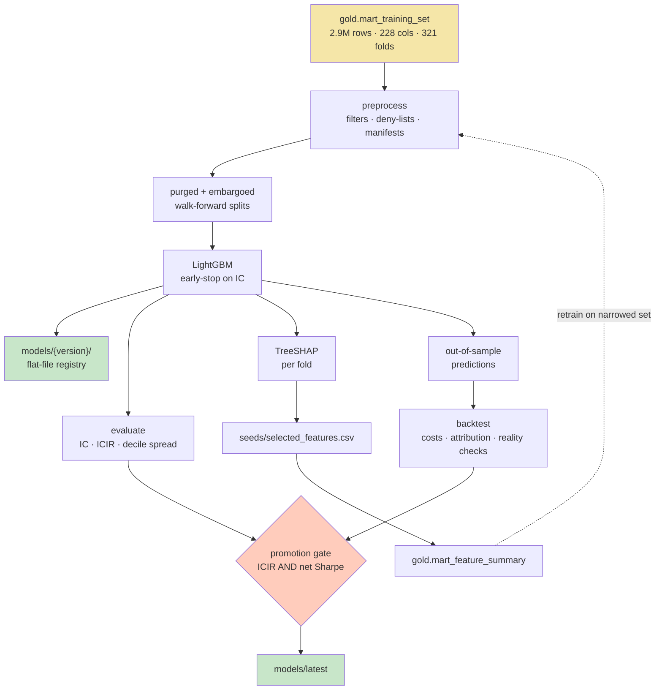

# Modelling — what we are predicting, with what, and how we will know

> **Design — not yet built.** `src/modeling/` is an empty placeholder. This document and its three
> companions describe Phase 6 as designed; they are the specification the code will be reviewed
> against, not a description of running code. Everything in `docs/warehouse/` *is* built.
>
> Implements [#50](https://github.com/Analyst-Ninja/aurum/issues/50). Companions:
> [`preprocessing-contract.md`](preprocessing-contract.md) ·
> [`training-and-retraining.md`](training-and-retraining.md) ·
> [`feature-selection-shap.md`](feature-selection-shap.md) ·
> [`backtesting.md`](backtesting.md)

Written for someone who knows data engineering but not quantitative finance. Every finance term is
explained the first time it appears. All measured numbers were taken from the live warehouse on
**2026-09-05** and the query that produced each is given.

Contents:

1. [What we are actually predicting](#1-what-we-are-actually-predicting)
2. [Which target, and why not the other three](#2-which-target-and-why-not-the-other-three)
3. [Which model, and why not the other four](#3-which-model-and-why-not-the-other-four)
4. [The feature space](#4-the-feature-space)
5. [How we will know it works](#5-how-we-will-know-it-works)
6. [The pipeline end to end](#6-the-pipeline-end-to-end)
7. [Known limitations](#7-known-limitations)
8. [See also](#8-see-also)

---

## 1. What we are actually predicting

The warehouse hands us a **panel**: one row per (symbol, date), 503 symbols, every trading day from
2000-01-03 to 2026-09-02.

```
 rows      symbols   first date    last date     monthly folds
 2,895,171     503   2000-01-03    2026-09-02    321
```

```sql
select count(*), count(distinct symbol), min(date), max(date), count(distinct fold_id)
from gold.mart_training_set;
```

The question is **not** "will AAPL go up". It is:

> Given everything knowable about all ~450 tradable S&P 500 names on date *t*, rank them by how
> they will perform **relative to each other** over the next five trading days.

That framing — **cross-sectional**, not time-series — is the single most consequential choice in
this document, and the entire GOLD layer was built around it. Three reasons it is the right frame:

**1. The market factor is most of the variance and none of the skill.** On any given day the
dominant driver of a stock's return is whether the market went up. A model predicting raw returns
spends all its capacity learning "the market drifts up", which is true, free, and untradeable as a
stock-selection signal.

**2. It is the frame the features are already in.** GOLD ships 36 features in three cross-sectional
variants each — `_z` (winsorized z-score within the day), `_decile` (1–10 rank bucket within the
day), `_vs_sector` (value minus the sector median that day). 109 of the 228 columns in
`mart_training_set` only make sense cross-sectionally.

**3. It maps directly onto how the signal would be traded.** A ranking becomes a long-short
portfolio — buy the top, sell the bottom — with no threshold to calibrate and no market exposure to
hedge. See [`backtesting.md`](backtesting.md).

---

## 2. Which target, and why not the other three

`gold.mart_training_set` ships four target columns and one fold index. All are computed on the full
panel *before* the tradability filter, so the filter cannot silently stretch a five-bar horizon.

| Column | Definition | Kind |
|---|---|---|
| `fwd_ret_5d` | `ln(adj_close[t+5] / adj_close[t])` | regression |
| `fwd_ret_21d` | `ln(adj_close[t+21] / adj_close[t])` | regression |
| **`fwd_ret_5d_excess`** | **`fwd_ret_5d − mean(fwd_ret_5d)` over that date** | **regression** |
| `fwd_ret_5d_xs_decile` | rank of `fwd_ret_5d` within the date, bucketed 1–10 | ranking |
| `label_up_5d` | `1` if `fwd_ret_5d > 0` else `0` | binary |

> **The primary target is `fwd_ret_5d_excess`.** Log return over five trading days, minus the
> equal-weighted mean return of the tradable universe that same day.

Subtracting the daily cross-sectional mean is what "excess" means here: it removes the market
move, leaving only the part of a stock's return that is *specific to that stock*. A stock that
returned +1% on a day the universe returned +1% has an excess return of zero — it did nothing
interesting.

### 2.1 Why not `fwd_ret_5d` — this was measured, not assumed

An end-to-end SHAP run against the raw target during Phase 4 produced a feature ranking dominated
by `market_vol_63d`, `market_xs_dispersion`, `market_vol_21d`, `market_ret_21d` and
`month_of_year`. Every one of those is a **market-level** column: identical for all 450 symbols on
a given date. They cannot rank one stock above another; they carry exactly zero cross-sectional
information.

The model was not malfunctioning. Predicting a raw return, the largest available win *is* to
forecast the market's own move, so that is where the capacity went. The stock-selection signal —
the entire point — was crowded out.

This is the concrete reason for the target choice, and it is the reason to be suspicious of any
future SHAP ranking that comes back regime-dominated: the target is wrong, not the ranking.

### 2.2 Why not the classification or ranking targets

`label_up_5d` throws away magnitude. "Up 0.1%" and "up 14%" are the same label, and 14% is where
the money is. Its base rate also drifts with the market, so the same model looks differently
calibrated in a bull and a bear year.

`fwd_ret_5d_xs_decile` with `LGBMRanker` optimises the ordering directly, which is closer to what
gets traded. It is genuinely defensible — the reason it is not primary is tooling and diagnostics:
group-structured ranking objectives are harder to debug, harder to calibrate, and SHAP values from
a ranker are less interpretable. Both it and `label_up_5d` are trained as **secondary heads** on
identical folds under [#54](https://github.com/Analyst-Ninja/aurum/issues/54), so "which target
works best" is a measured result rather than an assumption inherited from this document.

`fwd_ret_21d` is a monthly-horizon variant, kept for a later horizon study.

### 2.3 Two transforms applied to the target — training only

1. **Winsorize per date** at the 1st and 99th percentile.
2. **Divide by that date's cross-sectional standard deviation.**

Step 2 is the one that gets skipped. The mean per-date standard deviation of
`fwd_ret_5d_excess` is **0.0405** (~4%), but that average hides an enormous range: dispersion in
March 2020 is several times a quiet month in 2017. Under a squared-error loss, a crisis month
therefore contributes several times the gradient of a calm one, and the fitted model is
disproportionately a crisis model. Dividing by the daily standard deviation makes every date
contribute equally, which turns L2 into something close to a rank-correlation objective — the
thing we actually score on.

```sql
select round(avg(sd)::numeric, 5)
from (select date, stddev_samp(fwd_ret_5d_excess) sd from gold.mart_training_set group by date) t;
-- 0.04048
```

Both transforms touch the **target only**, and only during training. Neither exists at inference,
where there is no target. See [`preprocessing-contract.md`](preprocessing-contract.md) §5.

---

## 3. Which model, and why not the other four

> **`LGBMRegressor`, L2 objective, early-stopped on cross-sectional rank correlation.**

Four properties of *this* dataset drive the choice.

**1. Missing values are structural, large, and meaningful.** 34.6% of rows have no fundamental data
at all — the symbol had not filed yet, or its XBRL concepts never mapped. Among rows that *do* have
fundamentals, `roe` is still 32.6% null and `ebitda_ttm` 37.7%, because roughly half of encountered
XBRL concepts are unmapped in `seeds/concept_map.csv`.

```sql
select round(100.0*count(*) filter (where fundamental_available_from is null)/count(*), 1) as no_fundamentals_pct
from gold.mart_training_set;                                                           -- 34.6

select round(100.0*count(*) filter (where roe is null)/count(*), 1) as roe_null_pct,
       round(100.0*count(*) filter (where ebitda_ttm is null)/count(*), 1) as ebitda_null_pct
from gold.mart_training_set where fundamental_available_from is not null;               -- 32.6 | 37.7
```

Imputing zero is wrong — zero is a meaningful net margin and a meaningful return, so the imputation
becomes indistinguishable from a real observation. Imputing the cross-sectional median injects
information from other stocks on the same date into a row that should not have it. LightGBM instead
learns, per split, which direction missing values should go. Linear models and most neural
architectures cannot; they require you to invent a value.

**2. Tree SHAP is exact and fast.** `mart_feature_summary` and `seeds/selected_features.csv` are
already built and tested; both assume a tree model, because `shap.TreeExplainer` computes exact
Shapley values in polynomial time. A neural model would force KernelSHAP: approximate, and orders
of magnitude slower over 200+ columns. The warehouse has already committed to trees.

**3. Native categorical handling** for `sector` and `industry` — 11 and ~150 levels — without
one-hot expansion.

**4. The shape of the data.** A wide, mixed-scale, low signal-to-noise tabular panel is the regime
in which gradient-boosted trees are still state of the art.

### 3.1 Rejected, and why

| Candidate | Why not |
|---|---|
| **XGBoost** | Genuinely equivalent in accuracy. LightGBM is faster at this row count and handles categoricals natively. A close call, not a strong one — if LightGBM disappoints, this is the first thing to try |
| **Ridge / linear** | **Kept, as a baseline** (§5). If a linear model on 36 z-scores matches the GBM, the non-linearity is not earning its complexity and we should ship the simpler thing |
| **Neural nets** | The data is tabular with no structure to learn a representation over. It is also *small where it matters*: ~6,600 distinct dates, not 2.9M independent samples (§5.3). And it forfeits exact SHAP |
| **`LGBMRanker`** | Optimises the objective we score on, but harder to calibrate and diagnose. Trained as a secondary head, not primary (§2.2) |
| **Linear factor model (Fama-French style)** | The honest classical baseline. It is effectively what the "sort on one factor" baselines in §5 measure |

---

## 4. The feature space

`mart_training_set` has **228 columns**: 222 inherited from `mart_features`, plus five targets and
`fold_id`.

```sql
select count(*) from information_schema.columns
where table_schema = 'gold' and table_name = 'mart_training_set';   -- 228
```

They fall into families:

| Family | Count | Examples |
|---|---|---|
| Keys and dimensions | 4 | `symbol`, `date`, `sector`, `industry` |
| Price and liquidity | 4 | `adj_close`, `dollar_volume` |
| Momentum and trend | 20 | `mom_12_1`, `ret_252d`, `dist_from_52w_high` |
| Volatility and risk | 13 | `vol_252d`, `beta_252d`, `max_drawdown_252d` |
| Liquidity and volume | 5 | `adv_21d`, `amihud_illiq_21d` |
| Oscillators | 7 | `rsi_14`, `macd_hist`, `bollinger_pctb_20` |
| Point-in-time provenance | 4 | `fundamental_available_from`, `days_since_available` |
| Raw fundamentals | 16 | `revenue`, `free_cash_flow_ttm` |
| Valuation, profitability, growth, leverage, quality | 30 | `earnings_yield`, `roic`, `accruals` |
| Market regime | 7 | `market_vol_63d`, `market_breadth` |
| Calendar | 4 | `day_of_week`, `is_quarter_end` |
| **Cross-sectional derivatives** | **108** | 36 `_z`, 36 `_decile`, 36 `_vs_sector` |
| Targets and fold | 6 | |

The families above sum to 114 base + 108 cross-sectional + 6 target/fold = 228.

**The count that must not be misread.** A suffix count over `mart_training_set` returns **37**
columns ending in `_decile`, not 36. The 37th is
`fwd_ret_5d_xs_decile` — a *target*. Any rule that keeps or drops "the decile columns" by suffix
silently either leaks the answer or discards a feature. This trap has its own acceptance criterion
in [#52](https://github.com/Analyst-Ninja/aurum/issues/52).

Which of these actually reach the model — and the argument for excluding raw price and size
*levels* while keeping their cross-sectional versions — is
[`preprocessing-contract.md`](preprocessing-contract.md) §4. Which survive SHAP selection is
[`feature-selection-shap.md`](feature-selection-shap.md).

---

## 5. How we will know it works

### 5.1 Metrics, and why not RMSE

Root-mean-square error on a five-day return is close to useless here. The target is ~99.9% noise,
so RMSE is dominated by that noise and is nearly identical for a good model and a worthless one. It
also says nothing about the only property that gets traded: **the ordering**.

| Metric | Definition | What it tells you |
|---|---|---|
| **IC** | Spearman rank correlation between prediction and outcome, computed **within each date**, then averaged | Are we ranking correctly. An IC of 0.03 is a real signal in this domain |
| **ICIR** | `mean(IC) / std(IC) × √252` | **The headline.** A decent IC that swings between +0.15 and −0.12 is not tradable; ICIR says so and IC alone does not |
| **Decile spread** | Mean outcome of the predicted top decile minus the bottom decile, per date | The same thing in return units, so it can be read as money |
| **Long-short Sharpe** | Annualized return / volatility of a top-minus-bottom-decile portfolio, using five overlapping tranches | The economic number. Detail in [`backtesting.md`](backtesting.md) |
| Max drawdown, turnover | On that same portfolio | Whether the Sharpe survives contact with reality |
| Hit rate, R² | | Reference only. Familiar, not decision-grade |

**"Information coefficient"** is the quant term for the rank correlation between a forecast and
what happened. **"Information ratio"** generalises Sharpe to any signal: how much predictive
skill you get per unit of its own instability.

### 5.2 Four baselines, or the headline is meaningless

Reported side by side with the model, on identical folds:

| Baseline | The question it answers |
|---|---|
| Predict zero for everything | Is there any signal here at all |
| Sort on `mom_12_1_z` alone | Does a 200-feature model beat one classic momentum factor |
| Sort on `reversal_5d_z` alone | Short-horizon mean reversion — the natural prior at a five-day horizon |
| Ridge on the 36 `_z` columns | Does the non-linearity earn its complexity |

A model that cannot beat a one-column sort is not a model; it is an expensive way to compute
momentum.

### 5.3 Two numbers that are routinely reported wrong

**Effective sample size, not row count.** Consecutive rows share four of five days of label, so the
2.9M rows contain closer to 580k independent observations. Confidence intervals computed on the row
count are fiction. Every interval is reported against effective N.

**The number of configurations tried.** A Sharpe selected as the best of 200 attempts is not the
Sharpe you will get. `n_configs_tried` is recorded in `metadata.json` and feeds the deflated-Sharpe
adjustment in [`backtesting.md`](backtesting.md) §7.

### 5.4 Breakdowns are mandatory

Pooled numbers are reported **with** per-sector and per-volatility-regime breakdowns
(`market_vol_63d` terciles). A model with a respectable pooled ICIR that works only in
high-volatility regimes is a materially different product from what the pooled number implies, and
the pooled number will never say so on its own.

---

## 6. The pipeline end to end



The dashed edge is the feature-selection loop that `mart_feature_summary` was built to close. It is
a **loop with a human checkpoint**: the seed is committed to git, so a bad training run cannot
silently reshape the mart. See [`feature-selection-shap.md`](feature-selection-shap.md) §5.

---

## 7. Known limitations

Every one of these biases results **upward**. They are restated at the top of each generated report
rather than left here to be remembered.

| # | Limitation | Cost | Fix |
|---|---|---|---|
| 1 | **Survivorship bias.** `seeds/company_meta.csv` is *today's* S&P 500 membership applied back to 2000. Companies that were in the index and then failed are absent | Backtested returns are optimistically biased by an unmeasured amount. This is the largest single caveat in the project | Ingest historical index membership |
| 2 | **Point-in-time lag is an approximation.** EDGAR ingestion carries no `filed_date`, so fundamentals are treated as knowable at `period_end + 60d` (quarterly) / `+90d` (annual) | Under-lagging invents alpha that never existed; over-lagging destroys real alpha. The direction of the error is unknown | [#47](https://github.com/Analyst-Ninja/aurum/issues/47) |
| 3 | **Overlapping labels.** Five-day targets on daily bars share four days of label | Effective N is ~5× smaller than the row count | Report effective N (§5.3) |
| 4 | **Costs are modelled, not observed.** Borrow cost assumed zero, shortability assumed universal, fills assumed at `adj_close` | Net Sharpe is an upper bound | Real borrow data; execution model at Phase 7 |
| 5 | **~53% of encountered XBRL concepts are unmapped** | Fundamental coverage is partial and uneven across sectors | Expand `seeds/concept_map.csv` |
| 6 | **Sector labels are current, not historical** | Sector-relative features are mildly anachronistic for reclassified companies | Historical GICS |
| 7 | **Equities only, S&P 500 only, daily bars.** No news, no options, no intraday | Deliberate scope, per spec | — |

---

## 8. See also

| Doc | Content |
|---|---|
| [`preprocessing-contract.md`](preprocessing-contract.md) | Filters, deny-lists, NaN policy, the train/inference symmetry contract |
| [`training-and-retraining.md`](training-and-retraining.md) | Purged walk-forward, hyperparameters, registry, retraining policy, container |
| [`feature-selection-shap.md`](feature-selection-shap.md) | The SHAP loop, producer side |
| [`backtesting.md`](backtesting.md) | Portfolio construction, costs, factor attribution, reality checks |
| [`../warehouse/dwh-medallion.md`](../warehouse/dwh-medallion.md) | The warehouse this consumes, as built |
| [`../warehouse/rationale/gold-models-rationale.md`](../warehouse/rationale/gold-models-rationale.md) | Why the marts are shaped this way — §5 covers targets, folds and the leakage contract |
| [`../warehouse/rationale/selected-features-seed.md`](../warehouse/rationale/selected-features-seed.md) | The seed, consumer side |
| [`../architecture/TECHNICAL_SPEC.md`](../architecture/TECHNICAL_SPEC.md) | §3.7 ML pipeline, §6 Phase 6, §7 open questions |
