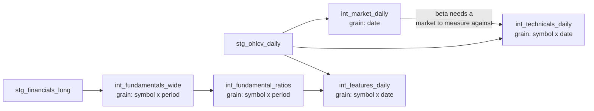

# SILVER intermediate models — what they do and why

Written for someone who knows data engineering but not finance. Every finance
term is explained the first time it appears.

Companion docs: [`bronze-models-rationale.md`](bronze-models-rationale.md),
[`silver-staging-models-rationale.md`](silver-staging-models-rationale.md).

Implements [GH-35](https://github.com/Analyst-Ninja/aurum/issues/35) (Phase 3 of
[`dwh-medallion-plan.md`](dwh-medallion-plan.md)).

---

## 1. What this layer is for

Staging gives you **clean data**. This layer turns it into **features** — the
numeric inputs a model actually learns from.

The distinction matters. "Apple closed at $325.13 on 2026-09-01" is clean data
and almost useless to a model: the absolute price of a share is an arbitrary
number set by how many pieces the company chose to slice itself into. What a
model can use is *"Apple is 4% above its 50-day average, its volatility is in
the calmest third of the last year, and it is 12% below its 52-week high."*
Those are features. Producing them is this layer's job.

Five models:

| Model | Grain | Rows | Materialization | In one line |
|---|---|---|---|---|
| `int_fundamentals_wide` | symbol × period_type × period | 20,032 | table | filings pivoted into a spreadsheet |
| `int_fundamental_ratios` | same | 20,032 | table | that spreadsheet divided by itself |
| `int_market_daily` | date | 6,707 | incremental | what the whole market did each day |
| `int_technicals_daily` | symbol × date | 2,935,412 | incremental | price-derived features |
| `int_features_daily` | symbol × date | 2,935,412 | incremental | fundamentals joined to prices, safely |



The one non-obvious edge is `int_market_daily → int_technicals_daily`. It exists
because *beta* (§5) measures a stock against the market, so the market series
must be joined **before** the window that computes it, not after.

---

## 2. `int_fundamentals_wide` — filings into a spreadsheet

**In:** `stg_financials_long`, one row per reported number.
**Out:** one row per company per reporting period, one column per item.

### 2.1 The shape problem

Staging stores Apple's Q3 2024 as ~90 separate rows. You cannot compute a profit
margin from that, because revenue and profit are in *different rows*. You need
them side by side. Classic long→wide pivot — with three complications.

### 2.2 Complication 1: several concepts fight for one column

Real example from this warehouse, Apple's quarter ending 2024-09-30:

| concept | canonical_name | priority |
|---|---|---|
| `InterestExpense` | interest_expense | 1 |
| `InterestExpenseDebt` | interest_expense | 3 |

Two rows both claiming the `interest_expense` column. Sum them and you
double-count; pick arbitrarily and your warehouse is non-deterministic.

`seeds/concept_map.csv` carries a **priority** — a pre-decided pecking order,
1 = most trustworthy. The model keeps rank 1:

```sql
row_number() over (
    partition by symbol, period_type, fiscal_period_end, canonical_name
    order by concept_priority asc, abs(value) desc, concept asc
) as _row_num
```

The trailing `abs(value)` and `concept` are tie-breakers, so if two concepts
ever share a priority the winner is still **stable across runs**.

### 2.3 Complication 2: signs

Same quarter, `capex` (money spent on buildings and equipment):

- filing says **+2,151,000,000**
- this model outputs **−2,151,000,000**

Companies report spending as a positive number — they are answering *"how much
did we spend?"*. For analysis you want one consistent convention: **money in
positive, money out negative**. The seed carries a `sign` column (`-1` for
capex, buybacks, dividends paid) and the model applies `value * canonical_sign`.

The payoff is immediate: free cash flow becomes `operating_cash_flow + capex`,
an **addition**. Leave capex positive and it must be a subtraction — and the day
someone forgets, the answer is wrong by twice the capex with nothing to flag it.

### 2.4 The pivot itself

```sql
max(case when canonical_name = 'revenue' then value end) as revenue
```

*Scan this company-quarter's rows; if one is labelled revenue take its value,
else leave blank.* `max()` looks like it is choosing between candidates, but
§2.2 already guaranteed exactly one row per label — it is just SQL's mechanism
for collapsing rows into columns. The column list is a Jinja loop, so adding a
field is one line, not four.

A few **derived** columns follow: `gross_profit` (falls back to
`revenue - cost_of_revenue` when the subtotal is not tagged — reported always
wins), `shares_outstanding`, `total_debt` (borrowed money only, deliberately
excluding unpaid supplier bills, because leverage means *borrowing*), `ebitda`,
`free_cash_flow`.

### 2.5 Complication 3: quarters are seasonally lumpy — TTM

Apple's revenue, from this warehouse:

| quarter ending | revenue | revenue_ttm |
|---|---|---|
| 2023-12-31 | 89.5B | 383.3B |
| 2024-03-31 | 119.6B | 385.7B |
| 2024-06-30 | 90.8B | 381.6B |
| 2024-09-30 | 85.8B | 385.6B |

The left column swings **86B → 120B**, a 40% range. Apple is not lurching in and
out of crisis; the December quarter contains Christmas. Judge the company on any
single quarter and you mostly learn what month it is.

**TTM = Trailing Twelve Months** — each quarter plus the previous three. Steady
at ~383B. Every window contains exactly one Christmas, so seasonality cancels.
That is what ratios should be built on.

Mechanically a 4-row rolling sum. The two guards matter more than the sum:

```sql
when count(revenue) over w_ttm = 4
 and (fiscal_period_end - min(fiscal_period_end) over w_ttm) between 240 and 320
    then sum(revenue) over w_ttm
```

1. **`count(...) = 4`** — SQL's `sum()` silently skips NULLs. One missing
   quarter would produce a **three-quarter total labelled as a year**,
   understated ~25%, no error raised.
2. **240–320 day span** — four consecutive quarter-ends span ~273 days. If a
   filing was skipped, "the last four rows" might stretch over two years. Not a
   twelve-month figure, so: NULL.

Both prefer **no answer over a wrong answer**. A NULL is visible and gets
handled; a plausible wrong number propagates silently.

**Flows get TTM; stocks do not.** Revenue is a *flow* — earned *during* a
period, so summing four is meaningful. `total_assets` is a *stock* — what you
own *at one instant*, like a bank balance. Adding your balance on four different
days is meaningless.

### 2.6 `available_from` — the most important column in the warehouse

Apple's quarter ended **2024-09-30**. Nobody outside Apple knew the numbers on
October 1st; the report was not published for weeks.

A model allowed to see September's results in early October looks like a genius.
It is not predicting — it is reading tomorrow's newspaper. This is
**look-ahead bias**, and it is the classic way a strategy backtests beautifully
and loses money live.

So every row carries a second date:

```sql
when period_type = 'quarterly'
    then fiscal_period_end + interval '60 days'
```

- `fiscal_period_end` — when the period *ended*
- `available_from` — when the public could *actually see it*

60 days quarterly / 90 annual, set in `dbt_project.yml`. Filings actually land
~43 days after period end, so 60 is deliberately conservative. Over-waiting
costs a little freshness; **under-waiting invents profit that never existed.**

> **Every downstream join keys on `available_from`, never on
> `fiscal_period_end`.** That is the rule the whole layer is built around.

### 2.7 Why a table, not incremental

Everything else in silver is incremental. This is not, on purpose:

- the TTM windows reach back 3 quarters and the growth lags in the next model
  reach back 4, so an incremental slice would have to re-read ~2 years anyway
- it is 20,032 rows and rebuilds in about **2 seconds**

Incremental here buys nothing and imports the exact silent-NULL failure mode
described in §5.3. Not worth it.

---

## 3. `int_fundamental_ratios` — the spreadsheet divided by itself

Same grain, and it carries `int_fundamentals_wide` through in full (`w.*`) so
downstream needs one dependency instead of two.

Raw numbers are not comparable across companies. Apple earning $14B and a
regional bank earning $200M tells you which is bigger, not which is *better run*.
Ratios normalise that away.

Four families:

| Family | Examples | The question it answers |
|---|---|---|
| **Profitability** | `gross_margin`, `net_margin`, `roe`, `roa`, `roic` | how much profit per unit of sales / per unit of capital? |
| **Growth** | `revenue_growth_yoy`, `eps_growth_yoy` | is it getting bigger? |
| **Leverage** | `debt_to_equity`, `current_ratio`, `interest_coverage` | how much debt, and can it service it? |
| **Quality** | `accruals`, `ocf_to_net_income`, `asset_turnover` | is the reported profit *real*? |

**Quality is the block most often skipped and the highest-value one.**
`accruals = (net_income_ttm - operating_cash_flow_ttm) / total_assets` is the
gap between profit a company *reports* and cash it *received*. Profit involves
judgement calls; cash does not. A persistent gap is the single best-documented
warning sign in cross-sectional equity research (Sloan's accrual anomaly).

### 3.1 Every division is guarded

```sql
w.net_income_ttm / nullif(w.total_equity, 0) as roe
```

`nullif(x, 0)` turns a zero denominator into NULL, so the result is NULL rather
than a division-by-zero error **or** an infinity. Infinities are the worse
outcome: they do not crash, they propagate into the cross-sectional z-scores in
GOLD and destroy the scaling for every other company that day.

### 3.2 Growth needs date guards, not just lags

```sql
case
    when period_type = 'quarterly'
     and (fiscal_period_end - prev_4_period_end) between 300 and 430
        then (curr_revenue - prev_4_revenue) / nullif(abs(prev_4_revenue), 0)
    ...
```

Three decisions:

- **Compare to the same quarter a year ago** (4 rows back), not last quarter.
  Christmas vs Christmas. Otherwise every retailer looks like it collapses each
  January.
- **Verify the row really is a year back** (300–430 days). A skipped filing makes
  "4 rows back" mean something else entirely.
- **`abs()` in the denominator.** Going from −10 to +5 is a 150% improvement;
  dividing by a *negative* base flips the sign and reports it as a collapse.

`roic` additionally clamps the implied tax rate to `[0, 0.60]` with a 21%
fallback — loss-making periods imply negative or absurd rates, and unclamped
that turns a tax refund into a fake earnings boost.

---

## 4. `int_market_daily` — what the whole market did

One row per date. Small (6,707 rows), and two things depend on it.

**It is the benchmark for beta.** To say "this stock is more volatile than the
market" you need a number for "the market".

**It describes the regime.** Whether a stock rose 2% means something different
on a day everything rose 2% versus a day everything else fell.

```sql
avg(log_ret)          as market_log_ret,     -- equal-weight universe return
stddev_samp(log_ret)  as market_xs_dispersion,
avg(case when ma_50_n = 50 and adj_close > ma_50 then 1.0
         when ma_50_n = 50 then 0.0 end)     as market_breadth
```

**Equal weight, not cap weight** — deliberately. A cap-weighted index weights
each company by its size, which requires share counts, which are *fundamentals*
with a point-in-time visibility problem. Using them here would drag look-ahead
bias into a model that otherwise has none. Equal weight is also the right
benchmark for a model that **ranks across the universe** rather than tracking an
index.

**Breadth** is the share of companies trading above their own 50-day average —
"is this a broad rally or five big names carrying everything?". The
`ma_50_n = 50` guard excludes companies whose average is still warming up, so
early history does not report a spuriously extreme value.

**It recomputes its own 50-day average** rather than reading
`int_technicals_daily`. That duplication is deliberate: technicals depends on
this model for beta, so reading it back would create a dependency cycle.

---

## 5. `int_technicals_daily` — price-derived features

The big one: 2.94M rows, ~9 minutes to build from scratch. Everything here is a
window function over `stg_ohlcv_daily`, partitioned by symbol, ordered by date.
No fundamentals — a price is knowable the day it prints, so this model needs no
point-in-time guard at all.

### 5.1 What the features mean

| Group | Columns | Plain English |
|---|---|---|
| **Momentum** | `ret_1d` … `ret_252d`, `mom_12_1` | has it been going up? Stocks that rose over ~12 months tend to keep rising — the best-documented effect in the field |
| **Trend** | `ma_10/20/50/200`, `price_to_ma_50`, `dist_from_52w_high` | where is it relative to its own recent average and its yearly range? |
| **Volatility** | `vol_21d/63d/252d`, `parkinson_vol_21d`, `downside_dev_21d`, `atr_14` | how violently does it move? Risk, roughly |
| **Risk** | `beta_252d`, `idio_vol_252d`, `max_drawdown_252d`, `sharpe_21d/63d` | how much of that is market-wide vs its own? How bad was the worst stretch? |
| **Liquidity** | `adv_21d`, `amihud_illiq_21d`, `volume_zscore_21d`, `obv_flow_21d` | can you actually trade it without moving the price? |
| **Oscillators** | `rsi_14`, `macd`, `bollinger_pctb_20`, `stoch_k_14` | bounded 0–100-ish indicators traders watch |

Three worth expanding:

**`mom_12_1`** — the 12-month return *excluding the most recent month*. The skip
is the entire point: the last month carries **short-term reversal**, a separate
and *opposite* effect, and leaving it in cancels the momentum signal.

**`beta_252d`** — how much the stock moves when the market moves. Beta 1.5 =
amplifies the market by half. Beta 0.5 = damped. Computed as an OLS slope of the
stock's return on the market's, over 252 days:

```sql
case when regr_count(log_ret, market_log_ret) over w_252 >= 200
     then regr_slope(log_ret, market_log_ret) over w_252 end
```

The `regr_count >= 200` guard stops a half-warm window reporting a confident
beta off 30 observations.

**`amihud_illiq_21d`** — average price move per dollar traded. If $1M moves the
price 3%, it is illiquid. Values are ~1e-11 in absolute terms; that is expected,
since the feature is only ever used *after* cross-sectional ranking.

### 5.2 Two return conventions, on purpose

```sql
ln(adj_close / lag(adj_close) over w_symbol)  as log_ret,   -- vol, Sharpe, beta
adj_close / lag(adj_close, 5) over w_symbol - 1 as ret_5d,  -- horizon returns
```

Log returns add up across time, which is what the volatility and beta formulas
assume. Simple returns are how a horizon return is quoted and what a model
should see. Both are cheap; using the wrong one is not.

### 5.3 The incremental lookback: the hardest part of this layer

**This is the section to read if you read nothing else.**

The model is incremental — reprocessing 2.94M rows on every run would be
absurd. But rolling windows and incremental loads interact in a way that fails
**silently**.

#### The naive failure

Compute a 252-day average over a slice containing only the last 5 days and you
get… NULL. Not an error. Not a warning. A column full of nothing, and a model
trained on nothing.

#### Defence part 1: read a wide frame

```sql
where date >= (select max(date) from {{ this }})
             - interval '{{ var("window_lookback_days") }} days'
```

#### Defence part 2: write a *narrower* tail — the part that is easy to miss

The leading edge of that read frame is **warm-up**, and its rows are *wrong*:

- the frame's first bar has no `lag()` predecessor → `ret_1d` is NULL
- its first 49 bars have no complete `ma_50`
- its first 251 have no complete 252-day window

Those rows **already exist in the target**, computed correctly by an earlier run
that had real history behind them. `delete+insert` over the whole read frame
**overwrites correct history with degraded values**.

That is not hypothetical. It happened here, and the measurements are in the git
history: **500 symbols with a NULL `ret_1d`** on the frame's first date, 98 NULL
`market_breadth` rows, and `beta_252d` going NULL on recent rows whose 252-day
window reached back into the damaged region.

The fix is a second, shorter bound on what gets **written**:

```sql

where date >= (select max(date) from {{ this }})
             - interval '{{ var("window_rewrite_days") }} days'

```

| Variable | Value | Role |
|---|---|---|
| `window_lookback_days` | 900 | how much history is **read** (~621 trading days) |
| `window_rewrite_days` | 90 | how much is **written** (~62 trading days) |

The gap between them is warm-up that is read but never emitted. Every written
row saw a complete frame, so **an incremental run is bit-identical to a full
refresh** — which is the property the acceptance test checks.

#### Defence part 3: `delete+insert`, not `append`

`append` would stack recomputed rows beside the old ones. `delete+insert`
replaces them.

#### The rule, stated correctly

The issue that specified this work said *"400 > 252 with headroom"*. That is
wrong twice, and both errors were only caught by diffing a full refresh against
an incremental run.

**1. Trading days are not calendar days.** Markets close on weekends and
holidays. 252 *trading* days ≈ **366 calendar days**. The original 400 left only
~23 trading days of usable tail.

**2. Nested windows compound.** `max_drawdown_252d` is a 252-row `min()` over a
drawdown that is itself measured against a 252-row `max()`:

```sql
-- CTE `rolling`
adj_close / nullif(max(adj_close) over w_252, 0) - 1  as drawdown_252d,
-- CTE `derived`
min(drawdown_252d) over (... rows between 251 preceding and current row)
```

Its effective history is **504 trading days, not 252**. Sized for 252, it was
wrong by up to **0.39** on 2,472 of 11,113 recent rows — silently.

> **So the rule is:** a feature built from a window of N rows over a value that
> itself spans M rows needs warm-up for **N + M**, counted in *trading* days,
> converted to calendar days, plus `window_rewrite_days`.

**3. Unbounded frames are banned outright.** A cumulative sum starts in a
different place in a slice than in a full refresh, so it is not reproducible.
The conventional `obv_slope_21d` (regression slope of cumulative on-balance
volume) hit exactly this: cumulative OBV reaches ~1e11 while its 21-day
variation is ~1e8, so the slope is computed by catastrophic cancellation and the
answer depends on where the sum started. Drift was under 1e-6 — harmless
numerically, but enough to make the checksum differ on 9,062 of 11,113 rows.

Replaced by **`obv_flow_21d`**: the share of a period's volume that traded on up
days, bounded `[-1, 1]`, over a bounded frame. Same accumulation signal,
exactly reproducible, and it has a meaningful scale the raw slope never had.

#### The tests that keep this honest

- **`assert_long_window_features_populated.sql`** — asserts `vol_252d`,
  `ma_200`, `beta_252d`, `max_drawdown_252d` are non-NULL on each symbol's most
  recent bar (for symbols with ≥300 bars of history). Fires if the lookback
  shrinks below what the windows need.
- **`assert_intermediate_covers_all_bars.sql`** — asserts every bar in
  `stg_ohlcv_daily` reached both daily models. `window_rewrite_days` is also the
  **maximum the pipeline may lapse**: a longer gap leaves dates no run ever
  writes. This turns "the pipeline was down for four months" from a silent hole
  into a failed build.

### 5.4 Documented deviations from convention

Postgres has no window EMA (exponential moving average — a recursive
weighting), and a recursive CTE over 2.9M rows is not viable. So:

| Feature | Convention | Here | Why it's acceptable |
|---|---|---|---|
| `macd`, `macd_signal` | 12/26/9 EMA | simple moving averages | same fast-minus-slow trend construction; z-scored cross-sectionally before any model sees it |
| `rsi_14` | Wilder's recursive smoothing | simple 14-bar means (Cutler's RSI) | bounded 0–100 either way; standard variant |
| `atr_14` | Wilder's smoothing | simple 14-bar mean of true range | tracks closely; what most screeners report |

All three are flagged in the SQL so nobody "fixes" them into a recursive CTE and
wonders why the build takes an hour.

**One clamp worth knowing about.** `stoch_k_14` is clamped to `[0, 100]`.
`stg_ohlcv_daily` carries `adj_close` as landed but derives `adj_low` as
`low * adj_factor`, so on a bar that closed exactly at its low the two disagree
in the last float digit and %K lands a whisker below zero — ~3.6k rows of 2.9M.
The clamp uses an explicit `case`, because **`greatest()`/`least()` ignore NULLs
in Postgres** rather than propagating them: `greatest(NULL, 0)` returns `0`, so
a naive clamp would turn a genuinely-undefined value into a confident zero.

---

## 6. `int_features_daily` — joining fundamentals to prices without cheating

**In:** `stg_ohlcv_daily` + `int_fundamental_ratios`.
**Out:** one row per symbol per day, with the fundamentals the market knew
*that day* attached.

### 6.1 The as-of join

Every trading day gets the most recent filing whose `available_from` is on or
before that date. This is the single place look-ahead bias can enter, so it is
written to make leaking structurally impossible.

**Verified spot-check from this warehouse:**

| date | period attached | available_from | days stale |
|---|---|---|---|
| 2024-02-15 | **2023-09-30** | 2023-11-29 | 78 |
| 2024-03-15 | 2023-12-31 | 2024-02-29 | 15 |
| 2024-06-14 | 2024-03-31 | 2024-05-30 | 15 |

Look at the first row. On 2024-02-15, Apple's December quarter had **already
ended six weeks earlier** — and the model correctly attaches the *September*
quarter, because December's numbers did not become public until Feb 29. That is
the guard working.

### 6.2 Deviation: interval join instead of `distinct on`

GH-35 specified `distinct on (symbol, date)` over candidate rows. Correct, but
quadratic here: 2.9M bars × ~60 candidate periods each ≈ a **180M-row
intermediate to sort**.

The equivalent formulation used instead gives each filing a half-open validity
window:

```sql
lead(available_from) over (partition by symbol order by available_from) as available_to
...
and b.date >= f.available_from
and (f.available_to is null or b.date < f.available_to)
```

Exactly one row can satisfy both bounds, so it cannot fan out. Same result, one
pass, **40 seconds**. (If you know SCD Type 2, this is the same idea: turn a
sequence of effective-from stamps into non-overlapping validity ranges, then
range-join.)

`LEFT` join, deliberately: a symbol's early history predates its first filing,
and those bars must survive with NULL fundamentals rather than vanish.

### 6.3 Valuation ratios live here, and use the *raw* price

Valuation ratios need a price, so they cannot live in
`int_fundamental_ratios`. A quarterly fundamental over a daily close means
`market_cap`, `price_to_earnings` and `fcf_yield` **move every day** even though
the fundamental input changes four times a year. That is intended.

**The subtlety that would have silently corrupted every historical number:**

```sql
(adj_close / nullif(adj_factor, 0)) as close_raw
```

`adj_close` is back-adjusted for splits and dividends — it is *not* the price
anyone paid on that date. But `shares_outstanding` and `eps` come from the
filing **as reported at the time**, unadjusted. Multiply an adjusted price by an
unadjusted share count and every historical market cap is understated by the
cumulative adjustment factor.

So valuation — and *only* valuation — reconstructs the raw close. Every
technical feature stays on the adjusted series.

Sanity-checked against reality: Apple's market cap on 2024-02-15 computes to
**$2.90T** (actual ≈ $2.85T), P/E 31, FCF yield 3.5%.

### 6.4 `days_since_available`

`date - available_from`. A feature in its own right — a 90-day-old number
carries less information than a 15-day-old one — and a **diagnostic**: it can
never be negative, and a run of values past ~130 means a filing was missed.

---

## 7. The two lessons worth carrying forward

**1. Silent NULLs are worse than errors.** Every failure in this layer was
silent: a truncated window returns NULL, a partial `sum()` returns a plausible
number, an unbounded cumulative returns a *slightly* different float. None
raised anything. All were caught by explicitly comparing a full refresh against
an incremental run, column by column. **If a model is incremental and has
windows, that comparison is not optional.**

**2. Prefer NULL to a wrong number.** The TTM completeness guard, the growth
date guards, the `regr_count >= 200` beta guard, `nullif` on every denominator —
all choose "no answer" over "an answer that looks fine and is wrong". A NULL is
visible in a test and handled downstream. A plausible wrong number is found
months later, in production, by someone else.

---

## 8. Verify

```bash
cd src/transformation/aurum_dwh

# build + test the layer (35 tests)
uv run --group dbt dbt build --select silver.intermediate

# leakage: must be 0
uv run --group dbt dbt show --inline "
  select count(*) from silver.int_features_daily where available_from > date"

# the point-in-time spot check
uv run --group dbt dbt show --inline "
  select date, fiscal_period_end, available_from, days_since_available
  from silver.int_features_daily
  where symbol='AAPL' and date in ('2024-02-15','2024-06-14') order by date"
```

### The incremental-correctness check

The one that caught both bugs. Re-run it after **any** change to a window, a
frame, or a lookback variable.

```bash
# 1. full refresh, then snapshot the recent tail
uv run --group dbt dbt run --select silver.intermediate --full-refresh
uv run --group dbt dbt show --inline "
  create table silver._ck_full as
  select * from silver.int_technicals_daily
  where date >= (select max(date) from silver.int_technicals_daily) - 30"

# 2. run incrementally
uv run --group dbt dbt run --select silver.intermediate

# 3. diff EVERY column. Must return zero rows.
uv run --group dbt dbt show --inline "
  select x.k as column_name, count(*) as differing_rows
  from silver._ck_full a
  join silver.int_technicals_daily b on a.symbol=b.symbol and a.date=b.date
  cross join lateral jsonb_each(to_jsonb(a)) as x(k, va)
  where x.va is distinct from jsonb_extract_path(to_jsonb(b), x.k)
  group by 1 order by 2 desc"

# 4. clean up silver._ck_full
```

The `jsonb_each` trick diffs all ~45 columns without naming them, and reports
*which* column drifted — which is what turned "the checksum changed" into
"`max_drawdown_252d` is wrong on 2,472 rows".

> Step 1 creates a table via `dbt show`, which wraps its input in a subquery —
> run the `create table` through `dbt run-operation` with a small macro, or via
> any psql session, if the wrapper rejects it.
